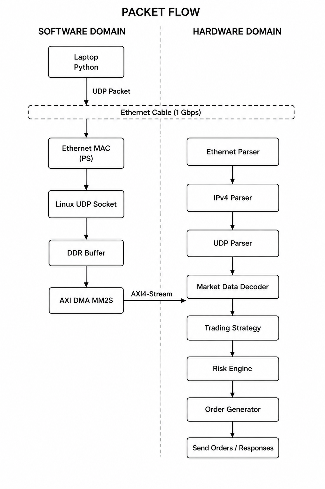

# PYNQ-Z2 FPGA HFT Pipeline

## Overview

Low-latency market-data processing and trading pipeline developed on a
PYNQ-Z2 using Python, Linux networking, AXI DMA, AXI4-Stream, and system verilog and sibling language/s.

Figure 1 illustrates the end-to-end packet flow through the proposed architecture. Market data is generated on the host computer, transmitted over Gigabit Ethernet to the PYNQ-Z2, transferred from the Processing System (PS) to the Programmable Logic (PL) using AXI DMA, and finally processed by the FPGA trading pipeline.

  

<b>Figure 1.</b> End-to-end packet flow through the proposed FPGA HFT pipeline.

## Architecture (still needs to be ironed out properly)

Laptop UDP generator
→ PYNQ PS Ethernet
→ Linux/raw socket
→ DDR
→ AXI DMA
→ FPGA parser
→ market-data decoder
→ strategy
→ order generator

## Hardware

- PYNQ-Z2 module
- Zynq-7020
- 1 Gbit Ethernet
- Direct laptop-to-board Ethernet connection
- 16 GB micro SD-card
- USB connection to laptop for power

## Current status

- [x] Direct Ethernet connection
- [x] Static PYNQ address: 192.168.2.99
- [ ] UDP market-data generator
- [ ] UDP receiver
- [ ] AXI DMA loopback
- [ ] Ethernet/IPv4/UDP parser
- [ ] Trading strategy
- [ ] Latency measurements

## Packet format

See `docs/packet_format.md`.

## Repository structure

idk still need to config it will occur at some point soon 

## Results

Timing, utilization, throughput, and latency results will be added I progress
w/ the proj. 
