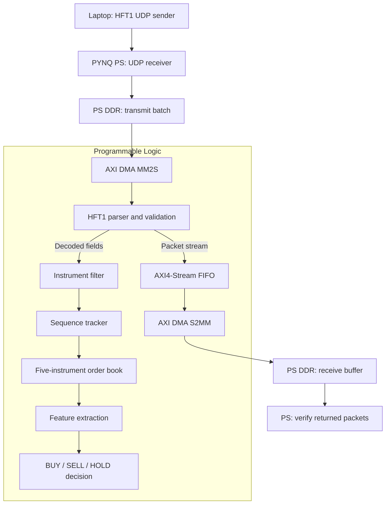
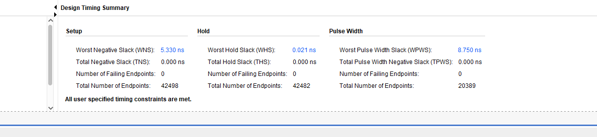

# PYNQ-Z2 FPGA HFT Pipeline

## Overview

Market-data processing and trading pipeline developed on the PYNQ-Z2 using Python, C, Linux networking, AXI DMA, AXI4-Stream, and SystemVerilog.

The flow below shows the path from UDP reception to FPGA processing. The parser forwards packet bytes towards the DMA return path while its decoded fields feed the trading engine.

```mermaid
flowchart TD
    Host["Laptop: HFT1 UDP sender"] --> Socket["PYNQ PS: UDP receiver"]
    Socket --> Tx["PS DDR: transmit batch"]
    Tx --> MM2S["AXI DMA MM2S"]

    subgraph PL["Programmable Logic"]
        MM2S --> Parser["HFT1 parser and validation"]
        Parser -->|Packet stream| FIFO["AXI4-Stream FIFO"]
        FIFO --> S2MM["AXI DMA S2MM"]

        Parser -->|Decoded fields| Filter["Instrument filter"]
        Filter --> Tracker["Sequence tracker"]
        Tracker --> Book["Five-instrument order book"]
        Book --> Features["Feature extraction"]
        Features --> Decision["BUY / SELL / HOLD decision"]
    end

    S2MM --> Rx["PS DDR: receive buffer"]
    Rx --> Check["PS: verify returned packets"]
```

## Architecture

Laptop UDP generator
→ PYNQ PS Ethernet
→ Linux/raw socket
→ DDR
→ AXI DMA
→ FPGA parser
→ market-data decoder
→ strategy
→ order generator

## Hardware

- PYNQ-Z2 module
- Zynq-7020
- 1 Gbit Ethernet
- Direct laptop-to-board Ethernet connection
- 16 GB micro SD-card
- USB connection to laptop for power

## Project progress - verification and performance benchmarks are all that is left, everything else is complete

- [x] Phase 1 — Direct Ethernet network setup
- [x] Phase 2 — UDP Communication
- [x] Phase 3 — AXI DMA integration
- [x] Phase 4 — FPGA packet parser 
- [x] Phase 5 — Trading strategy

## Packet format

See `phase2_udp_communication.md` section 2.2 and 2.3. 

## Repository structure

See docs for detailed report of how system works. Any images in md files  can be viewed better by accessing docs/images.

## Complete file path from Sender to final decision

Windows:
phase4_9_live_udp_sender.py

-> UDP ->
        
PYNQ Processing System:
phase4_9_live_udp_dma_test.py / phase4_9_live_udp_recvmmsg_dma.py and receive_udp_dma.c for recvmmsg

-> AXI DMA MM2S ->
        
Programmable Logic:
phase5_hft_pipeline.bit
phase5_hft_pipeline.hwh

-> AXI DMA S2MM ->
        
PYNQ Processing System:
phase4_9_live_udp_dma_test.py

## FPGA path maximum clock frequency

The complete FPGA path, from packet parser to trading decision, met its 50 MHz timing constraint with +5.330 ns worst setup slack and zero failing endpoints. At 20,000 packets/s, that corresponds to approximately 2,500 PL clock cycles per packet; the measured throughput bottleneck was PS reception and DMA control.

