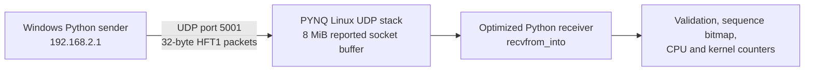
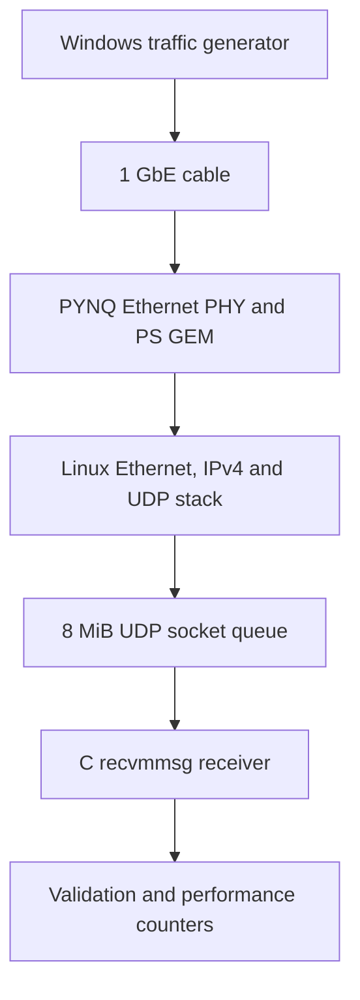

# Phase 2 — UDP and Binary Market-Data Communication

## Phase 2.1 — UDP Hello World

### Objective

Verify end-to-end UDP communication between the Windows host and the
PYNQ-Z2 over a direct Gigabit Ethernet connection.

### Host Implementation

- `send_udp.py`
- Sends a UDP packet containing the string `"Hello FPGA"`.

### PYNQ Implementation

- `receive_udp.py`
- Listens on UDP port `5001`.
- Prints the received payload.

### Verification

Host:

```text
Sent 10 bytes to 192.168.2.99:5001
```

PYNQ:

```text
Received 10 bytes from ('192.168.2.1', <port>)
Payload: Hello FPGA
```

### Outcome

Successful end-to-end UDP communication was established.

## Phase 2.2 — Market-Data Packet Design

### Overview

The project uses a fixed-length binary UDP payload for transferring synthetic
market-data updates from the host laptop to the PYNQ-Z2.

The format is designed for simple and deterministic FPGA parsing.

All multi-byte integer fields use **big-endian network byte order**.

The total UDP payload length is 32 bytes.

### Packet Layout

| Byte Offset | Field | Width | Description |
|---:|---|---:|---|
| `0–3` | Magic / Protocol ID | 4 bytes | ASCII identifier `HFT1` |
| `4` | Version | 1 byte | Protocol version |
| `5` | Message Type | 1 byte | Type of market-data message |
| `6` | Side | 1 byte | `0 = BID`, `1 = ASK` |
| `7` | Flags | 1 byte | Reserved for future use |
| `8–11` | Sequence Number | 4 bytes | Packet ordering and loss detection |
| `12–19` | Timestamp | 8 bytes | Host timestamp in nanoseconds |
| `20–23` | Instrument ID | 4 bytes | Numeric instrument identifier |
| `24–27` | Price | 4 bytes | Price represented as integer ticks |
| `28–31` | Quantity | 4 bytes | Number of shares or contracts |

### Field Definitions

#### Magic / Protocol ID

The first four bytes must contain:

```text
HFT1
```

Hexadecimal representation:

```text
8'h48 8'h46 8'h54 8'h31
```

Packets with an incorrect magic value must be rejected.

#### Version

Current protocol version:

```text
1
```

A future incompatible packet format should increment this value.

#### Message Type

| Value | Meaning |
|---:|---|
| `1` | Quote update |
| `2` | Trade |
| `3` | Heartbeat |

The initial implementation only supports quote updates.

#### Side

| Value | Meaning |
|---:|---|
| `0` | Bid |
| `1` | Ask |

#### Flags

The flags field is currently set to zero.

Possible future definitions include:

| Bit | Meaning |
|---:|---|
| `0` | Snapshot message |
| `1` | End of message batch |
| `2` | Synthetic test message |

#### Sequence Number

The sequence number increments for every transmitted packet.

Example:

```text
1, 2, 3, 4, 5
```

If the receiver observes:

```text
1, 2, 4
```

then packet `3` was lost or rejected.

#### Timestamp

The host generates the timestamp using:

```python
time.time_ns()
```

The timestamp is primarily used for logging during the software-development
phases.

It is not yet a precise end-to-end latency measurement because the host and
PYNQ clocks are not synchronized.

#### Instrument ID

Symbols are represented by numeric identifiers rather than variable-length
strings.

| Instrument ID | Symbol |
|---:|---|
| `1` | AAPL |
| `2` | MSFT |
| `3` | GOOGL |

Numeric identifiers simplify FPGA comparison logic.

#### Price

Prices are transmitted as unsigned integer ticks rather than floating-point
values.

The initial tick size is:

```text
1 tick = $0.01
```

Examples:

| Display Price | Packet Value |
|---:|---:|
| `$185.25` | `18525` |
| `$100.07` | `10007` |
| `$1.00` | `100` |

#### Quantity

Quantity is transmitted as an unsigned 32-bit integer representing shares or
contracts.

### Python Struct Format

The Python format string is:

```python
PACKET_FORMAT = "!4sBBBBIQIII"
```

| Symbol | Meaning |
|---|---|
| `!` | Big-endian network byte order |
| `4s` | Four-byte magic value |
| `B` | Unsigned 8-bit integer |
| `I` | Unsigned 32-bit integer |
| `Q` | Unsigned 64-bit integer |

The packet size can be verified using:

```python
import struct

PACKET_FORMAT = "!4sBBBBIQIII"
PACKET_SIZE = struct.calcsize(PACKET_FORMAT)

assert PACKET_SIZE == 32
```

### Example Packet

Example market-data update:

```text
Magic:          HFT1
Version:        1
Message Type:   Quote update
Side:           Bid
Sequence:       15
Instrument:     AAPL
Price:          $185.25
Quantity:       100
```

Encoded field values:

```text
Magic:          b"HFT1"
Version:        1
Message Type:   1
Side:           0
Flags:          0
Sequence:       15
Instrument ID:  1
Price Ticks:    18525
Quantity:       100
```

### Validation Rules

A receiver must reject a packet when:

- Its length is not exactly 32 bytes.
- Its magic value is not `HFT1`.
- Its version is unsupported.
- Its message type is unsupported.
- Its side is not `0` or `1`.
- Its sequence number is invalid or unexpected.

## Phase 2.3 — Binary Packet Transmission and Decoding

### Objective

Transmit one fixed-length binary market-data packet from the Windows host to
the PYNQ-Z2 and verify that every field is decoded correctly.

### Implementation

Two Python programs were used:

```text
host/send_market_packet.py
pynq/receive_market_packet.py
```

#### Host Sender

The host program:

1. Creates the market-data fields.
2. Encodes them into a 32-byte payload using `struct.pack()`.
3. Sends the payload to the PYNQ-Z2 using UDP.

#### PYNQ Receiver

The PYNQ program:

1. Listens on UDP port `5001`.
2. Checks that the received payload is exactly 32 bytes.
3. Decodes the fields using `struct.unpack()`.
4. Validates the protocol identifier, version and side.
5. Prints the decoded market-data update.

### Network Configuration

| Device | IPv4 Address | Role |
|---|---|---|
| Windows host | `192.168.2.1` | Packet sender |
| PYNQ-Z2 | `192.168.2.99` | Packet receiver |

UDP destination port:

```text
5001
```

### Running the Receiver

On the PYNQ-Z2:

```bash
python3 receive_market_packet.py
```

Expected startup output:

```text
Listening for 32-byte market packets...
UDP port: 5001
```

The receiver must remain running while the host sends the packet.

### Running the Sender

From the `host` directory on Windows:

```powershell
python .\send_market_packet.py
```

### Host Output

The host successfully transmitted one 32-byte packet:

```text
Sent 32 bytes to 192.168.2.99:5001
Packet: 48 46 54 31 01 01 00 00 00 00 00 01 18 c2 dd f6 c9 cf 74 60 00 00 00 01 00 00 48 5d 00 00 00 64
```

### PYNQ Output

The PYNQ-Z2 successfully received and decoded the packet:

```text
Received packet from ('192.168.2.1', 53433)
Sequence:      1
Timestamp:     1784232454409647200
Message type:  1
Instrument ID: 1
Side:          BID
Price:         $185.25
Quantity:      100
Flags:         0
```

The source UDP port is selected automatically by the host operating system and
may be different each time the sender is executed.

### Packet Verification

The transmitted hexadecimal payload can be separated into fields as follows:

| Bytes | Decoded value |
|---|---|
| `48 46 54 31` | Protocol identifier `HFT1` |
| `01` | Protocol version `1` |
| `01` | Message type `1`, quote update |
| `00` | Side `0`, bid |
| `00` | Flags `0` |
| `00 00 00 01` | Sequence number `1` |
| `18 c2 dd f6 c9 cf 74 60` | 64-bit host timestamp |
| `00 00 00 01` | Instrument ID `1` |
| `00 00 48 5d` | Price value `18525` ticks |
| `00 00 00 64` | Quantity `100` |

With a tick size of one cent:

```text
18525 ticks = $185.25
```

### Result

The complete software packet path was successfully verified:

```text
Windows Python sender -> Direct Ethernet connection -> PYNQ Linux network stack -> Python packet validation and decoding
```

This confirms that:

- Binary packet packing and unpacking use the same byte order.
- All field offsets match the packet specification.
- The direct Ethernet connection transfers binary UDP payloads correctly.
- The receiver can validate and decode the market-data fields.
- The packet format is ready for continuous packet generation.

### Current Limitation

The packet is currently decoded by Python running on the Zynq processing
system.

The programmable logic is not yet processing the packet. A later phase will
transfer packet data from processing-system memory into the programmable logic
using AXI DMA.

### Next Step

The next stage is continuous market-data generation.

The sender will generate multiple packets while changing:

- Sequence number
- Timestamp
- Bid or ask side
- Price
- Quantity

The receiver will check sequence continuity and report missing or unexpected
packets.

## Phase 2.4 — Continuous Market-Data Streaming and Throughput Testing

### Objective

Extend the single-packet test from Phase 2.3 into a continuous stream of
synthetic market-data updates and measure the sustainable packet-processing
rate of the PYNQ-Z2 Python receiver.

The test must detect:

- Missing packets
- Invalid packets
- Duplicate packets
- Out-of-order packets
- A receive rate below the requested transmit rate

### Implementation

Two Python programs were used:

```text
host/send_market_stream.py
pynq/receive_market_stream.py
```

#### Host Stream Generator

The host program:

1. Accepts a target packet rate and test duration.
2. Generates continuously changing market-data updates.
3. Increments the sequence number for every packet.
4. Updates the timestamp, side, price and quantity fields.
5. Encodes each update using the 32-byte packet format from Phase 2.2.
6. Sends the packets to UDP port `5001` on the PYNQ-Z2.
7. Sends test metadata so the receiver knows the expected number of packets.

Example sender command:

```powershell
python .\send_market_stream.py --pps 7500 --duration 10
```

#### PYNQ Stream Receiver

The PYNQ program:

1. Receives each UDP payload.
2. Confirms that the payload is exactly 32 bytes.
3. Decodes it using `struct.unpack()`.
4. Validates the magic value, version, message type and side.
5. Tracks every sequence number.
6. Detects missing, duplicate and out-of-order packets.
7. Measures and prints the live receive rate once per second.
8. Produces a final integrity and throughput report.

### Running the Receiver

On the PYNQ-Z2:

```bash
python3 receive_market_stream.py
```

Expected startup output:

```text
Listening for 32-byte market packets...
UDP port: 5001
UDP receive buffer: 8,388,608 bytes
```

### Running the Sender

From the `host` directory on Windows:

```powershell
python .\send_market_stream.py --pps 7500 --duration 10
```

This command sends:

```text
7,500 packets/s × 10 seconds = 75,000 packets
```

### Pass Criteria

A stream test passes only when:

```text
Missing packets:       0
Invalid packets:       0
Duplicate packets:     0
Out-of-order packets:  0
Packet error rate:     0.000000%
Result:                PASS
```

The live and average receive rates must also remain close to the requested
transmit rate. A zero-loss result after a long queue-draining delay would not
represent real-time operation.

### Initial Receive-Buffer Limitation

The receiver initially requested a 4 MiB UDP receive buffer:

```python
sock.setsockopt(
    socket.SOL_SOCKET,
    socket.SO_RCVBUF,
    4 * 1024 * 1024,
)
```

However, the Linux kernel limited the actual socket buffer to:

```text
360,448 bytes
```

At 7,500 packets/s, a short receiver stall overflowed this buffer and caused
approximately 260 missing packets.

The temporary kernel limit was increased using:

```bash
sudo sysctl -w net.core.rmem_max=8388608
```

After restarting the receiver, Linux reported:

```text
UDP receive buffer: 8,388,608 bytes
```

Linux reports twice the requested size because it includes internal socket
bookkeeping in the displayed value.

### Benchmark Results

| Target Rate | Duration | Valid Packets | Missing Packets | Error Rate | Result |
|---:|---:|---:|---:|---:|:---:|
| `5,000 pps` | `10 s` | `50,000` | `0` | `0.000000%` | PASS |
| `6,000 pps` | `10 s` | `60,000` | `0` | `0.000000%` | PASS |
| `7,000 pps` | `10 s` | `70,000` | `0` | `0.000000%` | PASS |
| `7,500 pps`, small buffer | `10 s` | `74,737` | `263` | `0.350667%` | FAIL |
| `7,500 pps`, enlarged buffer | `10 s` | `75,000` | `0` | `0.000000%` | PASS |
| `7,800 pps`, small buffer | `10 s` | `77,631` | `369` | `0.473077%` | FAIL |
| `7,900 pps`, small buffer | `10 s` | `78,619` | `381` | `0.482278%` | FAIL |
| `8,000 pps` | `10 s` | `79,744` | `256` | `0.320000%` | FAIL |
| `10,000 pps` | `100 s` | `671,483` | `328,517` | `32.851700%` | FAIL |

The enlarged-buffer 7,500 packets/s test produced:

```text
Packets sent:          75,000
Valid unique packets:  75,000
Missing packets:       0
Invalid packets:       0
Duplicate packets:     0
Out-of-order packets:  0
Measured duration:     10.022 s
Average receive rate:  7,484 pps
Packet error rate:     0.000000%
Result:                PASS
```

The larger buffer absorbed a short processing stall and prevented packet loss.
The extra 22 ms shows that a small temporary backlog still occurred.

Testing at 8,000 packets/s remained unreliable, while 10,000 packets/s caused
continuous overload. The current receiver was therefore capped at:

```text
7,500 packets/s
```

### Throughput Analysis

A 32-byte UDP update occupies approximately 98 bytes on the physical Ethernet
link after including Ethernet, IPv4, UDP, preamble, frame-check and inter-frame
overheads.

At the selected rate:

```text
7,500 × 98 × 8 = 5.88 Mbit/s
```

Even the failed 10,000 packets/s test used only approximately:

```text
10,000 × 98 × 8 = 7.84 Mbit/s
```

Both rates are far below the 1 Gbit/s Ethernet link capacity. The physical link
is therefore not the bottleneck.

### Bottleneck

The current receive path performs the following operations for every packet:

```text
Linux receives UDP packet
        ↓
Packet enters socket receive buffer
        ↓
Python calls recvfrom()
        ↓
Python decodes the packet using struct.unpack()
        ↓
Python validates fields and sequence number
        ↓
Python updates statistics
```

At 10,000 packets/s, the receiver processed an average of approximately 6,714
packets/s during the 100-second test. The socket queue therefore grew until it
became full and Linux discarded incoming packets.

Increasing the receive buffer can absorb short bursts, but it cannot correct a
sustained difference between the arrival rate and processing rate.

The limiting factor is the Linux/Python per-packet processing path on the ARM
processor, not Ethernet bandwidth.

### Monitoring Commands

UDP receive errors can be inspected using:

```bash
netstat -su
```

Ethernet interface errors and drops can be inspected using:

```bash
ip -s link show eth0
```

The receiver process can be found using:

```bash
pgrep -af receive_market_stream.py
```

Its CPU usage can then be monitored using:

```bash
top -p <PID>
```

### Final Endurance Test

The selected 7,500 packets/s cap can be validated over 100 seconds using:

```powershell
python .\send_market_stream.py --pps 7500 --duration 100
```

This test sends 750,000 market-data packets. It passes only if every packet is
received and the measured duration remains close to 100 seconds.

### Result

Phase 2.4 successfully established continuous binary market-data communication
between the Windows host and PYNQ-Z2.

The receiver correctly detected packet loss, duplicates, invalid packets and
ordering errors while measuring the live processing rate.

The maximum configured rate for the current Python implementation is:

```text
7,500 packets/s
```

This result provides a measured processing-system baseline for comparison with
the later FPGA implementation.

### Current Limitation

The market-data packets are still received and decoded by Python on the Zynq
processing system. The programmable logic does not yet parse or process the
packets.

### Next Step

The next phase will use AXI DMA to transfer data between the processing system
and programmable logic. This will verify the PS-to-PL streaming path before the
Ethernet, IPv4 and UDP parsing logic is moved into FPGA hardware.

## Phase 2.5 — Sustained Reliability Validation

### Objective

Validate that the selected maximum software rate of 7,500 packets/s can be
sustained over a long test without packet loss, corruption, duplicate packets or
ordering errors.

This phase uses the completed Phase 2.4 packet generator and receiver without
adding profiling work to the per-packet receive path.

### Test Configuration

| Item | Configuration |
|---|---|
| Host | Windows laptop, `192.168.2.1` |
| Receiver | PYNQ-Z2, `192.168.2.99` |
| Transport | UDP over direct Gigabit Ethernet |
| UDP port | `5001` |
| Payload format | Fixed 32-byte big-endian `HFT1` market-data packet |
| Target rate | `7,500 packets/s` |
| Test duration | `100 seconds` |
| Planned packets | `750,000` |
| Requested socket receive buffer | `4 MiB` |
| Actual Linux socket receive buffer | `8,388,608 bytes` |

Before starting the receiver, the PYNQ kernel receive-buffer limit was set to:

```bash
sudo sysctl -w net.core.rmem_max=8388608
```

### Commands

Start the receiver on the PYNQ-Z2:

```bash
python3 receive_market_stream.py
```

Start the sustained stream from the Windows host:

```powershell
python .\send_market_stream.py --pps 7500 --duration 100
```

### Acceptance Criteria

The test passes only when:

```text
Valid unique packets: 750,000
Missing packets:      0
Invalid packets:      0
Duplicate packets:    0
Out-of-order packets: 0
Packet error rate:    0.000000%
Result:               PASS
```

The measured duration and average receive rate must also remain close to the
100-second and 7,500 packets/s targets.

### Final Result

The sustained validation completed successfully:

```text
Target rate:           7,500 packets/s
Packets sent:          750,000
Valid unique packets:  750,000
Missing packets:       0
Invalid packets:       0
Duplicate packets:     0
Out-of-order packets:  0
Highest sequence:      750,000
Measured duration:     99.996 s
Average receive rate:  7,500 pps
Packet error rate:     0.000000%
Invalid packet rate:   0.000000%
Duplicate packet rate: 0.000000%
Out-of-order rate:     0.000000%
Result:                PASS
```

### Outcome

The Python/Linux receiver sustained the selected 7,500 packets/s operating rate
for 100 seconds and received all 750,000 market-data packets exactly once.

The receive buffer absorbed short scheduling jitter without loss, and the final
average rate matched the sender target exactly.

The validated software baseline is therefore:

```text
Sustained operating rate: 7,500 packets/s
Packet loss:              0.000000%
Test duration:            100 seconds
```

The 7,500 packets/s result is the reference point for subsequent FPGA work.
It represents the current Linux/Python per-packet processing limit, not the
capacity of the Gigabit Ethernet link or the FPGA fabric.

### Phase 2 Completion

Phase 2 is complete. It established:

- direct UDP communication between the Windows host and PYNQ-Z2;
- a deterministic 32-byte binary market-data protocol;
- packet validation and sequence-integrity checking;
- continuous market-data streaming;
- a configured 8 MiB UDP receive buffer for short bursts; and
- a verified sustained software throughput of 7,500 packets/s.
# Phase 2.6 — Optimized Python UDP Packet Streaming

## Executive summary

Phase 2.6 optimized the Windows-to-PYNQ UDP software path before introducing
AXI DMA or FPGA processing. The 32-byte, big-endian `HFT1` packet protocol was
kept unchanged so the measured improvement came from software implementation
changes rather than a different workload.

The optimized Python receiver passed at **11,000 packets/s** for 10 seconds:

| Metric | Result |
|---|---:|
| Target rate | 11,000 packets/s |
| Packets sent | 110,000 |
| Valid unique packets | 110,000 |
| Missing / invalid / duplicate / out of order | 0 / 0 / 0 / 0 |
| Average receive rate | 10,998 packets/s |
| Process CPU utilisation | 97.2% of one core |
| Kernel UDP errors | 0 |
| Result | PASS |

Compared with the established 7,500 packets/s baseline, this is:

```text
11,000 / 7,500 = 1.4667× throughput
(11,000 - 7,500) / 7,500 × 100 = 46.7% improvement
```

The next tested rate, 11,500 packets/s, lost 12,828 of 115,000 packets. A
12,500 packets/s test showed 26,682 missing packets and exactly 26,682 Linux
`UdpRcvbufErrors`, confirming socket receive-queue overflow once the Python
receiver could no longer drain packets at the arrival rate.

> **Validation scope:** The original 7,500 packets/s baseline passed a
> 100-second, 750,000-packet sustained test. The optimized 11,000 packets/s
> result was a 10-second boundary test, not a completed 100-second sustained
> validation. Phase 2.7 subsequently moved the receiver to C and
> `recvmmsg()` instead of treating 11,000 packets/s as the final architecture.

## Objectives

- Raise the lossless packet-rate ceiling above 7,500 packets/s.
- Preserve the existing 32-byte `HFT1` protocol.
- Reduce per-packet allocation, packing, and receive overhead.
- Measure process CPU usage at each rate.
- Distinguish sender pacing problems from PYNQ kernel/socket drops.
- Establish whether Python or the 1 Gb/s Ethernet link was the limiting stage.

## Files

| File | Runs on | Purpose |
|---|---|---|
| [`send_market_stream_optimized.py`](send_market_stream_optimized.py) | Windows host | Generates and precisely paces the UDP market-data stream |
| [`receive_market_stream_optimized.py`](receive_market_stream_optimized.py) | PYNQ-Z2 | Receives, validates, counts, and reports the stream |
| `phase2_6_udp_optimization.md` | Documentation | Records the implementation, commands, results, and analysis |

## Test path



The test exercises the host sender, Ethernet interface, PYNQ Linux network
stack, UDP socket queue, and Python receiver. It does **not** yet transfer
packets into programmable logic; that begins in Phase 3.

## HFT1 packet format

Both programs use the same precompiled format:

```python
PACKET_STRUCT = struct.Struct("!4sBBBBIQIII")
```

The `!` selects network byte order. Every UDP datagram is exactly 32 bytes.

| Offset | Size | Field | Type | Purpose |
|---:|---:|---|---|---|
| 0 | 4 | Magic | `4s` | Must be `HFT1` |
| 4 | 1 | Version | `u8` | Protocol version, currently `1` |
| 5 | 1 | Message type | `u8` | Quote, stream-start, or stream-end |
| 6 | 1 | Side | `u8` | Quote side, restricted to `0` or `1` |
| 7 | 1 | Flags | `u8` | Must be zero in this test |
| 8 | 4 | Sequence | `u32` | Packet sequence number |
| 12 | 8 | Timestamp | `u64` | Sender timestamp in nanoseconds |
| 20 | 4 | Instrument ID | `u32` | Quote instrument or control value |
| 24 | 4 | Price ticks | `u32` | Quote price or control value |
| 28 | 4 | Quantity | `u32` | Quote quantity or packet count |

### Control-message field reuse

| Message type | Instrument field | Price field | Quantity field |
|---|---:|---:|---:|
| `STREAM_START` (`4`) | Target packets/s | Duration in milliseconds | Planned packet count |
| `QUOTE_UPDATE` (`1`) | Instrument ID | Price in ticks | Quote quantity |
| `STREAM_END` (`5`) | Target packets/s | Duration in milliseconds | Actual packets sent |

`STREAM_START` tells the receiver how large a sequence bitmap to allocate and
which rate to validate. `STREAM_END` supplies the actual sent count used to
calculate missing packets.

## Optimization summary

### Sender changes

| Optimization | Implementation | Why it helps |
|---|---|---|
| Connected UDP socket | `sock.connect(destination)` followed by `sock.send()` | Avoids supplying and resolving the destination tuple on every packet |
| Reusable packet storage | One 32-byte `bytearray` | Avoids allocating a new packet object for every send |
| Precompiled packet layout | One `struct.Struct` instance | Avoids reparsing the format string repeatedly |
| In-place packing | `PACKET_STRUCT.pack_into(...)` | Writes directly into the reusable packet buffer |
| Absolute pacing | Deadline derived from stream start and sequence number | Prevents delay error from accumulating packet by packet |
| Hybrid wait | Coarse sleep followed by a short busy-spin | Reduces CPU load while improving deadline precision |
| Receiver setup interval | 50 ms after `STREAM_START` | Gives the PYNQ time to allocate and initialize its bitmap |
| End-marker repetition | Five `STREAM_END` datagrams | Makes loss of the control marker less likely without retransmitting data |
| Pacing diagnostics | Missed deadlines plus average/maximum lateness | Separates sender timing problems from receiver drops |

The sender deadline for sequence `n` is calculated from a fixed origin:

```text
deadline(n) = start_time + (n - 1) × 1 second / target_pps
```

This is preferable to repeatedly sleeping for one packet period because small
sleep errors do not accumulate across the entire test.

### Receiver changes

| Optimization | Implementation | Why it helps |
|---|---|---|
| Reusable receive storage | One `bytearray(2048)` | Avoids allocating a new bytes object for every datagram |
| In-place receive | `sock.recvfrom_into(receive_buffer)` | Places packet bytes directly into the existing buffer |
| Precompiled unpacker | `PACKET_STRUCT.unpack_from(receive_buffer)` | Reuses the parsed binary layout |
| Direct duplicate lookup | One byte per expected sequence number | Makes duplicate detection constant-time |
| Highest-sequence tracking | Compare each new unique sequence with the maximum | Detects late/out-of-order packets without scanning gaps per packet |
| Reduced clock calls | Check reporting after every 256 valid packets | Removes many `perf_counter()` calls from the hot path |
| Process accounting | `resource.getrusage(RUSAGE_SELF)` | Separates user and system CPU time |
| Kernel accounting | `/proc/net/snmp` before and after each stream | Attributes missing data to UDP input or socket-buffer errors |
| Active-sender lock | Accept data only from the `STREAM_START` source | Prevents unrelated UDP traffic from contaminating a test |

The sequence bitmap has `planned_packets + 1` entries so sequence number `n`
maps directly to index `n`. For a 110,000-packet test, its application-level
size is approximately 110,001 bytes.

## Receiver validation logic

For each 32-byte datagram, the receiver checks:

1. Packet size is exactly 32 bytes.
2. Magic is `HFT1` and version is `1`.
3. The stream was started by a valid `STREAM_START` packet.
4. Data comes from the active sender.
5. Message type is `QUOTE_UPDATE`.
6. Side is `0` or `1`, and flags are zero.
7. Sequence is within `1..planned_packets`.
8. The bitmap entry has not already been set.

It then updates the valid, duplicate, out-of-order, and highest-sequence
counters. The first valid quote starts the receive-duration measurement, so
the deliberate 50 ms control/setup interval is excluded.

The final checks are:

```text
missing = actual_sent - valid_unique
receive_rate = valid_unique / measured_duration
rate passes when receive_rate >= target_rate × 0.995
```

Integrity passes only when the actual sent count equals the planned count and
missing, invalid, duplicate, and out-of-order counts are all zero.

## Running instructions

### 1. Prepare the PYNQ receive path

Check the current kernel values:

```bash
sysctl net.core.rmem_max
sysctl net.core.rmem_default
sysctl net.core.netdev_max_backlog
```

If a reboot restored smaller values, apply the temporary test settings:

```bash
sudo sysctl -w net.core.rmem_max=8388608
sudo sysctl -w net.core.rmem_default=4194304
sudo sysctl -w net.core.netdev_max_backlog=10000
```

The receiver requests a 4 MiB `SO_RCVBUF`. Linux normally reports twice the
requested value for internal accounting, so the expected startup line is:

```text
UDP receive buffer: 8,388,608 bytes
```

### 2. Start the receiver on the PYNQ

```bash
python3 receive_market_stream_optimized.py
```

Expected startup output:

```text
Listening for 32-byte market packets...
UDP port:           5001
UDP receive buffer: 8,388,608 bytes
```

The receiver may remain running for multiple tests. Each valid `STREAM_START`
resets the counters and allocates a bitmap for the new planned packet count.

### 3. Run the sender from Windows PowerShell

Sanity-check the old rate first:

```powershell
python .\send_market_stream_optimized.py --pps 7500 --duration 10
```

Then reproduce the passing range:

```powershell
python .\send_market_stream_optimized.py --pps 10000 --duration 10
python .\send_market_stream_optimized.py --pps 11000 --duration 10
```

The recorded boundary failures can be reproduced with:

```powershell
python .\send_market_stream_optimized.py --pps 11500 --duration 10
python .\send_market_stream_optimized.py --pps 12500 --duration 10
```

Run one command at a time and wait for the receiver's complete summary before
starting the next test.

### 4. Acceptance criteria

A rate passes only if:

- The sender completes the planned packet count at the requested average rate.
- Missing, invalid, duplicate, and out-of-order counts are zero.
- Linux `UdpInErrors` and `UdpRcvbufErrors` do not increase.
- The average receive rate is at least 99.5% of the target.
- The receiver prints `Result: PASS`.

## Measured performance

### Established Phase 2.5 baseline

| Target | Duration | Sent | Valid | Missing | Invalid | Duplicate | Out of order | Average rate | Result |
|---:|---:|---:|---:|---:|---:|---:|---:|---:|---|
| 7,500 pps | 100 s | 750,000 | 750,000 | 0 | 0 | 0 | 0 | 7,500 pps | PASS |

This is the sustained reference result. It used the same packet format but the
earlier Python sender/receiver implementation.

### Phase 2.6 optimized Python rate sweep

| Target rate | Sent | Valid unique | Missing | Error rate | Average receive rate | CPU of one core | UDP `RcvbufErrors` | Result |
|---:|---:|---:|---:|---:|---:|---:|---:|---|
| 7,500 pps | 75,000 | 75,000 | 0 | 0.000% | 7,501 pps | 54.3% | 0 | PASS |
| 10,000 pps | 100,000 | 100,000 | 0 | 0.000% | 10,001 pps | 74.1% | 0 | PASS |
| **11,000 pps** | **110,000** | **110,000** | **0** | **0.000%** | **10,998 pps** | **97.2%** | **0** | **PASS** |
| 11,500 pps | 115,000 | 102,172 | 12,828 | 11.155% | Not captured | Not captured | Not captured | FAIL |
| 12,500 pps | 125,000 | 98,318 | 26,682 | 21.346% | 9,720 pps | 97.3% | 26,682 | FAIL |

All Phase 2.6 sweep entries used a target duration of 10 seconds. Invalid,
duplicate, and out-of-order counts were zero in every recorded run.

The 11,500 packets/s terminal output supplied for this report ended before the
duration, average-rate, CPU, and kernel-counter lines. Those values are marked
`Not captured` rather than inferred. Its 12,828 missing packets are sufficient
to classify the test as failed.

### CPU breakdown for passing Phase 2.6 runs

| Target rate | User CPU | System CPU | Total CPU | CPU utilisation | CPU time per packet | Packets per CPU-second |
|---:|---:|---:|---:|---:|---:|---:|
| 7,500 pps | 5.391 s | 0.040 s | 5.431 s | 54.3% | 72.41 µs | 13,810 |
| 10,000 pps | 2.657 s | 4.753 s | 7.410 s | 74.1% | 74.10 µs | 13,495 |
| 11,000 pps | 1.347 s | 8.375 s | 9.722 s | 97.2% | 88.38 µs | 11,315 |

The receiver is nearly saturating one Cortex-A9 core at 11,000 packets/s. The
increase in CPU time per packet near the boundary shows that scaling is not
perfectly linear as socket pressure and scheduling overhead rise.

### Development progression

| Stage | Receiver | Demonstrated lossless rate | Validation scope | Meaning |
|---|---|---:|---|---|
| Phase 2.5 baseline | Original Python | 7,500 pps | 750,000 packets over 100 s | Sustained software baseline |
| Phase 2.6 | Optimized Python with `recvfrom_into()` | 11,000 pps | 110,000 packets over 10 s | Short boundary-test ceiling |
| Phase 2.7 | C with `recvmmsg()` | 20,000 pps | Two 200,000-packet, 10 s runs | Subsequent receiver optimization |

The Phase 2.7 result is included only to show the project progression. Its
implementation and detailed measurements belong in
[`phase2_7_recvmmsg_optimized2.md`](phase2_7_recvmmsg_optimized2.md).

## Theoretical calculations

### 1. Improvement over the sustained baseline

Throughput multiplier:

```text
11,000 / 7,500 = 1.4667×
```

Percentage improvement:

```text
(11,000 - 7,500) / 7,500 × 100 = 46.7%
```

This may be described informally as approximately 50% higher, but **46.7%** is
the exact result from the tested rates.

### 2. Packet timing

| Target rate | Scheduled interval between packets |
|---:|---:|
| 7,500 pps | 133.333 µs |
| 10,000 pps | 100.000 µs |
| 11,000 pps | 90.909 µs |
| 11,500 pps | 86.957 µs |
| 12,500 pps | 80.000 µs |

At 11,000 packets/s, the entire sender, kernel, Ethernet, PYNQ UDP stack, and
Python receive/validation path must accept one packet approximately every
90.9 microseconds without allowing the socket queue to grow indefinitely.

### 3. Ethernet occupancy

For a 32-byte UDP payload over Ethernet/IPv4 without a VLAN tag:

| Component | Bytes |
|---|---:|
| Preamble and start-frame delimiter | 8 |
| Ethernet header | 14 |
| IPv4 header | 20 |
| UDP header | 8 |
| HFT1 payload | 32 |
| Ethernet FCS | 4 |
| Inter-frame gap | 12 |
| **Total link occupancy** | **98** |

One packet therefore occupies:

```text
98 × 8 = 784 bits
784 / 1,000,000,000 = 0.784 microseconds on a 1 Gb/s link
```

The theoretical 1 Gb/s packet-rate ceiling is:

```text
1,000,000,000 / 784 = 1,275,510 packets/s
```

This is a serialization limit, not a rate that the Python/Linux application is
expected to achieve.

### 4. Data rate at the 11,000 packets/s ceiling

Application payload rate:

```text
11,000 × 32 × 8 = 2.816 Mb/s
```

Approximate physical link occupancy:

```text
11,000 × 98 × 8 = 8.624 Mb/s
8.624 / 1,000 × 100 = 0.8624% of a 1 Gb/s link
```

The Ethernet link is therefore not close to bandwidth saturation. The
measured ceiling is caused by per-packet software and kernel work.

### 5. CPU scaling

If the 54.3% CPU measured at 7,500 packets/s scaled perfectly linearly, the
expected CPU at 11,000 packets/s would be:

```text
54.3% × 11,000 / 7,500 = 79.6%
```

The measured value was 97.2%. The difference indicates nonlinear overhead near
the receive-path limit. It also explains why adding only 500 packets/s caused
the next observed test to fail.

### 6. Receive-buffer interpretation

The displayed socket buffer is 8,388,608 bytes. Dividing only by the 32-byte
application payload gives an upper-bound illustration:

```text
8,388,608 / 32 = 262,144 payloads
```

The real queue capacity is much smaller because Linux accounts for socket and
packet metadata, alignment, and networking structures in addition to payload
bytes. More importantly, a larger buffer can absorb a temporary burst but
cannot fix sustained overload: if arrivals remain faster than processing, any
finite queue eventually fills.

## Failure analysis

### 11,500 packets/s

The first tested rate above the passing boundary produced:

| Metric | Value |
|---|---:|
| Sent | 115,000 |
| Valid unique | 102,172 |
| Missing | 12,828 |
| Packet error rate | 11.155% |
| Invalid / duplicate / out of order | 0 / 0 / 0 |
| Result | FAIL |

The incomplete terminal capture does not include the UDP kernel counters, so
this run alone cannot attribute every missing packet to a specific layer.

### 12,500 packets/s

The complete failing run produced:

| Metric | Value |
|---|---:|
| Sent | 125,000 |
| Valid unique | 98,318 |
| Missing | 26,682 |
| `UdpInErrors` increase | 26,682 |
| `UdpRcvbufErrors` increase | 26,682 |
| Process CPU utilisation | 97.3% of one core |
| Result | FAIL |

The exact equality between missing packets and `UdpRcvbufErrors` is strong
evidence of this sequence:

1. Packets arrive from Ethernet faster than the Python process drains them.
2. The UDP socket receive queue fills.
3. Linux drops newly arriving datagrams and increments `RcvbufErrors`.
4. The application later observes the missing sequence numbers.

The absence of invalid, duplicate, and out-of-order packets shows that the
packets which reached the application remained structurally correct.

## Interpreting test output

| Observation | Interpretation |
|---|---|
| Sender average rate is below target | Windows/Python sender is the immediate limit |
| Missed pacing periods rise | Sender missed one or more scheduled packet intervals |
| Maximum deadline error spikes but packet loss stays zero | A temporary sender scheduling delay was recovered |
| `UdpRcvbufErrors` matches missing packets | PYNQ UDP socket queue overflowed |
| `UdpInErrors` rises without `RcvbufErrors` | Another UDP/kernel receive error occurred |
| Application misses packets while kernel counters remain zero | Inspect sender and Ethernet driver counters |
| CPU approaches one core and receive rate plateaus | Python receiver is at its sustainable processing limit |

Linux UDP counters in `/proc/net/snmp` are host-wide, so the direct, isolated
test link should not carry unrelated UDP traffic during a benchmark.

For Ethernet driver counters, capture this command before and after a failing
test:

```bash
sudo ethtool -S eth0
```

## Outcome

Phase 2.6 raised the demonstrated lossless rate from 7,500 to 11,000 packets/s,
an exact improvement of 46.7%, without changing the packet protocol. The test
also identified the next bottleneck: the PYNQ Python/Linux receive path reached
approximately one full CPU core, after which the UDP socket queue overflowed.

This result justified Phase 2.7's move to a compiled C receiver with
`recvmmsg()`. It also confirmed that the limitation was packet-processing cost,
not 1 Gb/s Ethernet bandwidth.

## Phase 2.7 — C `recvmmsg()` UDP Receiver Optimisation

### Executive summary

This phase replaced the PYNQ-Z2's single-packet Python UDP receive loop with a
C receiver built around Linux `recvmmsg()`. The packet protocol, test traffic,
socket-buffer size and integrity requirements were kept compatible with the
earlier Python implementation so that the results could be compared directly.

The final selected operating point for this phase is **20,000 packets/s**. It
was demonstrated twice for 10 seconds with:

- 200,000 packets transmitted and received per run.
- Zero missing, invalid, duplicate or out-of-order packets.
- Zero Linux UDP receive errors.
- Zero socket-buffer overflows.
- 66.8–75.8% utilisation of one ARM core.

The implementation failed at 22,500 packets/s and above because the Linux UDP
socket queue overflowed. The measured loss was therefore in the PS/Linux
receive path, not on the physical Gigabit Ethernet link and not in the C packet
validation logic.

Relative to the original stable Python baseline of 7,500 packets/s, the new
20,000 packets/s result is:

```text
2.67 times the original packet rate
12,500 additional packets/s
166.7% higher throughput
```

> **Validation scope:** 20,000 packets/s has been confirmed losslessly in two
> 10-second tests. The older 7,500 packets/s baseline was additionally tested
> for 100 seconds. A 100-second optimized2 run remains recommended before
> describing 20,000 packets/s as a sustained long-duration result.

### Files

| File | Host | Purpose |
|---|---|---|
| `receive_market_stream_optimized2.c` | PYNQ-Z2 | C receiver using Linux `recvmmsg()` |
| `send_market_stream_optimized2.py` | Windows laptop | Precisely paced synthetic market-data generator |
| `phase2_7_recvmmsg_optimized2.md` | Repository documentation | Design, operation and measured results |

The previous Python implementations remain available as the functional and
performance baselines.

### Test system

| Item | Configuration |
|---|---|
| Traffic generator | Windows laptop, `192.168.2.1` |
| Receiver | PYNQ-Z2, `192.168.2.99` |
| SoC | Zynq-7000 XC7Z020, dual-core ARM Cortex-A9 plus programmable logic |
| Receiver OS | PYNQ Linux, Ubuntu 22.04 base, Linux 6.6.10 Xilinx kernel |
| Link | Direct 1 GbE cable |
| Transport | IPv4/UDP |
| UDP destination | `192.168.2.99:5001` |
| Application payload | Fixed 32-byte, big-endian `HFT1` packet |
| Requested socket buffer | 4 MiB |
| Linux-reported socket buffer | 8,388,608 bytes |
| C receive batch capacity | 64 UDP datagrams |

### Data path

The programmable logic is not yet in the packet path during Phase 2.7. The
receiver measures the maximum practical rate of the processing-system software
path before AXI DMA integration begins.



Linux removes the Ethernet, IPv4 and UDP headers. The C receiver therefore sees
one complete 32-byte application payload in each message buffer.

### HFT1 wire format

Both optimized2 files use the Python/C-compatible layout represented in Python
as:

```python
PACKET_FORMAT = "!4sBBBBIQIII"
```

The leading `!` specifies network byte order (big-endian).

| Offset | Size | Field | Description |
|---:|---:|---|---|
| 0 | 4 | `magic` | ASCII `HFT1` |
| 4 | 1 | `version` | Protocol version, currently `1` |
| 5 | 1 | `message_type` | Quote, stream start or stream end |
| 6 | 1 | `side` | Synthetic buy/sell side, `0` or `1` |
| 7 | 1 | `flags` | Reserved, currently zero |
| 8 | 4 | `sequence` | Monotonically increasing quote sequence |
| 12 | 8 | `timestamp_ns` | Sender timestamp field |
| 20 | 4 | `instrument_id` | Synthetic instrument identifier |
| 24 | 4 | `price_ticks` | Integer price representation |
| 28 | 4 | `quantity` | Integer quantity |
| **Total** | **32** | | |

#### Message types

| Value | Name | Purpose |
|---:|---|---|
| `1` | `MESSAGE_QUOTE_UPDATE` | Normal synthetic market-data quote |
| `4` | `MESSAGE_STREAM_START` | Announces test rate, duration and packet count |
| `5` | `MESSAGE_STREAM_END` | Announces how many quote packets were sent |

The control messages reuse the final three 32-bit fields:

| Control field | `instrument_id` | `price_ticks` | `quantity` |
|---|---|---|---|
| Stream start | Target packets/s | Duration in ms | Planned quote count |
| Stream end | Target packets/s | Duration in ms | Actual quote count |

### Why replace Python?

The optimized Python receiver reached 11,000 packets/s losslessly, but consumed
97.2% of one CPU core. At that rate its CPU demand was:

```text
User CPU time:        1.347 s
System CPU time:      8.375 s
Total CPU time:       9.722 s
Valid packets:      110,000
CPU time per packet: 88.4 microseconds
```

Packets at 11,000 packets/s arrive every 90.9 microseconds, leaving only about
2.5 microseconds of average CPU headroom per packet.

The Python hot path also performed interpreter dispatch, Python integer and
tuple creation, structure unpacking and one socket call per datagram. C removes
most language-level overhead and allows the receiver to provide an array of
buffers to the kernel in one `recvmmsg()` call.

### How `recvmmsg()` operates

`recvmmsg()` is the Linux batched form of `recvmsg()`. The receiver prepares an
array of message descriptors and corresponding data buffers:

```c
struct mmsghdr *messages;
struct iovec *vectors;
struct sockaddr_in *senders;
uint8_t *buffers;
```

With the default batch size of 64, the data-buffer allocation is:

```text
64 buffers × 2,048 bytes = 131,072 bytes
```

Each `mmsghdr` points to one `iovec`, and each `iovec` points to one receive
buffer. UDP message boundaries remain intact: one returned array entry contains
one complete UDP payload.

The central system call is:

```c
int received = recvmmsg(
    socket_fd,
    messages,
    (unsigned int)batch_size,
    MSG_WAITFORONE,
    NULL
);
```

`MSG_WAITFORONE` blocks until the first packet is available and then switches
to non-blocking behaviour while draining additional queued packets. It does
**not** deliberately wait for all 64 buffers to fill. This avoids imposing a
fixed batch-formation delay. See the
[Linux `recvmmsg()` manual](https://man7.org/linux/man-pages/man2/recvmmsg.2.html).

Examples:

| Packets currently available | Return value |
|---:|---:|
| 0 | Block until at least one arrives |
| 1 | 1 |
| 7 | Up to 7 |
| 64 | 64 |
| 100 | 64; the remainder stay queued |

### C implementation, block by block

#### 1. GNU/Linux interface selection

```c
#define _GNU_SOURCE
```

This must appear before the system headers so glibc exposes the Linux-specific
`recvmmsg()` declaration and related structures.

#### 2. Compile-time protocol and performance constants

The constants define the port, packet length, requested socket buffer, maximum
control-packet count and default batch size:

```c
#define DEFAULT_LISTEN_PORT 5001
#define DEFAULT_BATCH_SIZE 64
#define PACKET_SIZE 32
#define MAX_DATAGRAM_SIZE 2048
#define RECEIVE_BUFFER_BYTES (4 * 1024 * 1024)
#define MAX_PLANNED_PACKETS 10000000U
```

`MAX_DATAGRAM_SIZE` is larger than the valid packet size so an oversized UDP
datagram can be received, measured and rejected instead of being silently
accepted as a valid 32-byte packet.

#### 3. UDP and stream state structures

`struct udp_statistics` stores Linux counters read from `/proc/net/snmp`, most
importantly `InErrors` and `RcvbufErrors`.

`struct stream_state` stores all state belonging to one test:

- Active sender address and port.
- Target rate and planned packet count.
- Sequence bitmap.
- Validity and ordering counters.
- First-packet and reporting timestamps.
- `recvmmsg()` call and batch statistics.
- Starting CPU and kernel-counter snapshots.

Keeping the state together allows a new `STREAM_START` packet to reset the
receiver cleanly without restarting the executable.

#### 4. Signal handling

The receiver installs `SIGINT` and `SIGTERM` handlers using `sigaction()`:

```c
signal_action.sa_handler = handle_signal;
signal_action.sa_flags = 0;
```

With automatic syscall restart disabled, `Ctrl+C` interrupts a blocking
`recvmmsg()` call, allowing the main loop to clean up allocated memory and close
the socket before exiting.

#### 5. Big-endian field loading

The packet is network-order data, while the ARM processor is little-endian.
`load_be32()` uses `memcpy()` followed by `ntohl()`:

```c
static uint32_t load_be32(const uint8_t *source)
{
    uint32_t value;
    memcpy(&value, source, sizeof(value));
    return ntohl(value);
}
```

Using `memcpy()` avoids unsafe assumptions about pointer alignment. The
receiver uses the function for sequence numbers and the 32-bit control fields
carried by `STREAM_START` and `STREAM_END`.

#### 6. Linux UDP counter capture

`read_udp_statistics()` reads `/proc/net/snmp` only at stream start and stream
end. It extracts:

- `UdpInErrors`
- `UdpRcvbufErrors`

This work never occurs in the quote-packet hot path. Comparing the start and end
values attributes kernel drops to an individual test.

#### 7. Stream initialisation

`reset_stream()` runs when message type `4` is received. It:

1. Validates the announced rate, duration and packet count.
2. Records the sender IP address and UDP source port.
3. Allocates a byte-per-sequence bitmap with `calloc()`.
4. Clears packet counters and timing state.
5. Captures initial CPU and kernel statistics.

For a 20,000 packets/s, 10-second test:

```text
Planned packets: 200,000
Bitmap size:     200,001 bytes
```

The bitmap permits exact duplicate detection while remaining far smaller and
faster than a Python `set` of integer objects.

#### 8. Per-datagram validation

`process_datagram()` is the main application hot path. It validates:

- Datagram length equals 32 bytes.
- Magic equals `HFT1`.
- Version equals `1`.
- Sender matches the source that issued `STREAM_START`.
- Message type is supported.
- Side is `0` or `1`.
- Flags are zero.
- Sequence is inside the announced range.

For quote packets it then checks and updates the sequence bitmap:

```c
if (state->seen_sequences[sequence]) {
    state->duplicate_packets++;
    return;
}

state->seen_sequences[sequence] = 1;
state->valid_packets++;
```

The highest sequence and late-arrival condition provide out-of-order
measurement without sorting or storing complete packets.

#### 9. First-packet timing

The measured test duration begins on the first valid quote, not on the
`STREAM_START` control packet. This excludes the sender's 50 ms receiver-setup
interval and measures only the quote stream.

When periodic reporting is disabled, no clock read occurs for every normal
quote. This keeps timestamp and formatting operations out of the performance
path.

#### 10. Batch accounting

For each call that begins while a stream is active, the receiver records:

```c
state.recvmmsg_calls++;
state.messages_returned += received;
```

The final average is:

```text
Average receive batch = messages returned / recvmmsg calls
```

An average close to 1.00 means the receiver is keeping up and usually blocks
for the next packet. A rising average means packets are accumulating in the
socket queue between calls. A maximum of 64 means the complete receive vector
was filled at least once.

#### 11. Final result generation

`finish_stream()` runs on message type `5`. It calculates:

- Missing packets.
- Average receive rate.
- Error percentages.
- User and system CPU time.
- CPU utilisation relative to one core.
- Average and maximum batch size.
- Kernel UDP error deltas.
- Integrity and real-time pass/fail status.

A test passes only when the announced packet count is complete, all integrity
counters are zero and the measured rate is at least 99.5% of the requested
rate.

#### 12. Cleanup

On termination, the program frees:

- The per-stream sequence bitmap.
- `mmsghdr` descriptors.
- `iovec` descriptors.
- Source-address storage.
- Packet buffers.

It then closes the UDP socket and exits normally.

### Sender implementation

`send_market_stream_optimized2.py` retains absolute-deadline pacing based on
`time.perf_counter_ns()`. After an operating-system scheduling interruption it
catches up to the original schedule rather than permanently shifting every
later packet. This preserves the requested average rate but can produce short
bursts.

The default timestamp mode is **scheduled**:

```text
timestamp = initial wall-clock time + planned packet offset
```

This removes a separate `time.time_ns()` call from every quote. Scheduled
timestamps are appropriate for throughput testing, but not for one-way latency
measurement.

The sender reports:

- Actual average send rate.
- Number of packets sent at least one pacing interval late.
- Average deadline error.
- Maximum deadline error.

`Missed pacing periods` does not mean lost packets. It identifies Windows
scheduling delays and the resulting catch-up bursts.

### Build and run

#### 1. Confirm the PYNQ socket-buffer limit

```bash
sysctl net.core.rmem_max
```

If a reboot restored a lower value, apply the test settings:

```bash
sudo sysctl -w net.core.rmem_max=8388608
sudo sysctl -w net.core.rmem_default=4194304
sudo sysctl -w net.core.netdev_max_backlog=10000
```

These `sysctl -w` changes are temporary and normally reset after reboot.

#### 2. Compile on the PYNQ

```bash
gcc -O3 -Wall -Wextra -std=gnu11 \
    receive_market_stream_optimized2.c \
    -o receive_market_stream_optimized2
```

No external libraries are required. GCC normally prints nothing when the build
succeeds.

Compilation is required only after the C source changes. The executable does
not need to be recompiled before every rate test.

#### 3. Start the receiver

For maximum throughput, leave periodic reports disabled:

```bash
./receive_market_stream_optimized2
```

Expected startup output:

```text
Listening for 32-byte market packets...
UDP port:           5001
UDP receive buffer: 8388608 bytes
recvmmsg batch size: 64
Periodic reports:   disabled
```

The receiver remains active after one test and automatically resets when the
next valid `STREAM_START` arrives. Do not restart or recompile it between rate
tests. Press `Ctrl+C` only after the final test.

Optional flags:

```bash
./receive_market_stream_optimized2 --report
./receive_market_stream_optimized2 --batch 32
./receive_market_stream_optimized2 --ip 0.0.0.0 --port 5001
```

Live reporting is useful for observation but should remain disabled for the
final maximum-rate benchmark.

#### 4. Run the Windows sender

Regression test at the former Python limit:

```powershell
python send_market_stream_optimized2.py --pps 11000 --duration 10
```

Selected optimized2 rate:

```powershell
python send_market_stream_optimized2.py --pps 20000 --duration 10
```

Recommended long-duration validation:

```powershell
python send_market_stream_optimized2.py --pps 20000 --duration 100
```

Actual wall-clock timestamp mode, when explicitly required:

```powershell
python send_market_stream_optimized2.py \
    --pps 20000 --duration 10 --actual-timestamps
```

One-way latency cannot be calculated accurately from different host clocks
unless the Windows and PYNQ clocks are properly synchronised.

### Measured performance

#### Development progression

| Revision | Implementation | Highest lossless rate shown | Validation | CPU observation |
|---|---|---:|---|---|
| Original | Python UDP receiver | 7,500 pps | 750,000 packets over 100 s | Earlier system load approximately 60–66% |
| optimized1 | Lower-allocation Python receiver | 11,000 pps | 110,000 packets over 10 s | 97.2% of one core |
| optimized2 | C plus `recvmmsg()` | **20,000 pps** | 200,000 packets over 10 s, repeated twice | 66.8–75.8% of one core |

#### Python-to-C comparison at 11,000 packets/s

| Metric | optimized1 Python | optimized2 C | Change |
|---|---:|---:|---:|
| Valid packets | 110,000 | 110,000 | Same |
| Missing packets | 0 | 0 | Same |
| User CPU | 1.347 s | 0.258 s | 80.8% lower |
| System CPU | 8.375 s | 3.449 s | 58.8% lower |
| Total process CPU | 9.722 s | 3.707 s | 61.9% lower |
| CPU utilisation | 97.2% | 37.1% | 60.1 percentage points lower |
| CPU time per packet | 88.4 µs | 33.7 µs | 61.9% lower |
| Kernel receive-buffer errors | 0 | 0 | Same |

Although the C receiver's average batch was only 1.07 packets/call at this
rate, CPU utilisation fell sharply. Most of the initial improvement therefore
came from replacing Python work with C and reducing receive-path overhead, not
from deliberately accumulating large batches.

#### optimized2 rate sweep

| Target rate | Valid | Missing | Error rate | CPU | Calls | Average batch | UDP `RcvbufErrors` | Result |
|---:|---:|---:|---:|---:|---:|---:|---:|---|
| 11,000 | 110,000 | 0 | 0.000% | 37.1% | 103,026 | 1.07 | 0 | PASS |
| 20,000, run 1 | 200,000 | 0 | 0.000% | 75.8% | 127,099 | 1.57 | 0 | PASS |
| 20,000, run 2 | 200,000 | 0 | 0.000% | 66.8% | 167,026 | 1.20 | 0 | PASS |
| 22,500 | 151,026 | 73,974 | 32.877% | 95.6% | 14,439 | 10.46 | 73,974 | FAIL |
| 25,000 | 111,411 | 138,589 | 55.436% | 92.1% | 29,923 | 3.72 | 138,590 | FAIL |
| 27,500 | 111,278 | 163,722 | 59.535% | 94.6% | 16,893 | 6.59 | 163,722 | FAIL |

All tests used 10-second target durations. `Maximum receive batch` reached the
configured limit of 64 in every shown optimized2 test.

#### Windows pacing at 11,000 packets/s

| Metric | Result |
|---|---:|
| Packets sent | 110,000 |
| Average send rate | 11,000 pps |
| Missed pacing periods | 552 |
| Average deadline error | 1,622 ns |
| Maximum deadline error | 1,214,528 ns |

The average rate was correct and the receiver lost no packets. The maximum
deadline error nevertheless demonstrates that Windows occasionally descheduled
the Python sender for more than 1 ms, after which its absolute pacing loop sent
a catch-up burst. This likely contributed to occasional full 64-packet receive
batches.

### Performance calculations

#### 1. Improvement over the original baseline

Original stable rate:

```text
7,500 packets/s
```

Selected C receiver rate:

```text
20,000 packets/s
```

Rate multiplier:

```text
20,000 / 7,500 = 2.6667 times
```

Percentage increase:

```text
(20,000 - 7,500) / 7,500 × 100 = 166.7%
```

#### 2. Improvement over optimized Python

```text
20,000 / 11,000 = 1.818 times
(20,000 - 11,000) / 11,000 × 100 = 81.8%
```

#### 3. Ethernet occupancy per packet

The approximate physical-link occupancy for one 32-byte UDP payload is:

| Component | Bytes |
|---|---:|
| Preamble and start-frame delimiter | 8 |
| Ethernet header | 14 |
| IPv4 header | 20 |
| UDP header | 8 |
| HFT1 payload | 32 |
| Ethernet FCS | 4 |
| Inter-frame gap | 12 |
| **Total link occupancy** | **98** |

At 1 Gb/s, one packet occupies:

```text
98 bytes × 8 / 1,000,000,000 = 784 ns
```

The theoretical link-limited packet rate is therefore:

```text
1,000,000,000 / (98 × 8) = 1,275,510 packets/s
```

This is a physical serialization calculation, not an achievable Linux/Python
or Linux/C application rate.

#### 4. Link utilisation at 20,000 packets/s

Application payload rate:

```text
20,000 × 32 × 8 = 5.12 Mb/s
```

Approximate physical wire rate:

```text
20,000 × 98 × 8 = 15.68 Mb/s
```

Gigabit link utilisation:

```text
15.68 / 1,000 × 100 = 1.568%
```

The Ethernet link therefore has substantial unused bandwidth. The observed
ceiling is caused by per-packet processing overhead rather than bit rate.

#### 5. Packet spacing at 20,000 packets/s

```text
1 / 20,000 = 50 microseconds between packet deadlines
```

Subtracting the 0.784 microsecond link occupancy gives approximately:

```text
50 - 0.784 = 49.216 microseconds
```

between the end of one packet's link occupancy and the next scheduled packet.

#### 6. CPU demand at 20,000 packets/s

For the two passing runs:

```text
Run 1 CPU time: 0.524 + 7.060 = 7.584 s
Run 2 CPU time: 0.519 + 6.157 = 6.676 s
```

CPU time per packet:

```text
Run 1: 7.584 / 200,000 = 37.92 microseconds
Run 2: 6.676 / 200,000 = 33.38 microseconds
```

A simple linear model would predict a one-core limit of approximately
26,000–30,000 packets/s. The real system fails earlier because kernel receive
cost and socket-queue behaviour become nonlinear near saturation. This is why
measured overload testing is more authoritative than linear extrapolation.

### Failure analysis

The 22,500 packets/s test produced:

```text
Missing packets:         73,974
Kernel UDP InErrors:     73,974
Kernel UDP RcvbufErrors: 73,974
Process CPU utilisation: 95.6%
Average receive batch:   10.46 packets/call
```

The exact equality between application-level missing packets and Linux
`RcvbufErrors` shows that packets were dropped when the UDP receive queue was
full.

The overload sequence is:

1. Arrival rate exceeds the sustainable kernel/userspace drain rate.
2. UDP datagrams accumulate in the socket receive queue.
3. `recvmmsg()` begins returning larger batches.
4. The receiving core approaches full utilisation.
5. The socket buffer fills.
6. Linux drops newly arriving datagrams and increments `RcvbufErrors`.

A larger socket buffer could absorb a longer temporary burst, but it cannot
correct a sustained service rate below the arrival rate. It would delay the
onset of loss rather than remove the steady-state bottleneck.

At the 20,000 packets/s operating point, user-space C consumed only about 0.52
CPU seconds during each 10-second test, while system CPU consumed 6.16–7.06
seconds. The dominant remaining cost is therefore the Linux networking and
socket path rather than C validation.

### Interpreting the output

| Output | Meaning |
|---|---|
| `Valid unique packets` | First valid receipt of each sequence number |
| `Missing packets` | Sent count minus valid unique count |
| `Duplicate packets` | Sequence already marked in the bitmap |
| `Out-of-order packets` | New sequence lower than a previously received sequence |
| `Process user CPU` | CPU time executing the C process in userspace |
| `Process system CPU` | Kernel time charged to the process |
| `recvmmsg calls` | Batched receive syscalls made during the stream |
| `Average receive batch` | Messages returned per active receive call |
| `Maximum receive batch` | Largest batch returned in one call |
| `Kernel UDP InErrors` | Linux UDP input errors during the test |
| `Kernel UDP RcvbufErrors` | Datagrams dropped because the socket receive queue was full |

A large average batch during a passing high-rate run indicates useful syscall
amortisation. A sudden large batch combined with high CPU and `RcvbufErrors`
indicates backlog and overload rather than healthy batching.

### Troubleshooting

#### GCC returns directly to the prompt

This normally means compilation succeeded. Confirm the executable exists:

```bash
ls -l receive_market_stream_optimized2
```

#### Bash reports syntax errors involving `free()` or `return`

C source code was pasted into the Bash prompt instead of into the `.c` file.
This does not damage an already compiled executable. Return to the editor or
run the existing binary:

```bash
./receive_market_stream_optimized2
```

#### `Address already in use`

Another receiver is still bound to UDP port 5001. Stop it with `Ctrl+C` before
starting another receiver process.

#### Reported receive buffer is smaller than 8,388,608 bytes

Reapply the `net.core.rmem_max` setting and restart the receiver. Linux commonly
reports twice the requested `SO_RCVBUF` value for internal accounting.

#### Sender reaches its average rate but reports missed pacing periods

The operating system delayed individual deadlines and the sender caught up
later. Inspect the maximum deadline error because large delays create bursts
that may stress the PYNQ queue even when the long-term average is correct.

#### Missing packets equal `RcvbufErrors`

The PYNQ UDP socket queue overflowed. Increasing the buffer may help a short
burst but will not repair sustained CPU saturation.

### Limitations

- The onboard Ethernet path still passes through the Zynq PS GEM and Linux.
- This is not kernel bypass and is not direct Ethernet-to-PL processing.
- Test traffic uses a synthetic fixed-format market packet.
- The Windows Python sender can introduce millisecond-scale scheduling jitter.
- Scheduled timestamps are unsuitable for accurate one-way latency tests.
- The 20,000 packets/s result is a software-path benchmark, not a Gigabit
  line-rate result.
- 20,000 packets/s has not yet been validated for 100 seconds with optimized2.

### Recommended next steps

1. Run 20,000 packets/s for 100 seconds and record the result.
2. Preserve 20,000 packets/s as the software receiver baseline for Phase 3.
3. Compare CPU-side packet processing with the later AXI/FPGA pipeline.
4. If a higher PS rate becomes necessary, test a compiled Windows sender,
   CPU/IRQ affinity and more direct Linux receive mechanisms.
5. For production-style latency, ultimately replace the PS/Linux fast path
   with a PL-connected Ethernet MAC and streaming hardware parser.

### Conclusion

Moving the receiver from optimized Python to C plus `recvmmsg()` reduced CPU
utilisation at 11,000 packets/s from 97.2% to 37.1% while preserving zero-loss
integrity. The receiver then sustained 20,000 packets/s twice without errors,
raising throughput by 166.7% over the original 7,500 packets/s baseline.

The sharp failure above 20,000 packets/s, together with matching application
loss and kernel `RcvbufErrors`, identifies the remaining limit as the Linux UDP
receive path. The experiment therefore achieved its goal: it raised the stable
software packet rate substantially and produced a measured CPU baseline against
which the FPGA/AXI implementation can be evaluated.

### Next Phase

Phase 3 introduces AXI DMA loopback between the Zynq processing system and
programmable logic. The objective is to verify the PS-to-PL streaming path before
packet parsing and trading logic are implemented in FPGA hardware.
