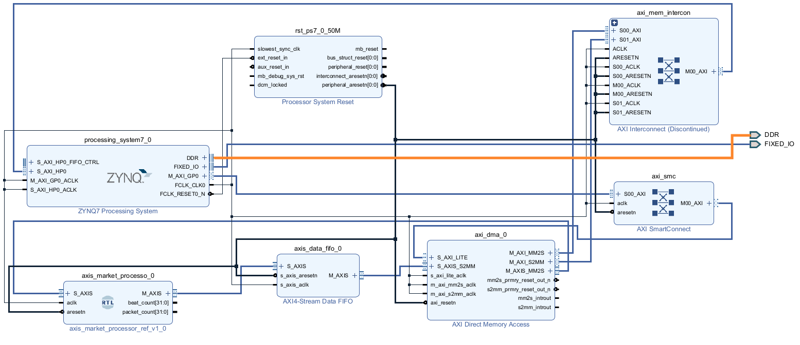
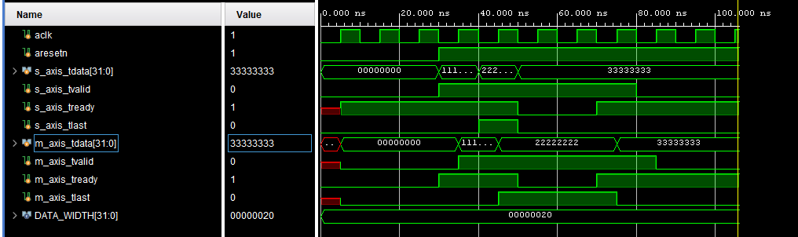

# Phase 3 — AXI DMA Communication and Programmable-Logic Integration

**Platform:** PYNQ-Z2, Zynq-7000  
**Tools:** Vivado, SystemVerilog, PYNQ Python, AXI DMA  
**Status:** AXI DMA loopback proven; AXI4-Stream pass-through RTL designed and behaviourally verified; hardware insertion of the custom RTL block remains  
**Last updated:** 24 July 2026

## 3.1 Phase objective

The purpose of Phase 3 is to establish a reliable communication path between the Processing System (PS) and Programmable Logic (PL) of the PYNQ-Z2. This is the point where the HFT pipeline moves beyond software-only UDP reception and begins transferring market-data packets into FPGA logic for hardware processing.

The target data path is: Laptop UDP sender -> PYNQ Ethernet PHY and PS Gigabit Ethernet MAC -> Linux UDP socket -> PS DDR transmit buffer -> AXI DMA MM2S channel
-> AXI4-Stream packet-processing RTL in the PL -> AXI DMA S2MM channel -> PS DDR receive buffer -> Python validation


The Ethernet interface on the PYNQ-Z2 is connected to the Zynq Processing System rather than directly to the Programmable Logic. Linux therefore receives the UDP packets first. The packet bytes must then be placed in a PS DDR buffer and transferred to the PL through AXI DMA.

Phase 3 is concerned with this PS-to-PL and PL-to-PS transfer. The custom market-data processing itself will be added after the communication path has been proven reliable.

## 3.2 AXI interfaces used in the design

The design uses more than one form of AXI. These interfaces have different jobs and should not be treated as interchangeable.

### 3.2.1 AXI4 memory-mapped

AXI4 memory-mapped communication addresses locations in a memory space. The AXI DMA uses memory-mapped transactions to read input data from PS DDR and write processed data back to PS DDR.

The DMA performs these transfers:

```text
MM2S: PS DDR memory → AXI DMA
S2MM: AXI DMA → PS DDR memory
```

The CPU does not manually drive the low-level AXI read and write handshakes. The AXI DMA IP and AXI interconnect generate those transactions after software gives the DMA a buffer address and transfer length.

### 3.2.2 AXI4-Lite

AXI4-Lite is used as a control interface. Python accesses the DMA control and status registers through the Processing System and the AXI-Lite connection.

Software uses this path to provide information such as:

- The physical address of the transmit buffer
- The physical address of the receive buffer
- The number of bytes to transfer
- Whether a channel should start
- DMA status and completion information

The Zynq PS `M_AXI_GP0` interface is suitable for this control path because the processor is the AXI master and the DMA register interface is the controlled AXI slave.

### 3.2.3 AXI4-Stream

AXI4-Stream transfers an ordered sequence of data words without providing a memory address for every word. It is the interface used between the DMA and the custom PL processing block.

For a 32-bit AXI4-Stream configuration, every accepted transfer carries one 32-bit word:

```text
MM2S M_AXIS → custom RTL S_AXIS
custom RTL M_AXIS → S2MM S_AXIS
```

The essential AXI4-Stream signals used by the current module are:

| Signal | Driven by | Purpose |
| --- | --- | --- |
| `TDATA` | Source | Carries the current data word |
| `TVALID` | Source | Indicates that `TDATA` contains a valid word |
| `TREADY` | Destination | Indicates that the destination can accept the word |
| `TLAST` | Source | Marks the final word of the current packet or DMA transfer |

An AXI4-Stream transfer occurs only on a rising clock edge where both of the following are high:

```systemverilog
tvalid && tready
```

`TVALID` and `TREADY` are independent. The source is allowed to assert `TVALID` before the destination asserts `TREADY`. If that happens, the source must keep `TDATA`, `TVALID`, `TLAST`, and any other sideband signals stable until the destination accepts the transfer.

## 3.3 Initial Vivado hardware platform

The first Vivado block design established a baseline DMA loopback before introducing custom RTL.

The design contained:

- ZYNQ7 Processing System
- AXI DMA
- AXI interconnect or SmartConnect infrastructure
- Processor System Reset infrastructure
- PS DDR connection
- AXI DMA MM2S and S2MM channels
- A direct AXI4-Stream loopback from MM2S to S2MM

The validated baseline stream path was: Python transmit array -> PS DDR -> AXI DMA MM2S -> Direct AXI4-Stream connection -> AXI DMA S2MM -> PS DDR -> Python receive array


The direct stream loopback deliberately contained no packet-processing RTL. Its only purpose was to prove that the Processing System, DDR memory, DMA channels, AXI interfaces, overlay metadata, and Python runtime could operate together.



*Figure 3.1: Block Diagram*
## 3.4 Bitstream and overlay generation

After validating the block design, Vivado generated the HDL wrapper and FPGA bitstream.

Two files are required by PYNQ:

| File | Purpose |
| --- | --- |
| `.bit` | Contains the FPGA configuration data loaded into the PL |
| `.hwh` | Describes the hardware design, IP names, register maps, addresses, interrupts, and other metadata used by PYNQ |

The `.bit` and `.hwh` files must describe the same Vivado build and should use the same base filename. Using an old `.hwh` file with a new bitstream can cause PYNQ to expose incorrect IP names or register addresses.

The generated wrapper was kept as SystemVerilog. The completed overlay exposed:

```text
axi_dma_0
processing_system7_0
```

This confirmed that PYNQ could identify the DMA and Processing System from the hardware metadata.

## 3.5 PYNQ runtime setup and troubleshooting

The initial overlay tests encountered several software-environment problems. These were runtime problems rather than failures in the AXI hardware design.

### 3.5.1 XRT device error

An early attempt produced:

```text
Could not open device index 0
```

This indicated that the Python/XRT environment was not successfully opening the programmable device. Kernel inspection later showed that the `zocl` DRM driver had initialized and that KDS clients were being created, confirming that the kernel-side FPGA runtime was present.

### 3.5.2 Missing Python dependency

Another attempt failed with:

```text
No module named pydantic
```

The PYNQ image contained a dedicated Python virtual environment with the required packages. The correct interpreter was:

```text
/usr/local/share/pynq-venv/bin/python3
```

The working execution form was therefore based on:

```bash
sudo -E /usr/local/share/pynq-venv/bin/python3 dma_loopback_test.py
```

Using the correct environment allowed the PYNQ overlay and DMA libraries to load consistently.

### 3.5.3 Meaning of the fix

The fact that changing the Python environment resolved the failure is important. It separates two possible classes of fault:

- A hardware fault, such as an invalid bitstream, incorrect address map, missing DMA connection, or clock/reset problem
- A software-environment fault, such as importing the wrong PYNQ installation or missing Python dependencies

The successful DMA transfer later confirmed that the underlying Vivado hardware platform was operational.

## 3.6 Baseline DMA loopback validation

The DMA loopback test allocated physically contiguous buffers in PS DDR, filled the transmit buffer, started the S2MM receive channel, and then started the MM2S transmit channel.

Starting S2MM first is useful because it ensures that the receiving side is prepared before MM2S begins producing stream data. AXI4-Stream backpressure should still prevent data loss if the receiver is temporarily unready, but enabling the receive path first simplifies initial testing.

A representative Python structure is:

```python
import numpy as np
from pynq import Overlay, allocate

overlay = Overlay("/path/to/dma_loopback.bit")
dma = overlay.axi_dma_0

tx_buffer = allocate(shape=(8,), dtype=np.uint32)
rx_buffer = allocate(shape=(8,), dtype=np.uint32)

tx_buffer[:] = [
    0x48465431,
    0x01010000,
    0x00000001,
    0x00000000,
    0x00000000,
    0x00000000,
    0x00000000,
    0x00000000,
]

rx_buffer[:] = 0

dma.recvchannel.transfer(rx_buffer)
dma.sendchannel.transfer(tx_buffer)

dma.sendchannel.wait()
dma.recvchannel.wait()

assert np.array_equal(tx_buffer, rx_buffer)

tx_buffer.freebuffer()
rx_buffer.freebuffer()
```

The eight 32-bit words occupy 32 bytes, matching the current HFT packet size. The first word:

```text
0x48465431
```

is the ASCII representation of the packet magic value `HFT1`.

The loopback test passed. This proved all of the following:

- Python could allocate DMA-compatible contiguous buffers
- The overlay could be loaded
- PYNQ could locate `axi_dma_0`
- MM2S could read the transmit buffer from PS DDR
- AXI4-Stream data could cross the PL
- S2MM could write the received stream to PS DDR
- Python could read back the received data
- The two DMA channels could complete without hanging

This was the first end-to-end proof of PS-to-PL-to-PS data movement.

## 3.7 Custom AXI4-Stream pass-through block

After validating the direct DMA loopback, a custom registered AXI4-Stream block was created. The block currently performs no market-data transformation. It stores each accepted word in a one-word output register and forwards it to S2MM.

This apparently simple block is important because it establishes the exact handshake structure that later packet-processing logic must preserve.

### 3.7.1 Module interface

```systemverilog
module axis_passthrough #(
    parameter DATA_WIDTH = 32
) (
    input  logic                  aclk,
    input  logic                  aresetn,

    input  logic [DATA_WIDTH-1:0] s_axis_tdata,
    input  logic                  s_axis_tvalid,
    output logic                  s_axis_tready,
    input  logic                  s_axis_tlast,

    output logic [DATA_WIDTH-1:0] m_axis_tdata,
    output logic                  m_axis_tvalid,
    input  logic                  m_axis_tready,
    output logic                  m_axis_tlast
);

    assign s_axis_tready = !m_axis_tvalid || m_axis_tready;

    always_ff @(posedge aclk) begin
        if (!aresetn) begin
            m_axis_tdata  <= '0;
            m_axis_tvalid <= 1'b0;
            m_axis_tlast  <= 1'b0;
        end else if (s_axis_tready) begin
            m_axis_tvalid <= s_axis_tvalid;

            if (s_axis_tvalid) begin
                m_axis_tdata <= s_axis_tdata;
                m_axis_tlast <= s_axis_tlast;
            end
        end
    end

endmodule
```

### 3.7.2 Direction of the two stream interfaces

The naming is from the perspective of the custom module:

```text
AXI DMA MM2S M_AXIS
        ↓
custom module S_AXIS
        ↓ internal register
custom module M_AXIS
        ↓
AXI DMA S2MM S_AXIS
```

The custom block is an AXI4-Stream slave on its input because it receives data from MM2S. It is an AXI4-Stream master on its output because it produces data for S2MM.

`S_AXIS` does not mean that the signals should be zero. It describes which side of the interface receives the stream. The receiving S2MM `S_AXIS` interface expects the custom block to assert `m_axis_tvalid` whenever the custom block has valid output data.

### 3.7.3 The output register

The module contains one logical storage location:

```text
m_axis_tdata
m_axis_tlast
m_axis_tvalid
```

`m_axis_tvalid` also acts as the occupancy flag:

```text
m_axis_tvalid = 0 → output register is empty
m_axis_tvalid = 1 → output register contains a valid word
```

The actual values of `m_axis_tdata` and `m_axis_tlast` do not matter while `m_axis_tvalid` is zero. AXI uses `TVALID` to distinguish meaningful data from stale register contents.

### 3.7.4 Ready-generation equation

The central combinational expression is:

```systemverilog
assign s_axis_tready = !m_axis_tvalid || m_axis_tready;
```

This can be read as:

```text
Input ready = output register empty OR current output being drained
```

The module can accept a new input word in either of two situations.

#### Situation A: the output register is empty

If:

```text
m_axis_tvalid = 0
```

then:

```text
s_axis_tready = 1
```

The module has free internal storage. It can accept one word from MM2S even if S2MM is not currently ready. The word will be held in the output register until S2MM eventually asserts `m_axis_tready`.

#### Situation B: the current output is being accepted

If:

```text
m_axis_tvalid = 1
m_axis_tready = 1
```

then the existing output word will be accepted by S2MM on the next rising edge. The custom module can simultaneously accept a new MM2S word and use it to replace the departing output word.

This simultaneous drain-and-replacement behaviour allows a sustained throughput of one 32-bit word per clock cycle.

#### Situation C: the output is stalled

If:

```text
m_axis_tvalid = 1
m_axis_tready = 0
```

then:

```text
s_axis_tready = 0
```

The output register is full and S2MM is not accepting it. The custom module must stop MM2S because accepting another input would overwrite the stalled output word.

The complete truth table is:

| `m_axis_tvalid` | `m_axis_tready` | Register condition | `s_axis_tready` |
| ---: | ---: | --- | ---: |
| 0 | 0 | Empty | 1 |
| 0 | 1 | Empty | 1 |
| 1 | 0 | Full and stalled | 0 |
| 1 | 1 | Full and being drained | 1 |

Using only:

```systemverilog
assign s_axis_tready = !m_axis_tvalid;
```

would prevent simultaneous drain and replacement. It would introduce an empty cycle between transfers and limit the stage to one word every two clocks. Including `m_axis_tready` avoids that unnecessary throughput loss.

### 3.7.5 Sequential register behaviour

The sequential block runs on the rising edge of `aclk`:

```systemverilog
always_ff @(posedge aclk)
```

The reset is active-low and synchronous. Bringing `aresetn` low does not immediately change the registers; the registers are cleared on the next rising edge:

```systemverilog
if (!aresetn) begin
    m_axis_tdata  <= '0;
    m_axis_tvalid <= 1'b0;
    m_axis_tlast  <= 1'b0;
end
```

Clearing `m_axis_tvalid` is the essential reset operation because it marks the output register as empty.

When `s_axis_tready` is high, the output register is allowed to change:

```systemverilog
else if (s_axis_tready)
```

If `s_axis_tvalid` is also high, an input handshake occurs and the module stores the incoming word:

```systemverilog
m_axis_tvalid <= s_axis_tvalid;

if (s_axis_tvalid) begin
    m_axis_tdata <= s_axis_tdata;
    m_axis_tlast <= s_axis_tlast;
end
```

If `s_axis_tvalid` is low while `s_axis_tready` is high, no replacement word is arriving. `m_axis_tvalid` is therefore cleared, marking the register empty after the previous word has left.

When `s_axis_tready` is low, the sequential block performs no assignments. Nonblocking-assignment semantics cause all output registers to retain their previous values. This is precisely the behaviour required during backpressure.

### 3.7.6 `TLAST` propagation

`TLAST` marks the final word in a DMA transfer. It must remain paired with the corresponding `TDATA` word.

The module therefore captures both signals in the same condition:

```systemverilog
if (s_axis_tvalid) begin
    m_axis_tdata <= s_axis_tdata;
    m_axis_tlast <= s_axis_tlast;
end
```

Because the block is registered, the output data and output `TLAST` appear one pipeline stage after the input handshake. If S2MM introduces backpressure, both remain stable together until the output handshake completes.

Failure to propagate `TLAST` can cause S2MM to wait indefinitely for the end of a transfer, which may cause a Python call such as `recvchannel.wait()` to hang.

### 3.7.7 `TKEEP` integration check

The current behavioural module uses complete 32-bit words, and the 32-byte HFT packet contains exactly eight such words. No partial final word is required.

When the RTL is inserted into the Vivado block design, the DMA interfaces must be inspected for `TKEEP`. If `TKEEP` is enabled, it must either:

- Be passed through the custom module alongside `TDATA` and `TLAST`, or
- Be tied to `4'b1111` for a 32-bit stream when every byte of every word is valid

A generic pass-through version would use:

```systemverilog
input  logic [(DATA_WIDTH/8)-1:0] s_axis_tkeep;
output logic [(DATA_WIDTH/8)-1:0] m_axis_tkeep;
```

and register `s_axis_tkeep` using the same enable condition as `TDATA` and `TLAST`.

## 3.8 Behavioural simulation

The pass-through module was tested in Vivado using a SystemVerilog behavioural testbench. The purpose of the simulation was not merely to show that data could pass through under ideal conditions. It specifically exercised the backpressure rule that protects a stalled output word from being overwritten.

### 3.8.1 Test sequence

The simulation performed the following tests:

1. Assert reset and verify that `m_axis_tvalid` clears.
2. Send `0x11111111` with the output ready and verify a normal transfer.
3. Send `0x22222222` while the previous word leaves, verifying simultaneous drain and replacement.
4. Deassert `m_axis_tready` while `0x22222222` is stored.
5. Attempt to send `0x33333333` during the stall.
6. Verify that `s_axis_tready` falls and that the stored output remains unchanged.
7. Reassert `m_axis_tready`.
8. Verify that `0x22222222` leaves and `0x33333333` replaces it.
9. Remove input valid and verify that the output register becomes empty.

### 3.8.2 Testbench

```systemverilog
`timescale 1ns / 1ps

module axis_passthrough_tb;

    localparam DATA_WIDTH = 32;

    logic                  aclk;
    logic                  aresetn;

    logic [DATA_WIDTH-1:0] s_axis_tdata;
    logic                  s_axis_tvalid;
    logic                  s_axis_tready;
    logic                  s_axis_tlast;

    logic [DATA_WIDTH-1:0] m_axis_tdata;
    logic                  m_axis_tvalid;
    logic                  m_axis_tready;
    logic                  m_axis_tlast;

    axis_passthrough #(
        .DATA_WIDTH(DATA_WIDTH)
    ) dut (
        .aclk          (aclk),
        .aresetn       (aresetn),

        .s_axis_tdata  (s_axis_tdata),
        .s_axis_tvalid (s_axis_tvalid),
        .s_axis_tready (s_axis_tready),
        .s_axis_tlast  (s_axis_tlast),

        .m_axis_tdata  (m_axis_tdata),
        .m_axis_tvalid (m_axis_tvalid),
        .m_axis_tready (m_axis_tready),
        .m_axis_tlast  (m_axis_tlast)
    );

    always #5 aclk = ~aclk;

    initial begin
        aclk          = 1'b0;
        aresetn       = 1'b0;

        s_axis_tdata  = '0;
        s_axis_tvalid = 1'b0;
        s_axis_tlast  = 1'b0;

        m_axis_tready = 1'b0;

        repeat (3) @(posedge aclk);
        #1;

        if (m_axis_tvalid !== 1'b0)
            $fatal(1, "RESET FAILED: m_axis_tvalid should be 0");

        @(negedge aclk);
        aresetn       = 1'b1;
        m_axis_tready = 1'b1;

        s_axis_tdata  = 32'h1111_1111;
        s_axis_tvalid = 1'b1;
        s_axis_tlast  = 1'b0;

        @(posedge aclk);
        #1;

        if (m_axis_tvalid !== 1'b1)
            $fatal(1, "NORMAL TRANSFER FAILED: output valid is not 1");

        if (m_axis_tdata !== 32'h1111_1111)
            $fatal(1, "NORMAL TRANSFER FAILED: incorrect output data");

        if (m_axis_tlast !== 1'b0)
            $fatal(1, "NORMAL TRANSFER FAILED: TLAST should be 0");

        @(negedge aclk);
        s_axis_tdata = 32'h2222_2222;
        s_axis_tlast = 1'b1;

        @(posedge aclk);
        #1;

        if (m_axis_tdata !== 32'h2222_2222)
            $fatal(1, "REPLACEMENT FAILED: second word not loaded");

        if (m_axis_tlast !== 1'b1)
            $fatal(1, "REPLACEMENT FAILED: TLAST not copied");

        // Backpressure begins.
        @(negedge aclk);
        m_axis_tready = 1'b0;
        s_axis_tdata  = 32'h3333_3333;
        s_axis_tlast  = 1'b0;

        #1;

        if (s_axis_tready !== 1'b0)
            $fatal(1, "BACKPRESSURE FAILED: input ready should be 0");

        repeat (2) begin
            @(posedge aclk);
            #1;

            if (m_axis_tdata !== 32'h2222_2222)
                $fatal(1, "BACKPRESSURE FAILED: output data changed");

            if (m_axis_tvalid !== 1'b1)
                $fatal(1, "BACKPRESSURE FAILED: output valid changed");

            if (m_axis_tlast !== 1'b1)
                $fatal(1, "BACKPRESSURE FAILED: TLAST changed");
        end

        // Backpressure ends.
        @(negedge aclk);
        m_axis_tready = 1'b1;

        @(posedge aclk);
        #1;

        if (m_axis_tdata !== 32'h3333_3333)
            $fatal(1, "DRAIN FAILED: waiting word not captured");

        if (m_axis_tvalid !== 1'b1)
            $fatal(1, "DRAIN FAILED: output should remain valid");

        @(negedge aclk);
        s_axis_tvalid = 1'b0;
        s_axis_tlast  = 1'b0;

        @(posedge aclk);
        #1;

        if (m_axis_tvalid !== 1'b0)
            $fatal(1, "FINISH FAILED: output valid should clear");

        $display("ALL AXI4-STREAM TESTS PASSED");

        #20;
        $finish;
    end

endmodule
```

### 3.8.3 Simulation result

The waveform showed the expected sequence:

```text
0x11111111 → normal transfer
0x22222222 → stored and then held during backpressure
0x33333333 → accepted after backpressure ended
```

The most important interval occurred at approximately 50–70 ns:

```text
m_axis_tready = 0
m_axis_tvalid = 1
s_axis_tready = 0
m_axis_tdata  = 0x22222222
m_axis_tlast  = 1
```

Throughout that interval, `m_axis_tdata`, `m_axis_tvalid`, and `m_axis_tlast` remained stable. This proved that the module did not overwrite the stalled output word.

When `m_axis_tready` returned high at approximately 70 ns:

- `s_axis_tready` also returned high
- S2MM accepted `0x22222222`
- The waiting `0x33333333` input replaced it on the next rising edge

The initial unknown values visible before reset took effect were normal simulation behaviour. The synchronous reset cleared the registers on an active clock edge.



*Figure 3.2: Behavioural simulation showing normal transfers, backpressure from 50–70 ns, and simultaneous drain and replacement.*

## 3.9 Hardware integration of the pass-through block

After the AXI4-Stream handshake logic passed behavioural simulation, the module was inserted into the physical Vivado block design.

The previous stream path was:

```text
AXI DMA MM2S -> AXI market processor -> AXI4-Stream Data FIFO -> AXI DMA S2MM
```

To test the new handshake block independently, the market-processing block was temporarily replaced by `axis_passthrough`.

The final Phase 3 hardware path became:

```text
PS DDR transmit buffer -> AXI DMA MM2S -> axis_passthrough -> AXI4-Stream Data FIFO -> AXI DMA S2MM -> PS DDR receive buffer
```

This arrangement preserved the AXI4-Stream Data FIFO already present in the design. The FIFO provides additional buffering between the custom RTL and the S2MM channel and can absorb short periods of downstream backpressure.

### 3.9.1 RTL wrapper

A Verilog wrapper was used to expose the SystemVerilog pass-through module to Vivado IP Integrator.

Vivado successfully recognised the wrapper as four generalized interfaces:

```text
S_AXIS
M_AXIS
aclk
aresetn
```

The wrapper does not implement the handshake itself. Its purpose is to:

- Instantiate the tested `axis_passthrough` module
- Expose the input as a grouped `S_AXIS` interface
- Expose the output as a grouped `M_AXIS` interface
- Associate both interfaces with `aclk`
- Associate the active-low reset with `aresetn`
- Allow the RTL block to connect cleanly to AXI DMA and AXI FIFO interfaces

The underlying handshake and storage behaviour remains inside `axis_passthrough.sv`.

### 3.9.2 Stream connections

The complete AXI4-Stream connection was:

```text
axi_dma_0/M_AXIS_MM2S -> axis_passthrough/S_AXIS -> axis_passthrough/M_AXIS -> axis_data_fifo_0/S_AXIS -> axis_data_fifo_0/M_AXIS -> axi_dma_0/S_AXIS_S2MM
```

The FIFO-to-S2MM connection was retained from the previous design.

### 3.9.3 Clock and reset

The AXI4-Stream pipeline operates from the Zynq Processing System fabric clock:

```text
processing_system7_0/FCLK_CLK0 = 50 MHz
```

The same clock domain is used by:

- AXI DMA MM2S stream interface
- `axis_passthrough`
- AXI4-Stream Data FIFO
- AXI DMA S2MM stream interface

The pass-through clock connection is:

```text
axis_passthrough/aclk -> processing_system7_0/FCLK_CLK0
```

The active-low reset is generated by the corresponding 50 MHz Processor System Reset block:

```text
rst_processing_system7_0_50M/peripheral_aresetn -> axis_passthrough/aresetn
```

Using the same clock and reset domain avoids the need for clock-domain-crossing logic inside the pass-through module.

At 50 MHz with a 32-bit stream and a maximum throughput of one word per clock, the theoretical raw stream capacity is:

```text
50,000,000 words/s × 32 bits/word = 1,600,000,000 bit/s = 1.6 Gbit/s
```

Each HFT record contains eight 32-bit words. The corresponding theoretical record capacity is:

```text
50,000,000 words/s ÷ 8 words/packet = 6,250,000 packets/s
```

These are ideal stream-interface limits and do not include DMA setup time, PS software overhead, DDR contention or network protocol overhead.

### 3.9.4 Vivado generation

After completing the connections, the block design was validated and its output products were regenerated.

Vivado generated out-of-context synthesis runs for:

```text
phase3_axi_design_axis_data_fifo_0_0_synth_1
phase3_axi_design_axis_passthrough_wra_0_0_synth_1
```

Temporary file-refresh warnings were reported:

```text
WARNING: [filemgmt 56-199]
Attempt to get parsing info during refresh
```

These warnings did not represent RTL compilation failures. Synthesis and implementation completed successfully, and both the new bitstream and hardware handoff file were produced.

The generated files were copied to the PYNQ using matching destination names:

```text
phase3_passthrough.bit
phase3_passthrough.hwh
```

They were stored under:

```text
/home/xilinx/PYNQ_HFT/phase3_passthrough/
```

Insert the final block-design screenshot using:

```markdown


*Figure 3.3: Final Phase 3 block design showing AXI DMA MM2S, the custom AXI4-Stream pass-through block, AXI4-Stream Data FIFO and AXI DMA S2MM.*
```

## 3.10 Single-packet hardware validation

The first hardware test transferred one 32-byte record through the complete physical FPGA path:

```text
Python transmit buffer -> PS DDR -> AXI DMA MM2S -> axis_passthrough -> AXI4-Stream Data FIFO -> AXI DMA S2MM -> PS DDR -> Python receive buffer
```

The overlay loaded successfully and exposed:

```text
['axi_dma_0', 'processing_system7_0']
```

The transmitted data was:

```text
TX[0] = 0x48465431
TX[1] = 0x01010000
TX[2] = 0x00000001
TX[3] = 0x00000002
TX[4] = 0x00000003
TX[5] = 0x00000004
TX[6] = 0x00000005
TX[7] = 0x00000006
```

The received data was:

```text
RX[0] = 0x48465431
RX[1] = 0x01010000
RX[2] = 0x00000001
RX[3] = 0x00000002
RX[4] = 0x00000003
RX[5] = 0x00000004
RX[6] = 0x00000005
RX[7] = 0x00000006
```

The test produced:

```text
DMA PASSTHROUGH TEST: PASS
```

Every received word matched its corresponding transmitted word.

This result proved that:

- The new FPGA overlay loaded correctly
- The `.bit` and `.hwh` files matched
- MM2S read the transmit buffer from PS DDR
- The custom pass-through accepted the AXI4-Stream data
- `TVALID` and `TREADY` operated correctly in hardware
- `TLAST` propagated through the pass-through block
- The AXI FIFO accepted and forwarded the stream
- S2MM detected the end of the transfer
- S2MM wrote the complete packet into the receive buffer
- The DMA channels completed without hanging
- No word was corrupted, dropped, duplicated or reordered

## 3.11 Repeated-transfer stress test

A repeated-transfer test was performed to verify that the DMA channels and AXI4-Stream pipeline could restart reliably.

The test performed:

```text
1,000 independent DMA transfers
```

Each transfer contained:

```text
8 words × 4 bytes/word = 32 bytes
```

A different deterministic data pattern was generated for every transfer. The receive buffer was filled with `0xDEADBEEF` before each transaction so that stale data would be immediately visible.

For every iteration, the software performed:

```text
Prepare transmit packet -> clear receive buffer -> start S2MM -> start MM2S -> wait for MM2S -> wait for S2MM -> compare every transmitted and received word
```

The result was:

```text
DMA STRESS TEST: PASS
Successful transfers: 1000
Total bytes:          32000
Elapsed time:         1.217123 s
Transfers per second: 821.61
```

The measured transaction rate was:

```text
1,000 transfers ÷ 1.217123 s = 821.61 transfers/s
```

No transfer failed, and no mismatch was detected.

This test exercised the following behaviour 1,000 times:

- DMA channel restart
- Buffer reuse
- MM2S transfer initialization
- S2MM transfer initialization
- `TLAST` generation and propagation
- AXI4-Stream handshake restart
- FIFO drain and refill
- Receive-buffer cache invalidation
- Exact data comparison

The measured 821.61 transfers/s is primarily a measurement of Python and DMA control overhead because each 32-byte packet was submitted as a separate DMA transaction. It is not the maximum throughput of the AXI4-Stream datapath.

## 3.12 Batched 20,000-packet/s validation

Submitting one DMA transaction for every 32-byte packet introduces unnecessary software overhead. To test a packet rate closer to the intended HFT operating rate, multiple logical packets were grouped into each DMA transfer.

The batch configuration was:

| Parameter | Value |
| --- | ---: |
| Target packet rate | 20,000 packets/s |
| Target duration | 10.0 s |
| Packet size | 32 bytes |
| Words per packet | 8 |
| Packets per DMA batch | 256 |
| Bytes per DMA batch | 8,192 bytes |
| Number of DMA batches | 781 |
| Planned packets | 199,936 |

The number of DMA transactions required per second was approximately:

```text
20,000 packets/s ÷ 256 packets/batch = 78.125 DMA batches/s
```

This is comfortably below the measured control rate of 821.61 independent DMA transactions/s.

### 3.12.1 Test operation

Each DMA batch contained 256 deterministic 32-byte records.

Every batch followed this sequence:

```text
Generate 256 transmit records -> initialize receive buffer -> start S2MM -> start MM2S -> transfer 8,192 bytes through the PL -> wait for both DMA channels -> compare transmit and receive buffers -> pace the next batch
```

The test used absolute timing deadlines instead of adding a fixed sleep after every transfer. This prevents timing errors from accumulating across the complete test.

### 3.12.2 Results

The test produced:

```text
20K PACKET-RATE TEST RESULTS
Packets completed:   199,936
Total bytes:         6,397,952
Elapsed time:        9.996933 s
Measured rate:       19,999.73 packets/s
Missed deadlines:    0
Result:              PASS
```

The measured packet rate was:

```text
199,936 packets ÷ 9.996933 s = 19,999.73 packets/s
```

The measured AXI payload rate was approximately:

```text
19,999.73 packets/s × 32 bytes/packet = 639,991 bytes/s ≈ 640 kB/s ≈ 5.12 Mbit/s
```

The result was only:

```text
0.27 packets/s
```

below the 20,000-packet/s target.

The percentage rate error was approximately:

```text
|20,000 - 19,999.73| ÷ 20,000 × 100 ≈ 0.00135%
```

No pacing deadline was missed:

```text
Missed deadlines: 0
```

All 6,397,952 transferred bytes were compared against the transmit buffer. No mismatch was detected.

### 3.12.3 Result summary

| Metric | Result |
| --- | ---: |
| Planned packets | 199,936 |
| Completed packets | 199,936 |
| Packet loss | 0 |
| Corrupted packets | 0 |
| DMA batches | 781 |
| Batch size | 256 packets |
| Total payload | 6,397,952 bytes |
| Elapsed time | 9.996933 s |
| Measured packet rate | 19,999.73 packets/s |
| Target packet rate | 20,000 packets/s |
| Rate error | Approximately 0.00135% |
| Missed deadlines | 0 |
| Final result | PASS |

### 3.12.4 Interpretation of the result

The 20,000-packet/s result represents logical 32-byte HFT records carried inside batched DMA transfers.

It does not represent 20,000 individual DMA control operations per second. The software issued approximately 78 DMA batches per second, with each batch containing 256 logical packets.

This distinction is important:

```text
One packet per DMA transfer -> approximately 821 packets/s -> performance dominated by Python and DMA setup overhead
```

```text
256 packets per DMA transfer -> approximately 20,000 packets/s -> DMA setup cost distributed across the complete batch
```

Batching is therefore the appropriate architecture for moving market-data records from PS DDR into the PL.

### 3.12.5 `TLAST` behaviour with batching

MM2S asserts `TLAST` at the end of the complete DMA transfer. With 256 packets in an 8,192-byte batch, `TLAST` is asserted after the final word of the final packet in that batch.

It is not asserted after every 32-byte logical record.

Therefore, the future packet processor should not rely exclusively on DMA `TLAST` to identify individual HFT packet boundaries. The current packet format has a fixed length of eight 32-bit words, so the hardware parser can maintain a word counter:

```text
Word 0 -> packet header and magic
Word 1 -> packet fields
Word 2 -> packet fields
Word 3 -> packet fields
Word 4 -> packet fields
Word 5 -> packet fields
Word 6 -> packet fields
Word 7 -> final word of the logical HFT packet
```

After word 7, the packet counter returns to zero and parsing begins for the next logical record.

`TLAST` remains useful for identifying the end of the complete DMA batch.

## 3.13 Performance comparison

| Test | Packets per DMA transaction | DMA transactions | Packets transferred | Duration | Measured rate | Result |
| --- | ---: | ---: | ---: | ---: | ---: | --- |
| Single-packet functional test | 1 | 1 | 1 | Not measured | Not measured | PASS |
| Repeated-transfer stress test | 1 | 1,000 | 1,000 | 1.217123 s | 821.61 packets/s | PASS |
| Batched rate test | 256 | 781 | 199,936 | 9.996933 s | 19,999.73 packets/s | PASS |

The comparison demonstrates that the AXI datapath was not responsible for the lower single-packet transaction rate. The lower result came from repeatedly programming and starting the DMA through Python.

Increasing the number of records per DMA transaction reduced the frequency of software control operations and allowed the same hardware path to sustain the 20,000-packet/s target.

## 3.14 Final Phase 3 architecture

The completed Phase 3 communication path is:

```text
Laptop UDP sender -> PYNQ PS Gigabit Ethernet MAC -> Linux UDP socket -> PS software buffer -> DMA-compatible PS DDR batch -> AXI DMA MM2S -> axis_passthrough -> AXI4-Stream Data FIFO -> AXI DMA S2MM -> PS DDR receive buffer -> Python validation
```

The hardware subsection validated during Phase 3 is:

```text
PS DDR -> AXI DMA MM2S -> axis_passthrough -> AXI4-Stream Data FIFO -> AXI DMA S2MM -> PS DDR
```

The pass-through block can now be replaced or extended with HFT packet-processing logic while preserving the verified DMA and FIFO infrastructure.

## 3.15 Phase 3 completion status

### 3.15.1 Completed requirements

| Requirement | Status |
| --- | --- |
| Configure Zynq Processing System | Complete |
| Configure AXI DMA MM2S and S2MM | Complete |
| Establish PS DDR access | Complete |
| Establish AXI-Lite DMA control | Complete |
| Establish AXI4 memory-mapped data paths | Complete |
| Generate matching `.bit` and `.hwh` files | Complete |
| Resolve PYNQ runtime environment | Complete |
| Verify direct DMA loopback | Passed |
| Implement registered AXI4-Stream block | Complete |
| Implement `TVALID`/`TREADY` handshake | Complete |
| Implement backpressure protection | Complete |
| Propagate `TLAST` | Complete |
| Verify handshake in behavioural simulation | Passed |
| Insert custom RTL into Vivado block design | Complete |
| Preserve AXI4-Stream FIFO | Complete |
| Run custom RTL in physical FPGA hardware | Passed |
| Verify one 32-byte record | Passed |
| Verify 1,000 independent DMA transfers | Passed |
| Verify 20,000-packet/s batched rate | Passed |
| Verify data integrity across all rate-test batches | Passed |
| Verify zero missed pacing deadlines | Passed |

### 3.15.2 Optional remaining work

The functional objectives of Phase 3 are complete. The following tasks are optional additions rather than blockers:

- Add an Integrated Logic Analyzer to capture hardware `TVALID`, `TREADY`, `TDATA` and `TLAST`
- Test additional DMA batch sizes
- Test non-multiple packet transfer lengths
- Record post-implementation timing slack
- Record LUT, flip-flop and BRAM utilization
- Add the final Vivado block-design screenshot
- Add an optional ILA waveform screenshot

### 3.15.3 Phase conclusion

Phase 3 successfully established and validated bidirectional communication between PS DDR and custom PL logic using AXI DMA.

The design sustained:

```text
19,999.73 logical HFT packets/s
```

for approximately ten seconds, with:

```text
0 corrupted packets
0 lost packets
0 missed deadlines
```

The successful tests confirm that the AXI DMA, custom handshake RTL, AXI4-Stream FIFO, PS DDR buffers and PYNQ software can operate together as a stable packet-transfer pipeline.

The next phase can now replace the pass-through operation with an eight-word HFT packet parser and hardware market-data processing logic.
