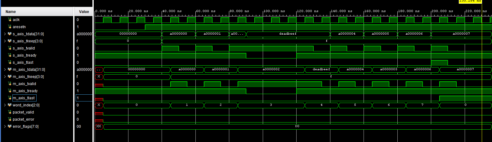
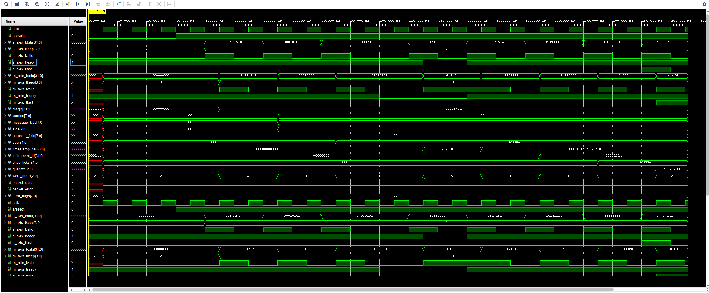
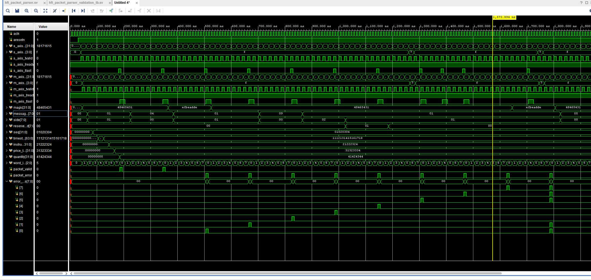
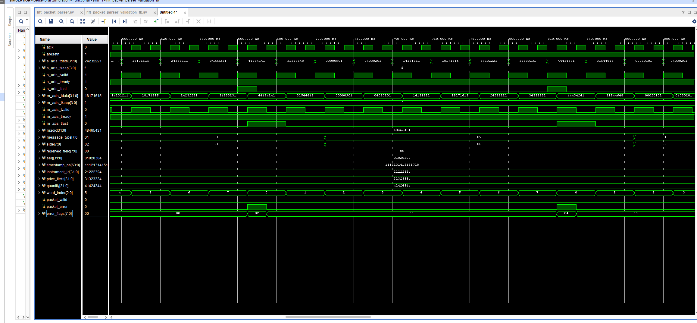
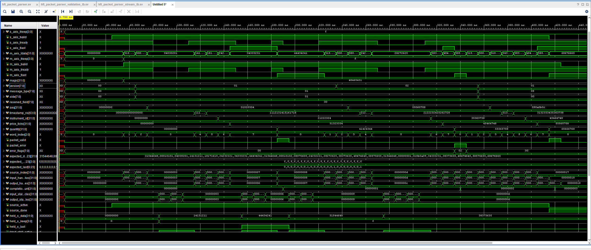
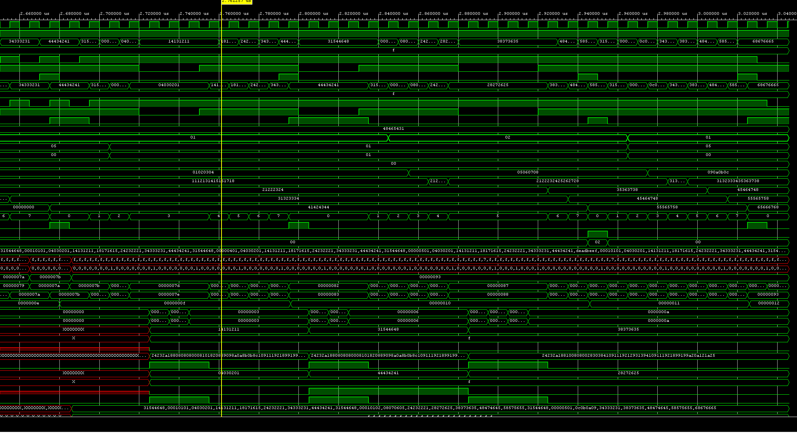

# Phase 4 — FPGA HFT1 Packet Parser

**Platform:** PYNQ-Z2, Zynq-7000  
**Tools:** Vivado, SystemVerilog, PYNQ Python, AXI DMA  
**Packet format:** `!4sBBBBIQIII`  
**Phase 4.1 status:** Complete  
**Last updated:** 25 July 2026

## 4.1 AXI Byte-Order Characterisation

### 4.1.1 Objective

Phase 3 established the following byte-exact communication path:

```text
PS DDR -> AXI DMA MM2S -> AXI4-Stream pass-through -> AXI DMA S2MM -> PS DDR
```

Before implementing the HFT1 packet parser, the precise relationship between
the network-order packet bytes in memory and the byte lanes of the 32-bit
AXI4-Stream interface had to be established.

Phase 4.1 therefore verifies:

- the HFT1 packet remains exactly 32 bytes;
- the packet is transferred as eight 32-bit AXI beats;
- the original network-order byte sequence is preserved through DMA;
- the position of each packet byte within `TDATA[31:0]`;
- the byte reordering required before the FPGA interprets multibyte fields.

No parser RTL is inserted during this test. The already verified Phase 3
pass-through overlay is used so that only the byte representation is being
tested.

### 4.1.2 Current system path

```text
Laptop UDP sender
-> PYNQ Linux UDP socket
-> PS DDR buffer
-> AXI DMA MM2S
-> Phase 3 AXI4-Stream pass-through
-> AXI DMA S2MM
-> PS DDR verification buffer
```

Linux removes the Ethernet, IPv4 and UDP headers before the data is placed in
the application receive buffer. Consequently, the programmable logic receives
the 32-byte HFT1 UDP payload rather than a complete Ethernet frame.

Phase 4 will therefore implement an HFT1 application-packet parser. It will not
parse Ethernet, IPv4 or UDP headers.

### 4.1.3 HFT1 packet definition

The packet is generated in Python using:

```python
PACKET_STRUCT = struct.Struct("!4sBBBBIQIII")
```

The `!` character selects network byte order, which is big-endian. The complete
packet layout is:

| Offset | Size | Format | Field |
|---:|---:|---:|---|
| 0 | 4 bytes | `4s` | Magic: `HFT1` |
| 4 | 1 byte | `B` | Version |
| 5 | 1 byte | `B` | Message type |
| 6 | 1 byte | `B` | Side |
| 7 | 1 byte | `B` | Reserved |
| 8 | 4 bytes | `I` | Sequence number |
| 12 | 8 bytes | `Q` | Timestamp in nanoseconds |
| 20 | 4 bytes | `I` | Instrument ID |
| 24 | 4 bytes | `I` | Price in ticks |
| 28 | 4 bytes | `I` | Quantity |

Total packet size:

```text
4 + 1 + 1 + 1 + 1 + 4 + 8 + 4 + 4 + 4 = 32 bytes
```

On a 32-bit AXI4-Stream interface:

```text
32 bytes / 4 bytes per beat = 8 AXI beats
```

### 4.1.4 Recognisable test packet

The test uses values with distinct bytes so that any byte-order reversal can be
identified immediately:

| Field | Test value |
|---|---:|
| Magic | `HFT1` |
| Version | `1` |
| Message type | `1` |
| Side | `1` |
| Reserved | `0` |
| Sequence | `0x01020304` |
| Timestamp | `0x1112131415161718` |
| Instrument ID | `0x21222324` |
| Price ticks | `0x31323334` |
| Quantity | `0x41424344` |

The corresponding packet byte sequence is:

```text
48 46 54 31 01 01 01 00
01 02 03 04 11 12 13 14
15 16 17 18 21 22 23 24
31 32 33 34 41 42 43 44
```

### 4.1.5 AXI byte-lane behaviour

AXI DMA reads bytes from increasing memory addresses and places them onto
increasing AXI byte lanes:

| Memory order | AXI byte lane |
|---|---|
| First byte | `TDATA[7:0]` |
| Second byte | `TDATA[15:8]` |
| Third byte | `TDATA[23:16]` |
| Fourth byte | `TDATA[31:24]` |

For example, the network-order sequence number `0x01020304` is stored as:

```text
Memory byte order: 01 02 03 04
```

The AXI byte-lane mapping is:

```text
TDATA[7:0]   = 0x01
TDATA[15:8]  = 0x02
TDATA[23:16] = 0x03
TDATA[31:24] = 0x04
```

When the complete vector is displayed from `TDATA[31]` down to `TDATA[0]`, it
appears as:

```text
TDATA[31:0] = 0x04030201
```

The bytes have not been corrupted or transmitted in the wrong order. The first
packet byte occupies the least-significant AXI byte lane, which makes the
32-bit hexadecimal value appear reversed.

All four bytes in one AXI beat are transferred simultaneously. It is therefore
more accurate to say:

> The lowest-addressed packet byte is mapped to the lowest AXI byte lane.

It is not a serial transfer in which the four byte lanes arrive at different
times.

### 4.1.6 Test program

The test program is stored on the PYNQ-Z2 as:

```text
/home/xilinx/PYNQ_HFT/phase4_packet_parser/phase4_1_axi_byte_order_test.py
```

Complete program:

```python
#!/usr/bin/env python3

import struct

import numpy as np
from pynq import Overlay, allocate


BITSTREAM_PATH = (
    "/home/xilinx/PYNQ_HFT/"
    "phase3_passthrough/phase3_passthrough.bit"
)

PACKET_STRUCT = struct.Struct("!4sBBBBIQIII")
PACKET_SIZE = PACKET_STRUCT.size


def print_packet_mapping(packet):
    print("\nPacket byte mapping")
    print("-------------------")

    for beat in range(8):
        start = beat * 4
        beat_bytes = packet[start:start + 4]

        network_word = int.from_bytes(beat_bytes, byteorder="big")
        expected_tdata = int.from_bytes(beat_bytes, byteorder="little")

        byte_string = " ".join(
            f"{value:02X}" for value in beat_bytes
        )

        tlast = 1 if beat == 7 else 0

        print(
            f"Beat {beat}: "
            f"bytes={byte_string}  "
            f"network_word=0x{network_word:08X}  "
            f"expected_TDATA=0x{expected_tdata:08X}  "
            f"TLAST={tlast}"
        )


def main():
    print("Phase 4.1 — AXI byte-order test")
    print(f"Packet size: {PACKET_SIZE} bytes")

    packet = PACKET_STRUCT.pack(
        b"HFT1",
        1,
        1,
        1,
        0,
        0x01020304,
        0x1112131415161718,
        0x21222324,
        0x31323334,
        0x41424344
    )

    assert len(packet) == 32

    print_packet_mapping(packet)

    print("\nLoading Phase 3 pass-through overlay...")
    overlay = Overlay(BITSTREAM_PATH)

    print(f"Available IP: {list(overlay.ip_dict.keys())}")

    dma = overlay.axi_dma_0

    tx_buffer = allocate(
        shape=(PACKET_SIZE,),
        dtype=np.uint8
    )

    rx_buffer = allocate(
        shape=(PACKET_SIZE,),
        dtype=np.uint8
    )

    try:
        tx_buffer[:] = np.frombuffer(
            packet,
            dtype=np.uint8
        )

        rx_buffer[:] = 0

        tx_buffer.flush()

        print("\nStarting DMA transfer...")

        dma.recvchannel.transfer(rx_buffer)
        dma.sendchannel.transfer(tx_buffer)

        dma.sendchannel.wait()
        dma.recvchannel.wait()

        rx_buffer.invalidate()

        received = rx_buffer.tobytes()

        print("\nTransmitted bytes")
        print("-----------------")
        print(packet.hex(" "))

        print("\nReceived bytes")
        print("--------------")
        print(received.hex(" "))

        if received == packet:
            print("\nDMA byte comparison: PASS")
        else:
            print("\nDMA byte comparison: FAIL")

            for index, (expected, actual) in enumerate(
                zip(packet, received)
            ):
                if expected != actual:
                    print(
                        f"Byte {index}: "
                        f"expected=0x{expected:02X}, "
                        f"received=0x{actual:02X}"
                    )

        print("\nReceived AXI-word interpretation")
        print("--------------------------------")

        for beat in range(8):
            start = beat * 4
            beat_bytes = received[start:start + 4]

            axis_word = int.from_bytes(
                beat_bytes,
                byteorder="little"
            )

            print(
                f"Beat {beat}: "
                f"TDATA=0x{axis_word:08X}"
            )

    finally:
        tx_buffer.freebuffer()
        rx_buffer.freebuffer()


if __name__ == "__main__":
    main()
```

### 4.1.7 Code explanation

#### Imports

```python
import struct
import numpy as np
from pynq import Overlay, allocate
```

- `struct` creates the exact binary HFT1 packet.
- `numpy` represents the packet as a byte array.
- `Overlay` programs the FPGA with the existing Phase 3 bitstream.
- `allocate` creates physically contiguous buffers suitable for AXI DMA.

#### Packet structure

```python
PACKET_STRUCT = struct.Struct("!4sBBBBIQIII")
PACKET_SIZE = PACKET_STRUCT.size
```

The structure is declared once and reports a size of exactly 32 bytes. The `!`
ensures all multibyte integers use big-endian network byte order.

#### Mapping function

```python
network_word = int.from_bytes(beat_bytes, byteorder="big")
expected_tdata = int.from_bytes(beat_bytes, byteorder="little")
```

`network_word` shows how the four bytes represent a protocol field in
big-endian order. `expected_tdata` shows how the same four bytes appear when
mapped onto the 32-bit AXI byte lanes.

This function does not change the packet. It only prints the two
interpretations.

#### Packet generation

```python
packet = PACKET_STRUCT.pack(...)
```

`pack()` converts the chosen field values into one immutable 32-byte sequence.
The assertion immediately checks that the protocol definition has not changed:

```python
assert len(packet) == 32
```

#### Overlay and DMA access

```python
overlay = Overlay(BITSTREAM_PATH)
dma = overlay.axi_dma_0
```

The Phase 3 pass-through overlay is loaded, and the AXI DMA instance is
retrieved from it. No Phase 4 RTL is required for this characterisation test.

#### DMA buffers

```python
tx_buffer = allocate(shape=(PACKET_SIZE,), dtype=np.uint8)
rx_buffer = allocate(shape=(PACKET_SIZE,), dtype=np.uint8)
```

Each buffer contains 32 individual bytes. Using `np.uint8` is important because
it preserves the exact byte sequence produced by `struct.pack()` without
introducing an additional host-side 32-bit integer interpretation.

#### Buffer preparation

```python
tx_buffer[:] = np.frombuffer(packet, dtype=np.uint8)
rx_buffer[:] = 0
tx_buffer.flush()
```

The network-order packet bytes are copied directly into the transmit buffer.
The receive buffer is cleared so that stale data cannot accidentally look like
a successful transfer. `flush()` ensures the DMA engine sees the current
transmit-buffer contents.

#### DMA transfer order

```python
dma.recvchannel.transfer(rx_buffer)
dma.sendchannel.transfer(tx_buffer)
```

S2MM is started before MM2S. This ensures the receive side is ready before the
first AXI4-Stream beat is produced, preventing the pipeline from waiting on an
unprepared destination.

The script then waits for both channels:

```python
dma.sendchannel.wait()
dma.recvchannel.wait()
```

#### Receive-buffer synchronisation

```python
rx_buffer.invalidate()
received = rx_buffer.tobytes()
```

`invalidate()` ensures the processor reads the data written by DMA rather than
an older cached copy. `tobytes()` converts the receive buffer back into a
standard Python byte string.

#### Byte-exact comparison

```python
if received == packet:
    print("\nDMA byte comparison: PASS")
```

This compares all 32 transmitted and received bytes. If a mismatch occurs, the
script reports the index, expected byte and received byte for every incorrect
position.

#### AXI-word interpretation

```python
axis_word = int.from_bytes(beat_bytes, byteorder="little")
```

The receive data is divided into eight four-byte groups. Each group is
interpreted according to the AXI byte-lane mapping so that the expected
`TDATA[31:0]` value can be printed.

#### Buffer cleanup

```python
finally:
    tx_buffer.freebuffer()
    rx_buffer.freebuffer()
```

The physically contiguous DMA buffers are released even if the test encounters
an exception.

### 4.1.8 Running the test

Create the Phase 4 directory:

```bash
mkdir -p /home/xilinx/PYNQ_HFT/phase4_packet_parser
```

Run the test with the PYNQ virtual environment:

```bash
sudo -E /usr/local/share/pynq-venv/bin/python3 \
    /home/xilinx/PYNQ_HFT/phase4_packet_parser/phase4_1_axi_byte_order_test.py
```

### 4.1.9 Captured terminal output

```text
Packet size: 32 bytes

Packet byte mapping
-------------------
Beat 0: bytes=48 46 54 31  network_word=0x48465431  expected_TDATA=0x31544648  TLAST=0
Beat 1: bytes=01 01 01 00  network_word=0x01010100  expected_TDATA=0x00010101  TLAST=0
Beat 2: bytes=01 02 03 04  network_word=0x01020304  expected_TDATA=0x04030201  TLAST=0
Beat 3: bytes=11 12 13 14  network_word=0x11121314  expected_TDATA=0x14131211  TLAST=0
Beat 4: bytes=15 16 17 18  network_word=0x15161718  expected_TDATA=0x18171615  TLAST=0
Beat 5: bytes=21 22 23 24  network_word=0x21222324  expected_TDATA=0x24232221  TLAST=0
Beat 6: bytes=31 32 33 34  network_word=0x31323334  expected_TDATA=0x34333231  TLAST=0
Beat 7: bytes=41 42 43 44  network_word=0x41424344  expected_TDATA=0x44434241  TLAST=1

Loading Phase 3 pass-through overlay...
Available IP: ['axi_dma_0', 'processing_system7_0']

Starting DMA transfer...

Transmitted bytes
-----------------
48 46 54 31 01 01 01 00 01 02 03 04 11 12 13 14 15 16 17 18 21 22 23 24 31 32 33 34 41 42 43 44

Received bytes
--------------
48 46 54 31 01 01 01 00 01 02 03 04 11 12 13 14 15 16 17 18 21 22 23 24 31 32 33 34 41 42 43 44

DMA byte comparison: PASS

Received AXI-word interpretation
--------------------------------
Beat 0: TDATA=0x31544648
Beat 1: TDATA=0x00010101
Beat 2: TDATA=0x04030201
Beat 3: TDATA=0x14131211
Beat 4: TDATA=0x18171615
Beat 5: TDATA=0x24232221
Beat 6: TDATA=0x34333231
Beat 7: TDATA=0x44434241
```

### 4.1.10 Results

| Beat | Network-order bytes | Network word | AXI `TDATA` | Field |
|---:|---|---:|---:|---|
| 0 | `48 46 54 31` | `0x48465431` | `0x31544648` | Magic |
| 1 | `01 01 01 00` | `0x01010100` | `0x00010101` | Version, type, side, reserved |
| 2 | `01 02 03 04` | `0x01020304` | `0x04030201` | Sequence |
| 3 | `11 12 13 14` | `0x11121314` | `0x14131211` | Timestamp upper |
| 4 | `15 16 17 18` | `0x15161718` | `0x18171615` | Timestamp lower |
| 5 | `21 22 23 24` | `0x21222324` | `0x24232221` | Instrument ID |
| 6 | `31 32 33 34` | `0x31323334` | `0x34333231` | Price ticks |
| 7 | `41 42 43 44` | `0x41424344` | `0x44434241` | Quantity |

The transmitted and received byte arrays are identical. The DMA loopback
therefore preserves the complete 32-byte network-order packet.

### 4.1.11 FPGA parser requirement

The FPGA parser must convert each AXI word back into its network-order numeric
representation before interpreting multibyte fields.

The required SystemVerilog byte-swap function is:

```systemverilog
function automatic logic [31:0] byte_swap32 (
    input logic [31:0] data
);
    byte_swap32 = {
        data[7:0],
        data[15:8],
        data[23:16],
        data[31:24]
    };
endfunction
```

Examples:

```text
byte_swap32(0x31544648) = 0x48465431
byte_swap32(0x04030201) = 0x01020304
byte_swap32(0x14131211) = 0x11121314
```

After swapping beat 1:

```text
network_word = 0x01010100
```

The four single-byte fields can be extracted as:

```systemverilog
version      <= network_word[31:24];
message_type <= network_word[23:16];
side         <= network_word[15:8];
reserved     <= network_word[7:0];
```

The 64-bit timestamp will be reconstructed from the swapped forms of beats 3
and 4:

```systemverilog
timestamp_ns <= {
    timestamp_upper_word,
    timestamp_lower_word
};
```

### 4.1.12 `TLAST` limitation of this test

The `TLAST` values printed in the packet mapping are the values expected for a
32-byte DMA transfer:

```text
Beats 0-6: TLAST = 0
Beat 7:    TLAST = 1
```

The Python test does not directly capture the internal AXI4-Stream `TLAST`
signal. Actual `TLAST` timing will be verified in the Phase 4 parser
testbench and, if required, using an Integrated Logic Analyzer in the hardware
design.

### 4.1.13 Completion criteria

Phase 4.1 is complete because:

- `struct.Struct("!4sBBBBIQIII")` produced exactly 32 bytes;
- the packet divided cleanly into eight 32-bit beats;
- the expected AXI byte-lane mapping was established;
- all eight resulting `TDATA` values were recorded;
- the transmitted and received buffers matched byte-for-byte;
- the required FPGA byte-swap operation was defined;
- no additional host-side byte conversion is required.

The Python sender must continue transmitting the original network-order packet
bytes. Byte-lane reordering will be handled inside the FPGA parser.

## 4.2 Parser Interface and AXI4-Stream Forwarding

### 4.2.1 Objective

Phase 4.2 created the complete parser interface while preserving the
backpressure-safe AXI4-Stream forwarding behaviour verified during Phase 3.

The source file is:

```text
hft_packet_parser.sv
```

At this stage the module did not yet interpret packet fields. It provided a
stable interface onto which the counter, extraction and validation logic could
be added incrementally.

### 4.2.2 AXI4-Stream input and output interfaces

The input interface from AXI DMA MM2S is:

| Signal | Width | Direction | Purpose |
|---|---:|---|---|
| `s_axis_tdata` | 32 | Input | Four packet bytes |
| `s_axis_tkeep` | 4 | Input | Identifies valid byte lanes |
| `s_axis_tvalid` | 1 | Input | Upstream has a valid beat |
| `s_axis_tready` | 1 | Output | Parser can accept the beat |
| `s_axis_tlast` | 1 | Input | Marks the end of the DMA frame |

The forwarded interface to the AXI FIFO or AXI DMA S2MM is:

| Signal | Width | Direction | Purpose |
|---|---:|---|---|
| `m_axis_tdata` | 32 | Output | Unmodified packet bytes |
| `m_axis_tkeep` | 4 | Output | Forwarded byte-valid mask |
| `m_axis_tvalid` | 1 | Output | Registered output beat is valid |
| `m_axis_tready` | 1 | Input | Downstream can accept the beat |
| `m_axis_tlast` | 1 | Output | Forwarded end-of-frame marker |

The decoded-field interface exposes:

```text
magic
version
message_type
side
reserved_field
seq
timestamp_ns
instrument_id
price_ticks
quantity
word_index
packet_valid
packet_error
error_flags
```

`seq` is used instead of `sequence` because `sequence` is a reserved
SystemVerilog Assertions keyword.

### 4.2.3 One-beat elastic register

The forwarding path contains one registered output slot. Input readiness is:

```systemverilog
always_comb begin
    s_axis_tready = !m_axis_tvalid || m_axis_tready;
end
```

The parser accepts an input beat when either:

- the output slot is empty; or
- the current output beat is being consumed during the same clock cycle.

The resulting behaviour is:

| Output register | `m_axis_tready` | `s_axis_tready` | Behaviour |
|---|---:|---:|---|
| Empty | 0 or 1 | 1 | Accept one input beat |
| Occupied | 1 | 1 | Consume and replace the beat |
| Occupied | 0 | 0 | Hold the output and backpressure MM2S |

The registered forwarding logic is:

```systemverilog
if (s_axis_tready) begin
    m_axis_tvalid <= s_axis_tvalid;

    if (s_axis_tvalid) begin
        m_axis_tdata <= s_axis_tdata;
        m_axis_tkeep <= s_axis_tkeep;
        m_axis_tlast <= s_axis_tlast;
    end
end
```

When `m_axis_tvalid=1` and `m_axis_tready=0`, `s_axis_tready` becomes zero.
Because the forwarding registers are not updated in that condition, `TDATA`,
`TKEEP` and `TLAST` remain stable for the complete stall.

This design can sustain one accepted 32-bit beat per clock when both sides
remain ready.

### 4.2.4 Phase 4.2 result

Phase 4.2 is complete because:

- the full parser interface was accepted by Vivado;
- `TDATA`, `TKEEP` and `TLAST` are forwarded unchanged;
- the output remains stable during downstream backpressure;
- the design can consume and replace an output beat in the same cycle;
- all decoded and status outputs receive defined reset values.

## 4.3 Fixed-Length Packet Framing

### 4.3.1 AXI transfer event

Parser state may change only after an actual AXI handshake:

```systemverilog
logic axis_fire;

assign axis_fire = s_axis_tvalid && s_axis_tready;
```

`TVALID` without `TREADY` does not transfer data. Using `axis_fire` therefore
prevents the parser from counting or decoding the same stalled beat multiple
times.

### 4.3.2 Eight-beat counter

A three-bit `word_index` identifies the current word of the fixed 32-byte
packet:

| `word_index` | Packet bytes | Field |
|---:|---:|---|
| 0 | 0–3 | Magic |
| 1 | 4–7 | Version, message type, side and reserved |
| 2 | 8–11 | Sequence number |
| 3 | 12–15 | Timestamp upper 32 bits |
| 4 | 16–19 | Timestamp lower 32 bits |
| 5 | 20–23 | Instrument ID |
| 6 | 24–27 | Price ticks |
| 7 | 28–31 | Quantity |

The counter resets to zero and advances only on `axis_fire`:

```systemverilog
if (axis_fire) begin
    if (word_index == 3'd7)
        word_index <= 3'd0;
    else
        word_index <= word_index + 3'd1;
end
```

The index visible before an active clock edge identifies the beat being
accepted on that edge. After acceptance, it advances to the index of the next
expected beat.

### 4.3.3 Framing rule

The parser treats every eight accepted 32-bit beats as one HFT1 packet:

```text
8 beats * 32 bits = 256 bits = 32 bytes
```

`TLAST` does not control the counter. This prevents malformed `TLAST` metadata
from shifting the field interpretation of every following word. Instead,
Phase 4.5 will check that:

```text
Beats 0–6: TLAST must be 0
Beat 7:    TLAST must be 1
```

### 4.3.4 Counter and backpressure test

The Phase 4.3 testbench sends eight words through the parser and introduces a
three-cycle downstream stall. The central test sequence is:

```text
word_index: 0 -> 1 -> 2 -> 3
                         -> hold during the stall
                         -> 4 -> 5 -> 6 -> 7 -> 0
```

During the tested stall:

```text
m_axis_tready = 0
s_axis_tready = 0
word_index    = 3
m_axis_tdata  = 0xA0000002
```

The registered output word remains stable, and the counter does not advance
until downstream readiness returns.

### 4.3.5 Simulation result

The testbench completed with:

```text
Phase 4.3 counter and backpressure test: PASS
```



The waveform must clearly show:

- `word_index` holding at `3`;
- `s_axis_tready` low during the stall;
- `m_axis_tdata` remaining stable;
- the counter continuing after the stall;
- the final transition from `7` back to `0`.

### 4.3.6 Phase 4.3 result

Phase 4.3 is complete because:

- the counter resets to zero;
- only accepted beats advance the counter;
- backpressure freezes packet position;
- eight accepted beats wrap the index back to zero;
- packet framing remains independent of malformed `TLAST`.

## 4.4 HFT1 Field Extraction

### 4.4.1 Objective

Phase 4.4 uses `word_index` to decode the fixed HFT1 packet while continuing to
forward the original AXI stream unchanged.

Field registers update only inside:

```systemverilog
if (axis_fire) begin
    // Field extraction
end
```

Consequently, gaps in `TVALID` and stalls in `TREADY` cannot cause a field to
be skipped or captured twice.

### 4.4.2 Byte-swap function

Phase 4.1 showed that each network-order word appears byte-reversed when the
complete `TDATA[31:0]` vector is displayed. The parser restores the numeric
network-order value with:

```systemverilog
function automatic logic [31:0] byte_swap32(
    input logic [31:0] data
);
    byte_swap32 = {
        data[7:0],
        data[15:8],
        data[23:16],
        data[31:24]
    };
endfunction
```

The function returns 32 bits. Declaring it as `[32:0]` would incorrectly create
a 33-bit result and generate a width mismatch.

### 4.4.3 Per-beat extraction

The implemented extraction logic is:

```systemverilog
if (axis_fire) begin
    case (word_index)
        3'd0: begin
            magic <= byte_swap32(s_axis_tdata);
        end

        3'd1: begin
            version        <= s_axis_tdata[7:0];
            message_type   <= s_axis_tdata[15:8];
            side           <= s_axis_tdata[23:16];
            reserved_field <= s_axis_tdata[31:24];
        end

        3'd2: begin
            seq <= byte_swap32(s_axis_tdata);
        end

        3'd3: begin
            timestamp_ns[63:32] <= byte_swap32(s_axis_tdata);
        end

        3'd4: begin
            timestamp_ns[31:0] <= byte_swap32(s_axis_tdata);
        end

        3'd5: begin
            instrument_id <= byte_swap32(s_axis_tdata);
        end

        3'd6: begin
            price_ticks <= byte_swap32(s_axis_tdata);
        end

        3'd7: begin
            quantity <= byte_swap32(s_axis_tdata);
        end
    endcase

    if (word_index == 3'd7)
        word_index <= 3'd0;
    else
        word_index <= word_index + 3'd1;
end
```

Beat 1 does not require a 32-bit swap because its four bytes represent four
separate one-byte fields. The first packet byte is already located on
`TDATA[7:0]`.

### 4.4.4 Timestamp reconstruction

The timestamp is a 64-bit big-endian field spanning two AXI beats:

```text
Beat 3 -> timestamp_ns[63:32]
Beat 4 -> timestamp_ns[31:0]
```

For the recognisable test packet:

```text
Beat 3 TDATA: 0x14131211 -> swapped: 0x11121314
Beat 4 TDATA: 0x18171615 -> swapped: 0x15161718

timestamp_ns = 0x1112131415161718
```

The upper half arrives first because the original packet uses big-endian
network byte order. Byte swapping corrects the lane interpretation within each
32-bit beat.

### 4.4.5 Field-extraction testbench

The testbench source is:

```text
hft_packet_parser_fields_tb.sv
```

It transmits the same recognisable packet used during Phase 4.1:

| Beat | Input `TDATA` | Expected decoded value |
|---:|---:|---:|
| 0 | `0x31544648` | Magic `0x48465431` |
| 1 | `0x00010101` | Version/type/side/reserved `01/01/01/00` |
| 2 | `0x04030201` | Sequence `0x01020304` |
| 3 | `0x14131211` | Timestamp upper `0x11121314` |
| 4 | `0x18171615` | Timestamp lower `0x15161718` |
| 5 | `0x24232221` | Instrument ID `0x21222324` |
| 6 | `0x34333231` | Price ticks `0x31323334` |
| 7 | `0x44434241` | Quantity `0x41424344` |

The `send_beat` task holds each beat stable until a rising clock edge on which
`s_axis_tready` is high:

```systemverilog
@(posedge aclk);
while (!s_axis_tready)
    @(posedge aclk);

@(negedge aclk);
s_axis_tvalid = 1'b0;
s_axis_tlast  = 1'b0;
```

This models a compliant AXI4-Stream source under backpressure.

The testbench also drives `m_axis_tready` low for three clock cycles. Because
the elastic output register is initially empty, it may accept one beat while
the downstream interface is stalled. Once the output register becomes
occupied, `s_axis_tready` becomes zero and no additional beat is accepted until
the stall is released.

### 4.4.6 Self-checking assertions

After the eighth beat, the testbench verifies:

```text
magic          = 0x48465431
version        = 0x01
message_type   = 0x01
side           = 0x01
reserved_field = 0x00
seq            = 0x01020304
timestamp_ns   = 0x1112131415161718
instrument_id  = 0x21222324
price_ticks    = 0x31323334
quantity       = 0x41424344
word_index     = 0
```

Every mismatch calls `$fatal`. A successful simulation prints:

```text
Phase 4.4 field extraction test: PASS
```

`packet_valid`, `packet_error` and `error_flags` remain inactive because packet
validation is introduced during Phase 4.5.

### 4.4.7 Waveform result



The waveform demonstrates:

- all eight `TDATA` values appearing in packet order;
- byte-swapped multibyte fields;
- direct extraction of the four beat-1 bytes;
- two-stage reconstruction of `timestamp_ns`;
- correct elastic-buffer behaviour during downstream backpressure;
- `TLAST` accompanying the final quantity beat;
- `word_index` wrapping from `7` back to `0`;
- no validation or error pulse before Phase 4.5.

The initial unknown values are expected because the module uses synchronous
active-low reset. All registers become defined on the first rising edge for
which `aresetn=0`.

### 4.4.8 Phase 4.4 result

Phase 4.4 is complete because:

- all fields were extracted at the correct beat index;
- every multibyte value was reconstructed in network order;
- the complete 64-bit timestamp was reconstructed correctly;
- field state changed only on accepted AXI beats;
- the original AXI packet was forwarded without modification;
- backpressure caused no dropped or duplicated beat;
- the self-checking testbench completed with `PASS`.

### 4.5 Packet Validation and Error Reporting

### 4.5.1 Objective

Phase 4.5 adds protocol validation to the field-extraction and forwarding logic
verified during Phase 4.4. Each accepted AXI beat is checked independently,
while an internal accumulator retains every error found across the complete
eight-beat packet.

At beat 7, the parser produces one of two mutually exclusive completion pulses:

```text
No accumulated errors -> packet_valid = 1 for one clock
One or more errors     -> packet_error = 1 for one clock
```

`error_flags` is asserted during the same completion clock and identifies every
failed check.

### 4.5.2 Protocol validation rules

The implemented protocol constants match the Phase 2 sender:

```text
Magic:           HFT1
Version:         1
Message type 1:  Quote update
Message type 4:  STREAM_START
Message type 5:  STREAM_END
Quote side 0:    BID
Quote side 1:    ASK
Control side:    0
Reserved byte:   0
```

Every packet must also contain exactly eight full 32-bit beats:

```text
TKEEP on every beat: 4'b1111
TLAST on beats 0–6:  0
TLAST on beat 7:     1
```

### 4.5.3 Error-flag mapping

| Flag value | Bit | Error |
|---:|---:|---|
| `0x01` | `error_flags[0]` | Invalid magic |
| `0x02` | `error_flags[1]` | Unsupported version |
| `0x04` | `error_flags[2]` | Unsupported message type |
| `0x08` | `error_flags[3]` | Invalid side |
| `0x10` | `error_flags[4]` | Non-zero reserved byte |
| `0x20` | `error_flags[5]` | Incorrect `TKEEP` |
| `0x40` | `error_flags[6]` | Early `TLAST` |
| `0x80` | `error_flags[7]` | Missing `TLAST` on beat 7 |

Because `error_flags` is a bit mask, several failures may be reported together.
For example:

```text
0xE3 = invalid magic
     + invalid version
     + incorrect TKEEP
     + early TLAST
     + missing final TLAST
```

### 4.5.4 Current-beat validation

`current_errors` is combinational logic describing only the beat presently on
the input:

```systemverilog
logic [7:0] current_errors;
logic [7:0] packet_errors;
```

The result is consumed only when:

```systemverilog
axis_fire = s_axis_tvalid && s_axis_tready;
```

Consequently, a stalled beat may remain on the input for several clocks without
being counted or validated more than once.

The framing checks are:

```systemverilog
if (s_axis_tkeep != 4'hF)
    current_errors = current_errors | ERROR_KEEP;

if ((word_index != 3'd7) && s_axis_tlast)
    current_errors = current_errors | ERROR_EARLY_TLAST;

if ((word_index == 3'd7) && !s_axis_tlast)
    current_errors = current_errors | ERROR_MISSING_TLAST;
```

Beat 0 checks the byte-swapped magic value:

```systemverilog
if (byte_swap32(s_axis_tdata) != 32'h48465431)
    current_errors = current_errors | ERROR_MAGIC;
```

Beat 1 checks the version, message type, side and reserved byte. Quote updates
accept side `0` or `1`, while control messages require side `0`.

### 4.5.5 Packet error accumulation

For beats 0–6, the parser accumulates errors using a bitwise OR:

```systemverilog
packet_errors <= packet_errors | current_errors;
```

The OR operation preserves every error already detected while adding any new
flag produced by the current beat.

At beat 7:

```systemverilog
if (word_index == 3'd7) begin
    word_index  <= 3'd0;
    error_flags <= packet_errors | current_errors;

    if ((packet_errors | current_errors) == 8'b0)
        packet_valid <= 1'b1;
    else
        packet_error <= 1'b1;

    packet_errors <= 8'b0;
end
```

The completion expression explicitly includes both `packet_errors` and
`current_errors`. This is required because non-blocking assignments do not
update `packet_errors` until the end of the clock step. Without the explicit OR,
an error first detected on beat 7 would not be included in the completion
decision.

Clearing `packet_errors` after beat 7 ensures that an invalid packet cannot
contaminate the result of the next packet.

### 4.5.6 One-clock completion outputs

At the beginning of every non-reset clock, the status outputs default to zero:

```systemverilog
packet_valid <= 1'b0;
packet_error <= 1'b0;
error_flags  <= 8'b0;
```

Beat 7 overrides these assignments for one clock. Therefore,
`packet_valid`, `packet_error` and `error_flags` are completion pulses rather
than persistent status registers.

At a wide waveform scale, the `error_flags` bus appears to remain at `00`
because each non-zero value occupies only one clock period. Expanding the
individual bits or zooming into a `packet_error` pulse reveals the expected
value.

### 4.5.7 Self-checking validation testbench

The validation testbench is:

```text
hft_packet_parser_validation_tb.sv
```

It performs twelve packet tests:

| Test | Packet condition | Expected completion | Expected flags |
|---:|---|---|---:|
| 1 | Valid quote update | `packet_valid` | `0x00` |
| 2 | Valid `STREAM_START` | `packet_valid` | `0x00` |
| 3 | Invalid magic | `packet_error` | `0x01` |
| 4 | Invalid version | `packet_error` | `0x02` |
| 5 | Unsupported message type | `packet_error` | `0x04` |
| 6 | Invalid quote side | `packet_error` | `0x08` |
| 7 | Non-zero reserved byte | `packet_error` | `0x10` |
| 8 | Incorrect `TKEEP` | `packet_error` | `0x20` |
| 9 | Early `TLAST` | `packet_error` | `0x40` |
| 10 | Missing final `TLAST` | `packet_error` | `0x80` |
| 11 | Multiple accumulated errors | `packet_error` | `0xE3` |
| 12 | Valid `STREAM_END` after errors | `packet_valid` | `0x00` |

The testbench also confirms that:

- no completion pulse occurs before beat 7;
- `word_index` returns to zero after every packet;
- all completion outputs clear after one clock;
- the error accumulator is clean for the following packet.

The complete test produced:

```text
Phase 4.5 packet validation test: PASS
```

### 4.5.8 Overall validation waveform

The overall waveform shows the complete twelve-packet validation sequence:



The trace shows:

- valid-packet pulses for the initial quote and `STREAM_START` packets;
- one `packet_error` pulse for each malformed packet;
- `word_index` repeatedly advancing from `0` through `7` and wrapping to `0`;
- individual error bits pulsing in the expected test order;
- the final valid `STREAM_END` proving recovery after accumulated errors.

### 4.5.9 Zoomed error-flag waveform

The zoomed waveform makes the one-clock bus values visible:



In the displayed section:

- the invalid-version packet produces `packet_error=1` with
  `error_flags=0x02`;
- the unsupported-message packet produces `packet_error=1` with
  `error_flags=0x04`;
- each flag returns to `0x00` on the following clock;
- each error pulse occurs when `word_index` wraps from `7` to `0`.

### 4.5.10 Phase 4.5 result

Phase 4.5 is complete because:

- all protocol fields are checked against the frozen HFT1 definition;
- all eight error classifications were observed;
- errors accumulate correctly across separate packet beats;
- beat-7 errors are included in the same completion decision;
- valid and invalid packets generate mutually exclusive completion pulses;
- completion outputs remain asserted for exactly one clock;
- validation state is cleared between packets;
- a valid packet is accepted immediately after a multi-error packet;
- the self-checking testbench completed with `PASS`.

## 4.6 Continuous Traffic and Backpressure Verification

### 4.6.1 Objective

Phase 4.6 verifies that the HFT1 packet parser preserves correct AXI4-Stream behaviour during continuous packet traffic and downstream backpressure.

The parser RTL was not changed for this phase. A new testbench, `hft_packet_parser_stream_tb.sv`, was created to stress the forwarding and parsing logic under conditions that are closer to the final DMA data path.

The test verifies that:

- Consecutive HFT1 packets can be accepted without an idle cycle between packets.
- Backpressure propagates from `m_axis_tready` to `s_axis_tready`.
- Input, output, and parser state remain stable while a beat is stalled.
- Every accepted input beat produces exactly one matching output beat.
- Packet boundaries remain aligned after stalls.
- `word_index` advances only on a completed input handshake.
- Valid and invalid packets still produce the correct completion pulse and error flags.

### 4.6.2 Difference from Earlier Testbenches

| Phase | Main purpose | Traffic pattern | Principal checks |
|---|---|---|---|
| 4.4 | Field extraction | One packet with gaps between beats | Byte swapping, decoded fields, counter wrap |
| 4.5 | Packet validation | Multiple packets with gaps | Validity rules, error accumulation, error flags |
| 4.6 | Stream robustness | Three consecutive packets with no deliberate inter-packet gaps | Backpressure, stability, byte-exact forwarding, no loss or duplication |

Unlike the earlier `send_beat` task, the Phase 4.6 source keeps `s_axis_tvalid` asserted while packet data is available. It changes to the next beat only after:

```systemverilog
s_axis_tvalid && s_axis_tready
```

This models a continuous AXI4-Stream source correctly. If the parser lowers `s_axis_tready`, the source holds `s_axis_tdata`, `s_axis_tkeep`, and `s_axis_tlast` unchanged until the stalled beat is accepted.

### 4.6.3 Test Packet Sequence

The test sends 24 AXI beats, corresponding to three complete 32-byte HFT1 packets.

| Packet | Message | Expected result | Expected flags |
|---:|---|---|---:|
| 0 | Valid quote update | `packet_valid` pulse | `8'h00` |
| 1 | Packet with invalid version | `packet_error` pulse | `8'h02` |
| 2 | Valid `STREAM_END` | `packet_valid` pulse | `8'h00` |

The packets are placed next to each other in the source array. There is no required idle cycle when `word_index` wraps from beat 7 of one packet to beat 0 of the next.

### 4.6.4 Backpressure Schedule

The testbench deliberately lowers `m_axis_tready` at several locations:

- In the middle of packet 0.
- Before the final beat of packet 0.
- Across the boundary between packets 0 and 1.
- In the middle of the invalid packet.

When the output register is occupied and `m_axis_tready` is low, the parser produces:

```systemverilog
s_axis_tready = !m_axis_tvalid || m_axis_tready;
```

Therefore, `s_axis_tready` becomes low and prevents the upstream source from advancing. Once `m_axis_tready` returns high, the held output beat is consumed and the parser can accept the next input beat.

### 4.6.5 Stall Stability Checks

The testbench records the input values when an input stall begins and checks that they do not change until the handshake occurs:

```systemverilog
s_axis_tvalid && !s_axis_tready
```

The held values are:

- `s_axis_tdata`
- `s_axis_tkeep`
- `s_axis_tlast`

The testbench performs the equivalent check on the output whenever:

```systemverilog
m_axis_tvalid && !m_axis_tready
```

During an output stall, the following signals must remain stable:

- `m_axis_tdata`
- `m_axis_tkeep`
- `m_axis_tlast`
- `m_axis_tvalid`

These checks verify the AXI4-Stream rule that a producer must not change an offered transfer while `TVALID` is high and `TREADY` is low.

### 4.6.6 Byte-Exact Forwarding Scoreboard

Every output handshake is compared with the corresponding expected input beat. The scoreboard checks:

```systemverilog
m_axis_tdata
m_axis_tkeep
m_axis_tlast
```

The output beat number is advanced only when:

```systemverilog
m_axis_tvalid && m_axis_tready
```

The simulation fails immediately if a beat is:

- Dropped.
- Duplicated.
- Reordered.
- Modified.
- Given the wrong `TKEEP`.
- Given the wrong `TLAST`.

At the end of the test, the number of accepted input and output beats must both equal 24.

### 4.6.7 Parser-State Checks

The `word_index` counter continues to define the fixed eight-beat HFT1 packet boundary.

The waveform confirms that:

- `word_index` advances only when `s_axis_tvalid && s_axis_tready` is true.
- It freezes while the input is stalled.
- It advances from 0 through 7 for each packet.
- It wraps from 7 back to 0 without requiring an idle cycle.
- Backpressure does not shift the decoded fields into the wrong packet positions.

The completion scoreboard also verifies that exactly three packet-completion pulses occur.

### 4.6.8 Validation Results

The first packet completes successfully and produces:

```text
packet_valid = 1
packet_error = 0
error_flags  = 0x00
```

The second packet contains an invalid version and produces:

```text
packet_valid = 0
packet_error = 1
error_flags  = 0x02
```

The third packet is valid and demonstrates recovery after the invalid packet:

```text
packet_valid = 1
packet_error = 0
error_flags  = 0x00
```

This proves that the accumulated errors are cleared at the end of each packet and do not leak into the following packet.

### 4.6.9 Simulation Result

The Vivado simulator reported:

```text
Phase 4.6 continuous traffic and backpressure test: PASS
Input beats accepted:  24
Output beats accepted: 24
Packets completed:     3
Input stall cycles:    13
Output stall cycles:   13
$finish called at time : 455 ns
```

The final counters therefore confirm:

| Counter | Result |
|---|---:|
| Accepted input beats | 24 |
| Accepted output beats | 24 |
| Completed packets | 3 |
| Input stall cycles | 13 |
| Output stall cycles | 13 |

Matching input and output beat counts prove that no transfer was lost or duplicated. Matching input and output stall counts are also consistent with backpressure propagating through the one-beat forwarding register.

### 4.6.10 Waveform Evidence



The waveform shows all three packets moving through the parser. The `TREADY` stalls interrupt individual transfers without changing packet order or corrupting the forwarded data. The completion pulses and `error_flags` follow the expected valid, invalid, valid sequence.

### 4.6.11 Vivado Waveform Warning

Vivado may display warnings similar to:

```text
WARNING: Simulation object
/hft_packet_parser_validation_tb/magic
was not found in the design.
```

These warnings are caused by a waveform configuration from the older Phase 4.5 testbench still referring to the `hft_packet_parser_validation_tb` hierarchy.

They do not indicate an RTL or Phase 4.6 test failure. The active simulation snapshot is:

```text
hft_packet_parser_stream_tb_behav
```

The stale warnings can be removed by creating a new waveform configuration or adding signals from `/hft_packet_parser_stream_tb` instead of loading the previous validation-test waveform configuration.

Initial `X` values visible before reset are also expected because the parser uses synchronous active-low reset. The registered signals become known on a rising clock edge while `aresetn` is low.

### 4.6.12 Completion Criteria

Phase 4.6 is complete because:

- Three packets were transferred continuously.
- All 24 input beats were accepted.
- All 24 output beats were accepted.
- The output scoreboard found no corruption, reordering, loss, or duplication.
- Input and output signals remained stable during stalls.
- `word_index` froze during backpressure and wrapped correctly.
- Packet validation remained aligned with packet boundaries.
- The invalid packet generated `error_flags = 8'h02`.
- The parser recovered and accepted the following valid packet.
- The complete self-checking testbench reported `PASS`.

## 4.7 Complete Parser Regression

### 4.7.1 Objective

Phase 4.7 combines the earlier parser simulations into one comprehensive, self-checking regression testbench:

```text
hft_packet_parser_regression_tb.sv
```

The regression verifies the complete parser rather than testing one feature in isolation. It covers packet framing, field extraction, packet validation, AXI4-Stream forwarding, backpressure, reset recovery and continuous traffic.

The simulation is considered successful only when every functional check passes and every accepted input beat appears unchanged at the output.

### 4.7.2 Testbench Structure

The testbench contains the following main components:

| Component | Purpose |
|---|---|
| Clock generator | Produces a 100 MHz simulation clock |
| Packet generator | Produces valid and malformed eight-beat HFT1 packets |
| AXI source driver | Holds each input beat until `TVALID && TREADY` |
| Output scoreboard | Compares every output beat against the corresponding input beat |
| Stall monitors | Confirm input, output and parser state remain stable during backpressure |
| Completion checker | Verifies `packet_valid`, `packet_error` and `error_flags` |
| Reset test | Interrupts an incomplete packet and verifies clean recovery |
| Watchdog | Stops the simulation if a handshake deadlocks |

All checks use `$fatal` on failure. Therefore, the final `PASS` message can only be reached if every assertion and comparison succeeds.

### 4.7.3 Regression Coverage

The following cases are tested:

1. Valid quote-update packet.
2. Valid `STREAM_START` packet.
3. Valid `STREAM_END` packet.
4. Invalid magic signature.
5. Invalid protocol version.
6. Unsupported message type.
7. Invalid quote side.
8. Invalid control-message side.
9. Nonzero reserved byte.
10. Incorrect `TKEEP`.
11. Early `TLAST`.
12. Missing final `TLAST`.
13. Multiple errors accumulated across one packet.
14. Valid-packet recovery after an invalid packet.
15. Reset after three beats of an incomplete malformed packet.
16. Valid-packet recovery after the mid-packet reset.
17. Three consecutive packets without `TVALID` gaps.
18. Backpressure within packets and across a packet boundary.

### 4.7.4 AXI Forwarding Scoreboard

Before an input beat is presented to the parser, its expected values are stored in scoreboard arrays:

```systemverilog
expected_data
expected_keep
expected_last
```

Whenever an output handshake occurs:

```systemverilog
m_axis_tvalid && m_axis_tready
```

the testbench compares:

```systemverilog
m_axis_tdata
m_axis_tkeep
m_axis_tlast
```

against the next expected beat.

The simulation fails if a beat is:

- Dropped.
- Duplicated.
- Reordered.
- Modified.
- Forwarded with an incorrect `TKEEP`.
- Forwarded with an incorrect `TLAST`.

This verifies that parsing takes place alongside the AXI data path without altering the original packet.

### 4.7.5 Validation Error Coverage

The testbench checks the complete `error_flags` mapping:

| Bit | Mask | Meaning |
|---:|---:|---|
| 0 | `8'h01` | Invalid magic signature |
| 1 | `8'h02` | Invalid version |
| 2 | `8'h04` | Unsupported message type |
| 3 | `8'h08` | Invalid side |
| 4 | `8'h10` | Nonzero reserved byte |
| 5 | `8'h20` | Incorrect `TKEEP` |
| 6 | `8'h40` | Early `TLAST` |
| 7 | `8'h80` | Missing final `TLAST` |

One regression packet deliberately combines:

```text
Invalid magic
+ Invalid version
+ Incorrect TKEEP
+ Early TLAST
+ Missing final TLAST
```

The expected accumulated mask is:

```text
0x01 | 0x02 | 0x20 | 0x40 | 0x80 = 0xE3
```

The following valid packet verifies that the error accumulator is cleared at the packet boundary.

### 4.7.6 Mid-Packet Reset Test

The reset test sends only the first three beats of a malformed packet. At that point:

```text
word_index = 3
```

The output forwarding register is allowed to drain, after which `aresetn` is asserted low across two rising clock edges.

The testbench confirms that reset:

- Returns `word_index` to zero.
- Clears `m_axis_tvalid`.
- Clears all decoded fields.
- Clears the accumulated packet errors.
- Produces no completion pulse for the incomplete packet.

A complete valid packet is then transmitted. It produces `packet_valid` with `error_flags = 8'h00`, proving that the parser restarts from a clean packet boundary.

### 4.7.7 Continuous Traffic and Backpressure

The final regression section sends three packets while keeping `s_axis_tvalid` asserted continuously:

| Packet | Contents | Expected result |
|---:|---|---|
| 0 | Valid quote update | `packet_valid`, flags `00` |
| 1 | Invalid version | `packet_error`, flags `02` |
| 2 | Valid `STREAM_END` | `packet_valid`, flags `00` |

The downstream interface deliberately lowers `m_axis_tready`:

- Within packet 0.
- At the packet 0/1 boundary.
- Within packet 1.

When the registered output becomes occupied, backpressure propagates to `s_axis_tready`. The source must then hold `TDATA`, `TKEEP` and `TLAST` unchanged.

The testbench also captures the decoded parser state and confirms that `word_index` and the decoded fields do not change without an input handshake.

### 4.7.8 Simulation Result

Vivado XSim reported:

```text
============================================================
Phase 4.7 complete parser regression: PASS
Input beats accepted:       147
Output beats accepted:      147
Completed packets:          18
Input backpressure cycles:  10
Output backpressure cycles: 10
============================================================
```

The simulation completed at:

```text
3046 ns
```

The final counters can also be seen in hexadecimal in the waveform:

| Counter | Hexadecimal | Decimal |
|---|---:|---:|
| Expected input beats | `0x93` | 147 |
| Accepted output beats | `0x93` | 147 |
| Accepted input beats | `0x93` | 147 |
| Completed packets | `0x12` | 18 |
| Input stall cycles | `0x0A` | 10 |
| Output stall cycles | `0x0A` | 10 |

The equal input, expected-output and accepted-output counts prove that no beat was dropped or duplicated.

The incomplete packet interrupted by reset is not included in the completion count because it never reached beat 7.

### 4.7.9 Waveform Evidence

```text
docs/images/phase4_7_complete_regression_waveform.png
```



The waveform shows:

- Continuous `s_axis_tvalid` across the final three packets.
- `word_index` advancing from 0 through 7 and wrapping to 0.
- `word_index` freezing while `s_axis_tready` is low.
- `m_axis_tready` backpressure propagating to the input.
- Stable input and output data during stalls.
- A `packet_valid` pulse for the first continuous packet.
- A `packet_error` pulse with `error_flags = 8'h02` for the invalid-version packet.
- A final `packet_valid` pulse proving recovery.
- Final counter values of 147 input beats, 147 output beats, 18 packet completions and 10 stall cycles.

The initial unknown values on the `held_*` testbench signals are expected. These registers are used only after a stall begins and are not parser outputs.

### 4.7.10 Vivado Waveform Configuration Warning

Vivado initially displayed warnings referring to:

```text
/hft_packet_parser_stream_tb/...
```

These warnings came from the older Phase 4.6 waveform configuration. The active Phase 4.7 simulation snapshot was:

```text
hft_packet_parser_regression_tb_behav
```

The warnings did not indicate an RTL error. The correct Phase 4.7 hierarchy was added with:

```tcl
add_wave /hft_packet_parser_regression_tb/*
restart
run all
```

The restarted simulation completed successfully.

### 4.7.11 Running the Regression

Add `hft_packet_parser_regression_tb.sv` as a Vivado simulation source and set:

```text
hft_packet_parser_regression_tb
```

as the simulation top.

Then run:

```tcl
launch_simulation
run all
```

If an older waveform configuration is still attached:

```tcl
close_sim
set_property xsim.view {} [get_filesets sim_1]
launch_simulation
add_wave /hft_packet_parser_regression_tb/*
run all
```

### 4.7.12 Completion Criteria

Phase 4.7 is complete because:

- All valid packet types passed.
- Every validation error bit was exercised.
- Multiple errors accumulated correctly.
- All decoded fields matched their expected network-order values.
- The parser recovered after invalid packets.
- The parser recovered after a mid-packet reset.
- Consecutive packets worked without `TVALID` gaps.
- Backpressure caused no data or state corruption.
- All 147 input beats were accepted.
- All 147 expected output beats were received.
- Exactly 18 complete packets produced completion pulses.
- The self-checking regression reported `PASS`.
