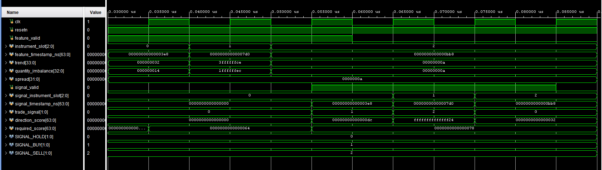
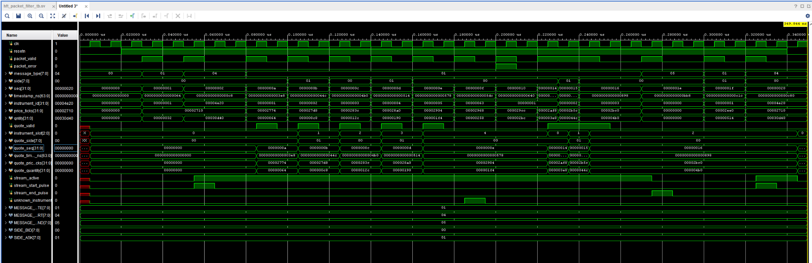
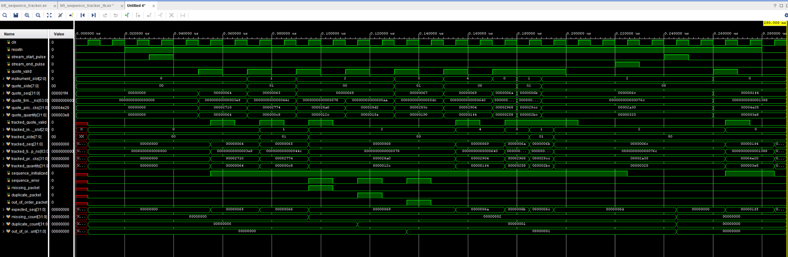
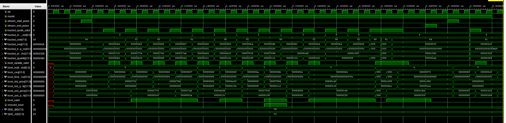
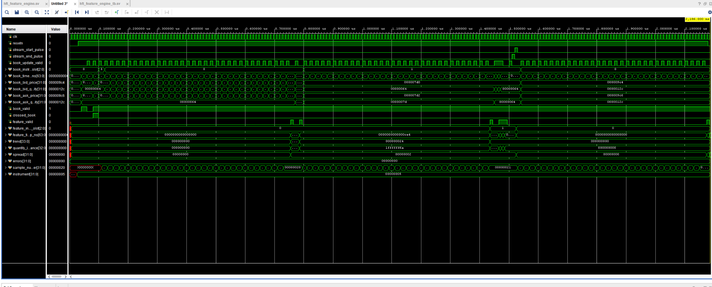

# Phase 5 — FPGA Trading Engine

## 5.1 Weighted Trading Decision Model

### Objective

Phase 5 converts the validated and decoded market data produced by Phase 4 into
real-time trading decisions. Phase 5.1 defines and verifies the final weighted
decision block that converts three precomputed market features into a `BUY`,
`SELL`, or `HOLD` signal.

The three input features are:

- Price trend, calculated from the difference between fast and slow moving
  averages.
- Bid/ask quantity imbalance.
- Bid–ask spread.

The feature-extraction, instrument-book, sequence-tracking, and time-sampling
blocks are implemented in later subphases. The `weighted_decision` module assumes
that its inputs have already been checked and are valid whenever
`feature_valid` is asserted.

### Initial operating configuration

The initial complete Phase 5 system will use the following operating targets:

| Setting | Initial value |
| --- | ---: |
| Total market-data rate | 20,000 packets/s |
| Number of instruments | 5 |
| Average rate per instrument | 4,000 packets/s |
| Decision rate per instrument | 2,000 decisions/s |
| Aggregate decision rate | 10,000 decisions/s |
| Decision period | 500 µs |
| Fast moving-average window | 8 samples, or 4 ms |
| Slow moving-average window | 32 samples, or 16 ms |

These timing values do not appear inside `weighted_decision`. They determine how
often the future feature engine asserts `feature_valid`.

---

### Trading model

The directional score is calculated as:

```text
direction_score = (TREND_WEIGHT * trend) + (IMBALANCE_WEIGHT * quantity_imbalance)
```

The required score is calculated as:

```text
required_score = BASE_THRESHOLD + (SPREAD_WEIGHT * spread)
```

The decision rules are:

```text
direction_score >  required_score -> BUY
direction_score < -required_score -> SELL
otherwise -> HOLD
```

The spread increases the confidence required to trade. A wider spread therefore makes both `BUY` and `SELL` decisions less likely without creating an artificial directional bias.

### Initial model constants

| Constant | Value | Purpose |
| --- | ---: | --- |
| `TREND_WEIGHT` | 4 | Weight applied to the moving-average trend |
| `IMBALANCE_WEIGHT` | 1 | Weight applied to quantity imbalance |
| `SPREAD_WEIGHT` | 2 | Amount added to the threshold per spread tick |
| `BASE_THRESHOLD` | 100 | Minimum absolute evidence required to trade |

These are initial verification values. They are parameters so that later
experiments can change them without modifying the decision logic.

### Trading-signal encoding

| Signal | Encoding |
| --- | --- |
| `HOLD` | `2'b00` |
| `BUY` | `2'b01` |
| `SELL` | `2'b10` |

---

### Module interface

| Signal | Direction | Width | Description |
| --- | --- | ---: | --- |
| `clk` | Input | 1 | FPGA clock |
| `resetn` | Input | 1 | Active-low synchronous reset |
| `feature_valid` | Input | 1 | Marks one valid input feature set |
| `instrument_slot` | Input | 3 | Identifies one of up to eight instrument slots |
| `feature_timestamp_ns` | Input | 64 | Timestamp associated with the feature set |
| `trend` | Input | 34 signed | Fast moving average minus slow moving average |
| `quantity_imbalance` | Input | 33 signed | Bid quantity minus ask quantity |
| `spread` | Input | 32 unsigned | Ask price minus bid price |
| `signal_valid` | Output | 1 | Marks one valid output decision |
| `signal_instrument_slot` | Output | 3 | Instrument associated with the decision |
| `signal_timestamp_ns` | Output | 64 | Timestamp associated with the decision |
| `trade_signal` | Output | 2 | Encoded `HOLD`, `BUY`, or `SELL` decision |
| `direction_score` | Output | 64 signed | Registered weighted directional score |
| `required_score` | Output | 64 signed | Registered spread-adjusted threshold |

The score datapath uses signed 64-bit registers. This provides sufficient
headroom for the current feature and weight widths and avoids overflow in the
initial model.

---

### Pipeline architecture

The module uses three registered stages:

| Stage | Operation |
| --- | --- |
| Stage 1 | Multiply trend, imbalance, and spread by their weights |
| Stage 2 | Add the directional products and calculate the required threshold |
| Stage 3 | Compare the scores and register `BUY`, `SELL`, or `HOLD` |

The instrument slot, timestamp, and valid bit pass through matching registers.
This ensures that the metadata at the output belongs to the same feature set as
the decision.

Once the pipeline is full, it can accept one feature set and produce one
decision on every clock cycle.

---

### `weighted_decision.sv`

```systemverilog
`timescale 1ns / 1ps

module weighted_decision #(
    parameter logic signed [15:0] TREND_WEIGHT       = 16'sd4,
    parameter logic signed [15:0] IMBALANCE_WEIGHT   = 16'sd1,
    parameter logic        [15:0] SPREAD_WEIGHT      = 16'd2,
    parameter logic signed [63:0] BASE_THRESHOLD     = 64'sd100
) (
    input logic clk,
    input logic resetn,

    input logic feature_valid,
    input logic [2:0] instrument_slot,
    input logic [63:0] feature_timestamp_ns,

    input logic signed [33:0] trend,
    input logic signed [32:0] quantity_imbalance,
    input logic        [31:0] spread,

    output logic signal_valid,
    output logic [2:0] signal_instrument_slot,
    output logic [63:0] signal_timestamp_ns,

    output logic [1:0] trade_signal,
    output logic signed [63:0] direction_score,
    output logic signed [63:0] required_score
);

    // Stage 1: weighted products
    logic signed [63:0] trend_product_s1;
    logic signed [63:0] imbalance_product_s1;
    logic signed [63:0] spread_product_s1;

    logic        valid_s1;
    logic [2:0]  instrument_slot_s1;
    logic [63:0] timestamp_s1;

    // Stage 2: accumulated scores
    logic signed [63:0] direction_score_s2;
    logic signed [63:0] required_score_s2;

    logic        valid_s2;
    logic [2:0]  instrument_slot_s2;
    logic [63:0] timestamp_s2;

    localparam logic [1:0] SIGNAL_HOLD = 2'b00;
    localparam logic [1:0] SIGNAL_BUY  = 2'b01;
    localparam logic [1:0] SIGNAL_SELL = 2'b10;

    always_ff @(posedge clk) begin
        if (!resetn) begin
            // Stage 1
            trend_product_s1       <= '0;
            imbalance_product_s1   <= '0;
            spread_product_s1      <= '0;
            valid_s1               <= 1'b0;
            instrument_slot_s1     <= '0;
            timestamp_s1           <= '0;

            // Stage 2
            direction_score_s2     <= '0;
            required_score_s2      <= '0;
            valid_s2               <= 1'b0;
            instrument_slot_s2     <= '0;
            timestamp_s2           <= '0;

            // Stage 3
            signal_valid           <= 1'b0;
            signal_instrument_slot <= '0;
            signal_timestamp_ns    <= '0;
            trade_signal           <= SIGNAL_HOLD;
            direction_score        <= '0;
            required_score         <= '0;
        end
        else begin
            // Stage 1: weighted multiplications
            trend_product_s1 <=
                $signed(trend) * $signed(TREND_WEIGHT);

            imbalance_product_s1 <=
                $signed(quantity_imbalance) *
                $signed(IMBALANCE_WEIGHT);

            spread_product_s1 <=
                $signed({1'b0, spread}) *
                $signed({1'b0, SPREAD_WEIGHT});

            valid_s1           <= feature_valid;
            instrument_slot_s1 <= instrument_slot;
            timestamp_s1       <= feature_timestamp_ns;

            // Stage 2: score and threshold calculation
            direction_score_s2 <=
                trend_product_s1 + imbalance_product_s1;

            required_score_s2 <=
                BASE_THRESHOLD + spread_product_s1;

            valid_s2           <= valid_s1;
            instrument_slot_s2 <= instrument_slot_s1;
            timestamp_s2       <= timestamp_s1;

            // Stage 3: register scores and metadata
            signal_valid           <= valid_s2;
            signal_instrument_slot <= instrument_slot_s2;
            signal_timestamp_ns    <= timestamp_s2;
            direction_score        <= direction_score_s2;
            required_score         <= required_score_s2;

            // Stage 3: BUY/SELL/HOLD comparison
            if (valid_s2) begin
                if (direction_score_s2 > required_score_s2) begin
                    trade_signal <= SIGNAL_BUY;
                end
                else if (direction_score_s2 < -required_score_s2) begin
                    trade_signal <= SIGNAL_SELL;
                end
                else begin
                    trade_signal <= SIGNAL_HOLD;
                end
            end
            else begin
                trade_signal <= SIGNAL_HOLD;
            end
        end
    end

endmodule
```

#### What each RTL section does

**Parameter block**

The parameter block defines the initial weights and base threshold. Using
parameters keeps the arithmetic structure unchanged while allowing the model
constants to be adjusted during later experiments.

**Feature inputs**

`trend` and `quantity_imbalance` are signed because either feature can indicate
upward/buying pressure or downward/selling pressure. `spread` is unsigned
because a valid bid–ask spread cannot be negative.

**Pipeline registers**

The `_s1` registers hold the three multiplication results. The `_s2` registers
hold the final directional score and required threshold. Separate valid,
instrument, and timestamp registers maintain transaction alignment through the
pipeline.

**Reset branch**

The active-low synchronous reset clears every pipeline stage and forces the
output decision to `HOLD`. Because the reset is synchronous, it takes effect on
a rising clock edge while `resetn` is low.

**Stage 1**

Stage 1 performs the three weighted multiplications. Explicit signed casts are
used for the directional features. A leading zero is added to `spread` and
`SPREAD_WEIGHT` before their signed casts so they remain positive signed
quantities.

Stage 1 also registers `feature_valid`, the instrument slot, and the timestamp.

**Stage 2**

Stage 2 adds the weighted trend and imbalance to form `direction_score_s2`. It
also adds the weighted spread to `BASE_THRESHOLD` to form
`required_score_s2`.

The Stage 1 valid bit and metadata are advanced into their Stage 2 registers on
the same clock.

**Stage 3**

Stage 3 copies the scores and metadata to the module outputs. When `valid_s2` is
high, it compares the directional score against both the positive and negative
required thresholds.

If no valid Stage 2 transaction is present, `signal_valid` is low and
`trade_signal` is forced to `HOLD`.

---

### Verification approach

The testbench verifies:

1. Synchronous reset behaviour.
2. A positive score that produces `BUY`.
3. A negative score that produces `SELL`.
4. A score inside the threshold range that produces `HOLD`.
5. Signed multiplication and addition.
6. Spread-adjusted threshold calculation.
7. Instrument-slot and timestamp alignment.
8. Three back-to-back input transactions.
9. One-decision-per-clock pipeline throughput.
10. Correct deassertion of `signal_valid` after the pipeline drains.

### `weighted_decision_tb.sv`

```systemverilog
`timescale 1ns / 1ps

module weighted_decision_tb;

    localparam logic [1:0] SIGNAL_HOLD = 2'b00;
    localparam logic [1:0] SIGNAL_BUY  = 2'b01;
    localparam logic [1:0] SIGNAL_SELL = 2'b10;

    logic clk;
    logic resetn;

    logic               feature_valid;
    logic [2:0]         instrument_slot;
    logic [63:0]        feature_timestamp_ns;
    logic signed [33:0] trend;
    logic signed [32:0] quantity_imbalance;
    logic        [31:0] spread;

    logic               signal_valid;
    logic [2:0]         signal_instrument_slot;
    logic [63:0]        signal_timestamp_ns;
    logic [1:0]         trade_signal;
    logic signed [63:0] direction_score;
    logic signed [63:0] required_score;

    weighted_decision dut (
        .clk                    (clk),
        .resetn                 (resetn),

        .feature_valid          (feature_valid),
        .instrument_slot        (instrument_slot),
        .feature_timestamp_ns   (feature_timestamp_ns),

        .trend                  (trend),
        .quantity_imbalance     (quantity_imbalance),
        .spread                 (spread),

        .signal_valid           (signal_valid),
        .signal_instrument_slot (signal_instrument_slot),
        .signal_timestamp_ns    (signal_timestamp_ns),

        .trade_signal           (trade_signal),
        .direction_score        (direction_score),
        .required_score         (required_score)
    );

    // Generate a 100 MHz clock.
    initial begin
        clk = 1'b0;
        forever #5 clk = ~clk;
    end

    task automatic send_feature (
        input logic [2:0]         test_slot,
        input logic [63:0]        test_timestamp,
        input logic signed [33:0] test_trend,
        input logic signed [32:0] test_imbalance,
        input logic [31:0]        test_spread
    );
        begin
            @(negedge clk);

            feature_valid        = 1'b1;
            instrument_slot      = test_slot;
            feature_timestamp_ns = test_timestamp;
            trend                = test_trend;
            quantity_imbalance   = test_imbalance;
            spread               = test_spread;
        end
    endtask

    task automatic check_result (
        input logic [1:0]         expected_signal,
        input logic [2:0]         expected_slot,
        input logic [63:0]        expected_timestamp,
        input logic signed [63:0] expected_direction_score,
        input logic signed [63:0] expected_required_score
    );
        begin
            if (signal_valid !== 1'b1) begin
                $fatal(1, "FAIL: signal_valid was not asserted");
            end

            if (trade_signal !== expected_signal) begin
                $fatal(
                    1,
                    "FAIL: expected signal %b, received %b",
                    expected_signal,
                    trade_signal
                );
            end

            if (signal_instrument_slot !== expected_slot) begin
                $fatal(
                    1,
                    "FAIL: expected slot %0d, received %0d",
                    expected_slot,
                    signal_instrument_slot
                );
            end

            if (signal_timestamp_ns !== expected_timestamp) begin
                $fatal(
                    1,
                    "FAIL: expected timestamp %0d, received %0d",
                    expected_timestamp,
                    signal_timestamp_ns
                );
            end

            if (direction_score !== expected_direction_score) begin
                $fatal(
                    1,
                    "FAIL: expected direction score %0d, received %0d",
                    expected_direction_score,
                    $signed(direction_score)
                );
            end

            if (required_score !== expected_required_score) begin
                $fatal(
                    1,
                    "FAIL: expected required score %0d, received %0d",
                    expected_required_score,
                    $signed(required_score)
                );
            end

            $display(
                "PASS: slot=%0d timestamp=%0d signal=%b score=%0d threshold=%0d",
                signal_instrument_slot,
                signal_timestamp_ns,
                trade_signal,
                $signed(direction_score),
                $signed(required_score)
            );
        end
    endtask

    initial begin
        resetn               = 1'b0;
        feature_valid        = 1'b0;
        instrument_slot      = '0;
        feature_timestamp_ns = '0;
        trend                = '0;
        quantity_imbalance   = '0;
        spread               = '0;

        // Apply synchronous reset for two clocks.
        repeat (2) @(posedge clk);

        @(negedge clk);
        resetn = 1'b1;

        // BUY:
        // direction = (50 * 4) + (20 * 1) = 220
        // threshold = 100 + (10 * 2) = 120
        send_feature(
            3'd0,
            64'd1000,
            34'sd50,
            33'sd20,
            32'd10
        );

        // SELL:
        // direction = (-50 * 4) + (-20 * 1) = -220
        // threshold = 100 + (10 * 2) = 120
        send_feature(
            3'd1,
            64'd2000,
            -34'sd50,
            -33'sd20,
            32'd10
        );

        // HOLD:
        // direction = (10 * 4) + (10 * 1) = 50
        // threshold = 100 + (10 * 2) = 120
        send_feature(
            3'd2,
            64'd3000,
            34'sd10,
            33'sd10,
            32'd10
        );

        // Stop sending new features.
        @(negedge clk);
        feature_valid = 1'b0;

        // First result: BUY.
        check_result(
            SIGNAL_BUY,
            3'd0,
            64'd1000,
            64'sd220,
            64'sd120
        );

        // Second result: SELL.
        @(negedge clk);
        check_result(
            SIGNAL_SELL,
            3'd1,
            64'd2000,
            -64'sd220,
            64'sd120
        );

        // Third result: HOLD.
        @(negedge clk);
        check_result(
            SIGNAL_HOLD,
            3'd2,
            64'd3000,
            64'sd50,
            64'sd120
        );

        // Verify that signal_valid clears after the pipeline drains.
        @(negedge clk);

        if (signal_valid !== 1'b0) begin
            $fatal(1, "FAIL: signal_valid did not clear");
        end

        $display("All weighted_decision tests passed.");
        $finish;
    end

    // Stop the simulation if the expected completion is never reached.
    initial begin
        #1000;
        $fatal(1, "FAIL: simulation timeout");
    end

endmodule
```

#### What each testbench section does

**Clock generation**

The clock changes state every 5 ns, producing a 10 ns period and a 100 MHz
simulation clock.

**`send_feature` task**

This task applies one feature set on a falling edge. The values are therefore
stable before the DUT samples them on the following rising edge. Calling the
task three times consecutively creates three back-to-back valid transactions.

**`check_result` task**

This task checks `signal_valid`, the encoded trading decision, the instrument
slot, timestamp, directional score, and required score. A mismatch immediately
ends the simulation using `$fatal`. A correct result prints a `PASS` line.

**BUY test**

The first transaction uses:

$$
(50 \times 4) + (20 \times 1) = 220
$$

The spread-adjusted threshold is:

$$
100 + (10 \times 2) = 120
$$

Since 220 is greater than 120, the expected result is `BUY`.

**SELL test**

The second transaction produces:

$$
(-50 \times 4) + (-20 \times 1) = -220
$$

Since -220 is less than -120, the expected result is `SELL`.

**HOLD test**

The third transaction produces:

$$
(10 \times 4) + (10 \times 1) = 50
$$

The score lies between -120 and 120, so the expected result is `HOLD`.

**Pipeline-drain check**

After all three results have appeared, the testbench checks that
`signal_valid` returns low. This confirms that the valid pipeline does not
produce an extra transaction.

**Timeout**

The independent timeout block prevents the simulation from running forever if
the DUT or testbench fails to reach `$finish`.

---

### Simulation waveform



**Figure 5.1.1 — Three back-to-back feature sets and their pipelined decisions.**

The waveform shows `feature_valid` asserted for three consecutive input cycles.
After the three-stage pipeline fills, `signal_valid` is asserted for three
consecutive output cycles.

The output transactions remain correctly aligned:

| Slot | Timestamp | Direction score | Required score | Decision |
| ---: | ---: | ---: | ---: | --- |
| 0 | 1000 | 220 (`0xDC`) | 120 (`0x78`) | `BUY` (`01`) |
| 1 | 2000 | -220 (`...FF24`) | 120 (`0x78`) | `SELL` (`10`) |
| 2 | 3000 | 50 (`0x32`) | 120 (`0x78`) | `HOLD` (`00`) |

Because the transactions are back-to-back, `signal_valid` appears as one
continuous three-cycle-high interval. Each rising clock while it is high
represents a different valid decision.

The unknown values visible before the first reset clock edge are expected
because the DUT uses synchronous reset. All registers become defined on the
first rising edge for which `resetn` is low.

---

### TCL console result

The complete self-checking simulation was executed with:

```tcl
restart
run all
```

The simulator reported:

```text
INFO: [Wavedata 42-604] Simulation restarted
run all
PASS: slot=0 timestamp=1000 signal=01 score=220 threshold=120
PASS: slot=1 timestamp=2000 signal=10 score=-220 threshold=120
PASS: slot=2 timestamp=3000 signal=00 score=50 threshold=120
All weighted_decision tests passed.
$finish called at time : 90 ns : File "C:/root_pqnq/PYNQ_HFT/PYNQ_HFT.srcs/sim_1/new/weighted_decision_tb.sv" Line 229
```

All three directed cases passed without an arithmetic, control, or metadata
alignment error.

---

### Phase 5.1 result

Phase 5.1 successfully implemented and verified a configurable three-stage
weighted trading-decision pipeline.

The verified block:

- Accepts signed trend and quantity-imbalance features.
- Applies configurable feature weights.
- Raises the trading threshold as the spread increases.
- Generates correctly encoded `BUY`, `SELL`, and `HOLD` decisions.
- Preserves the instrument slot and timestamp through the pipeline.
- Accepts back-to-back feature sets.
- Produces one decision per clock after the pipeline fills.
- Passes all directed self-checking simulation cases.

The next subphase will provide validated, per-instrument market state to the
feature-generation pipeline that eventually drives this decision block.

## Phase 5.2 — Packet Filtering and Instrument Mapping

### Purpose

The packet parser validates the packet format, but the trading pipeline should only receive supported quote updates from an active stream. The `hft_packet_filter` module therefore:

- Interprets `STREAM_START`, `STREAM_END`, and `QUOTE_UPDATE` messages.
- Tracks whether the market-data stream is active.
- Rejects packets marked with `packet_error`.
- Rejects quote updates before stream start or after stream end.
- Maps five external instrument IDs to internal slots `0` through `4`.
- Forwards accepted quote fields with a one-cycle `quote_valid` pulse.
- Pulses `unknown_instrument` for a quote containing an unsupported instrument ID.

### Interface

#### Inputs

| Signal | Width | Purpose |
| --- | ---: | --- |
| `packet_valid` | 1 | Indicates that the parser completed a packet |
| `packet_error` | 1 | Indicates that packet validation failed |
| `message_type` | 8 | Quote update, stream start, or stream end |
| `side` | 8 | Bid or ask side |
| `seq` | 32 | Global packet sequence number |
| `timestamp_ns` | 64 | Packet timestamp |
| `instrument_id` | 32 | External instrument identifier |
| `price_ticks` | 32 | Quote price represented in integer ticks |
| `qntity` | 32 | Quote quantity |

#### Outputs

| Signal | Width | Purpose |
| --- | ---: | --- |
| `quote_valid` | 1 | One-cycle pulse for an accepted quote |
| `instrument_slot` | 3 | Internal instrument slot from `0` to `4` |
| `quote_side` | 8 | Accepted quote side |
| `quote_seq` | 32 | Accepted sequence number |
| `quote_timestamp_ns` | 64 | Accepted timestamp |
| `quote_price_ticks` | 32 | Accepted price |
| `quote_quantity` | 32 | Accepted quantity |
| `stream_active` | 1 | Remains high between stream start and stream end |
| `stream_start_pulse` | 1 | One-cycle pulse when a valid stream start is received |
| `stream_end_pulse` | 1 | One-cycle pulse when a valid stream end is received |
| `unknown_instrument` | 1 | One-cycle pulse for an unsupported quote instrument |

### Instrument lookup

```systemverilog
always_comb begin
    instrument_found = 1'b1;
    matched_slot = 3'd0;

    case (instrument_id)
        INSTRUMENT_ID_0: matched_slot = 3'd0;
        INSTRUMENT_ID_1: matched_slot = 3'd1;
        INSTRUMENT_ID_2: matched_slot = 3'd2;
        INSTRUMENT_ID_3: matched_slot = 3'd3;
        INSTRUMENT_ID_4: matched_slot = 3'd4;

        default: begin
            instrument_found = 1'b0;
            matched_slot = 3'd0;
        end
    endcase
end
```

This combinational lookup converts an external 32-bit identifier into a smaller internal slot. The later modules use the slot as an array index, which is cheaper than repeatedly comparing complete instrument IDs.

The default branch clears `instrument_found`. The value assigned to `matched_slot` in the default branch is harmless because `quote_valid` is not asserted for an unknown instrument.

### Stream control and quote forwarding

```systemverilog
if (packet_valid && !packet_error) begin
    if (message_type == MESSAGE_STREAM_START) begin
        stream_active <= 1'b1;
        stream_start_pulse <= 1'b1;
    end
    else if (message_type == MESSAGE_STREAM_END) begin
        stream_active <= 1'b0;
        stream_end_pulse <= 1'b1;
    end
    else if (
        message_type == MESSAGE_QUOTE_UPDATE &&
        stream_active
    ) begin
        if (instrument_found) begin
            quote_valid <= 1'b1;
            instrument_slot <= matched_slot;
            quote_side <= side;
            quote_seq <= seq;
            quote_timestamp_ns <= timestamp_ns;
            quote_price_ticks <= price_ticks;
            quote_quantity <= qntity;
        end
        else begin
            unknown_instrument <= 1'b1;
        end
    end
end
```

The outer condition blocks invalid or erroneous parser results. A valid `STREAM_START` sets `stream_active`, and that state remains high until a valid `STREAM_END` is received.

An erroneous packet can therefore have `packet_valid` and `packet_error` high together. That means the parser completed the packet but detected a validation failure. The filter rejects it because `!packet_error` is false. Rejecting one packet does not end the stream.

The pulse outputs are assigned low at the start of every normal clock cycle. They only remain high for the cycle in which their corresponding event is accepted.

### Verification

The self-checking testbench verified:

- Reset behaviour.
- Rejection of quotes before `STREAM_START`.
- Mapping of instrument IDs `1` through `5` to slots `0` through `4`.
- Bid and ask forwarding.
- Sequence, timestamp, price, and quantity forwarding.
- Unknown-instrument rejection.
- Erroneous-packet rejection.
- Back-to-back quote forwarding.
- Stream-end handling.
- A second stream start.
- Reset while the stream was active.

```text
PASS: unknown instrument rejected
PASS: erroneous packet ignored
PASS: back-to-back quote forwarding
PASS: STREAM_END accepted
PASS: quote after STREAM_END ignored
PASS: active-stream reset
All hft_packet_filter tests passed.
```



*Figure 5.2.1 — Packet filtering, stream-state control, instrument mapping, and accepted quote forwarding.*

---

## Phase 5.3 — Global Sequence Tracking

### Purpose

The `hft_sequence_tracker` module checks the global sequence number attached to each accepted quote. It prevents duplicate and older packets from modifying the instrument books and records any gaps in the feed.

The implemented policy is:

| Condition | Classification | Forward quote? | Recovery action |
| --- | --- | ---: | --- |
| First quote | Initialization | Yes | Set the next expected sequence |
| `quote_seq == expected_seq` | Correct sequence | Yes | Advance normally |
| `quote_seq == last_seq` | Duplicate | No | Retain the current expectation |
| `quote_seq > expected_seq` | Missing packet gap | Yes | Count the gap and resynchronise |
| Older sequence | Out of order | No | Retain the current expectation |

The sequence is global across all instruments. It is therefore intentionally not indexed by `instrument_slot`.

### Initialization

```systemverilog
if (!sequence_initialized) begin
    sequence_initialized <= 1'b1;
    last_seq <= quote_seq;
    expected_seq <= quote_seq + 32'd1;
    tracked_quote_valid <= 1'b1;
end
```

The first accepted quote establishes the sequence baseline. It is forwarded because there is no earlier sequence against which it can be checked.

`expected_seq` becomes one greater than the first sequence. The following quote can then be classified using a direct comparison.

### Correct sequence

```systemverilog
else if (quote_seq == expected_seq) begin
    last_seq <= quote_seq;
    expected_seq <= quote_seq + 32'd1;
    tracked_quote_valid <= 1'b1;
end
```

A correctly sequenced quote advances both `last_seq` and `expected_seq`. The quote and all of its metadata are forwarded to the instrument-book stage.

### Missing-packet detection

```systemverilog
else if (quote_seq > expected_seq) begin
    sequence_error <= 1'b1;
    missing_packet <= 1'b1;
    missing_count <= missing_count + (quote_seq - expected_seq);

    last_seq <= quote_seq;
    expected_seq <= quote_seq + 32'd1;
    tracked_quote_valid <= 1'b1;
end
```

When the new sequence is greater than expected, one or more packets are missing. The gap size is:

```text
missing amount = received sequence - expected sequence
```

The received quote is still forwarded. This allows the pipeline to continue operating while exposing the data-loss condition through flags and counters.

The tracker resynchronises to the received sequence so that subsequent correct packets can be accepted normally.

### Duplicate and out-of-order rejection

```systemverilog
else if (quote_seq == last_seq) begin
    sequence_error <= 1'b1;
    duplicate_packet <= 1'b1;
    duplicate_count <= duplicate_count + 32'd1;
end
else begin
    sequence_error <= 1'b1;
    out_of_order_packet <= 1'b1;
    out_of_order_count <= out_of_order_count + 32'd1;
end
```

Duplicate and older packets are not forwarded because applying them could repeat or reverse a book update.

The corresponding one-cycle flag identifies the error type, while the counter provides a cumulative stream statistic.

### Stream handling

`stream_start_pulse` clears the sequence baseline and all three counters. The first quote in the new stream therefore establishes a fresh sequence.

`stream_end_pulse` clears `sequence_initialized` and suppresses tracked output. No old sequence expectation is carried into the following stream.

### Verification

The self-checking testbench verified:

- First-sequence initialization.
- Correct consecutive sequences.
- Missing-packet detection and gap counting.
- Duplicate rejection.
- Out-of-order rejection.
- Recovery after each error.
- Back-to-back quote forwarding.
- Stream-end handling.
- Counter clearing on the next stream.
- Reset while active.

```text
PASS: first sequence initialized
PASS: correct sequence accepted
PASS: missing sequences detected
PASS: duplicate sequence rejected
PASS: out-of-order sequence rejected
PASS: tracker recovered after errors
PASS: back-to-back quotes accepted
PASS: active reset
All hft_sequence_tracker tests passed.
```



*Figure 5.3.1 — Global sequence initialization, gap detection, duplicate rejection, out-of-order rejection, recovery, and stream reset.*

---

## Phase 5.4 — Per-Instrument Top-of-Book State

### Purpose

The `hft_instrument_book` module converts individual bid or ask quote updates into a complete top-of-book snapshot for the selected instrument.

For each of the five slots, the module stores:

- Latest bid price.
- Latest bid quantity.
- Latest ask price.
- Latest ask quantity.
- Whether a bid has been initialized.
- Whether an ask has been initialized.

One shared module services all five instruments. A separate module instance is not required for every company because the incoming `instrument_slot` selects the relevant state array.

### Per-instrument storage

```systemverilog
logic [31:0] bid_price [0:4];
logic [31:0] bid_quantity [0:4];
logic [31:0] ask_price [0:4];
logic [31:0] ask_quantity [0:4];

logic bid_initialized [0:4];
logic ask_initialized [0:4];
```

The first array index is the instrument slot. Updating slot 2, for example, does not change the stored book for slots 0, 1, 3, or 4.

The initialization flags distinguish a genuine zero value from a side of the book that has never been received.

### Bid update

```systemverilog
if (tracked_side == SIDE_BID) begin
    bid_price[tracked_instrument_slot] <= tracked_price_ticks;
    bid_quantity[tracked_instrument_slot] <= tracked_quantity;
    bid_initialized[tracked_instrument_slot] <= 1'b1;

    book_bid_price <= tracked_price_ticks;
    book_bid_quantity <= tracked_quantity;
    book_ask_price <= ask_price[tracked_instrument_slot];
    book_ask_quantity <= ask_quantity[tracked_instrument_slot];
end
```

A bid update replaces only the selected instrument's bid. The previously stored ask remains unchanged and is forwarded alongside the incoming bid.

The outputs use `tracked_price_ticks` and `tracked_quantity` directly. This avoids outputting the previous bid value because non-blocking assignments do not update the storage array until the clocked block finishes.

### Ask update

```systemverilog
else if (tracked_side == SIDE_ASK) begin
    ask_price[tracked_instrument_slot] <= tracked_price_ticks;
    ask_quantity[tracked_instrument_slot] <= tracked_quantity;
    ask_initialized[tracked_instrument_slot] <= 1'b1;

    book_bid_price <= bid_price[tracked_instrument_slot];
    book_bid_quantity <= bid_quantity[tracked_instrument_slot];
    book_ask_price <= tracked_price_ticks;
    book_ask_quantity <= tracked_quantity;
end
```

The ask path mirrors the bid path. It preserves the existing bid and inserts the incoming ask directly into the output snapshot.

### Book validity

The book becomes valid only after both sides have been initialized:

```text
book valid = bid initialized AND ask initialized
```

On the update that initializes the missing side, the incoming quote must be included in this calculation. A first bid followed by a first ask therefore produces a valid book immediately on the ask update.

An incomplete book may still assert `book_update_valid`, but `book_valid` remains low. This allows downstream logic to distinguish “an update occurred” from “a complete book is available.”

### Crossed-book detection

A book is crossed when:

```text
ask price < bid price
```

An equal bid and ask is locked rather than crossed:

```text
ask price == bid price -> crossed_book = 0
```

Like book validity, the comparison must use the incoming value on the side currently being updated and the stored value on the opposite side.

The feature engine rejects crossed books using:

```systemverilog
book_update_valid &&
book_valid &&
!crossed_book
```

### Verification

The self-checking testbench verified:

- Stream-start book clearing.
- Bid-first initialization.
- Ask-first initialization.
- Preservation of the opposite side.
- Independent books for different slots.
- Crossed-book detection.
- Equal bid and ask not being classified as crossed.
- Invalid slot rejection.
- Invalid side rejection.
- Back-to-back book updates.
- Stream-end output suppression.
- No state reuse in a second stream.
- Reset while active.

```text
PASS: first ask completes slot 0 book
PASS: bid update preserved previous ask
PASS: ask update preserved previous bid
PASS: ask-first initialization works
PASS: crossed book detected
PASS: equal bid and ask are not crossed
PASS: back-to-back book updates accepted
PASS: second stream does not reuse old book state
All hft_instrument_book tests passed.
```



*Figure 5.4.1 — Independent bid/ask storage, complete-book generation, crossed-book detection, back-to-back processing, and stream clearing.*

---

## Phase 5.5 — Moving-Average Feature Engine

### Purpose

The `hft_feature_engine` transforms each eligible book snapshot into the three features required by `weighted_decision`:

- Price trend.
- Bid/ask quantity imbalance.
- Bid/ask spread.

The module is packet-event driven. It does not use a clock divider or wait for a periodic decision interval. Once an instrument has completed warm-up, each eligible book update can enter the engine immediately.

### Feature equations

To avoid losing half-tick midpoints, the engine stores twice the midpoint:

$$
M_2 = P_b + P_a
$$

Quantity imbalance is:

$$
I = Q_b - Q_a
$$

Spread is:

$$
S = P_a - P_b
$$

The moving-average trend is:

$$ R =\frac{\sum_{k=0}^{7} M_{2,k}}{8} -
\frac{\sum_{k=0}^{31} M_{2,k}}{32}
$$

Because `M_2` is twice the true midpoint, `trend` is expressed in twice-price units. The weighted-decision constants must be calibrated for that scale.

### Eligible-update gate

```systemverilog
assign process_book_update =
    book_update_valid &&
    book_valid &&
    !crossed_book &&
    (book_instrument_slot < 3'd5);
```

The module only processes a complete, non-crossed book from a supported slot. Rejected updates do not advance any FIFO, pointer, sample counter, or FSM state.

### Midpoint calculation

```systemverilog
assign midpoint2 =
    {1'b0, book_bid_price} +
    {1'b0, book_ask_price};
```

The leading zero widens each price before addition. The 33-bit result can therefore represent the sum of two complete unsigned 32-bit prices without overflow.

No divider is needed for the midpoint. The final trend retains the same factor-of-two scale.

### Circular FIFO histories

```systemverilog
logic [32:0] fast_buffer [0:4][0:7];
logic [2:0] fast_pointer [0:4];
logic [35:0] fast_sum [0:4];

logic [32:0] slow_buffer [0:4][0:31];
logic [4:0] slow_pointer [0:4];
logic [37:0] slow_sum [0:4];
```

Each instrument owns:

- An eight-entry fast circular FIFO.
- A 32-entry slow circular FIFO.
- One pointer for each FIFO.
- One running sum for each FIFO.

The structure is FIFO-based for the moving-average calculations, but it is not an upstream packet queue. Samples are not delayed until a batch becomes available.

Once a window is full, its sum is updated using:

```text
new sum = old sum - oldest sample + newest sample
```

The oldest location is overwritten, and the pointer advances. The pointers wrap naturally because their widths exactly match the power-of-two buffer sizes.

The history arrays are not reset. During warm-up, entries are written before they are ever subtracted. Resetting only the sums, pointers, counters, and states also avoids creating a large reset network across the stored histories.

### Per-instrument FSM

Each instrument has an independent three-state FSM:

```systemverilog
typedef enum logic [1:0] {
    WARMUP_FAST,
    WARMUP_SLOW,
    FEATURE_READY
} feature_state_t;

feature_state_t current_state [0:4];
feature_state_t next_state [0:4];
```

| State | Samples | Fast window | Slow window | Produce feature? |
| --- | ---: | --- | --- | ---: |
| `WARMUP_FAST` | 1–8 | Fill | Fill | No |
| `WARMUP_SLOW` | 9–32 | Roll | Continue filling | On sample 32 |
| `FEATURE_READY` | 33 onward | Roll | Roll | Yes |

One global FSM would be incorrect because packets for the five instruments are interleaved. Slot 0 may already be ready while slot 1 is still receiving its first few samples.

### Combinational next-state logic

```systemverilog
always_comb begin
    for (
        state_index = 0;
        state_index < 5;
        state_index = state_index + 1
    ) begin
        next_state[state_index] = current_state[state_index];
    end

    if (process_book_update) begin
        case (current_state[book_instrument_slot])
            WARMUP_FAST: begin
                if (sample_count[book_instrument_slot] == 6'd7) begin
                    next_state[book_instrument_slot] = WARMUP_SLOW;
                end
            end

            WARMUP_SLOW: begin
                if (sample_count[book_instrument_slot] == 6'd31) begin
                    next_state[book_instrument_slot] = FEATURE_READY;
                end
            end

            FEATURE_READY: begin
                next_state[book_instrument_slot] = FEATURE_READY;
            end

            default: begin
                next_state[book_instrument_slot] = WARMUP_FAST;
            end
        endcase
    end
end
```

The default assignment holds every instrument in its current state. Only the slot associated with an eligible update can transition.

The comparisons use the old registered sample count:

- Old count `7` means the incoming update is sample 8.
- Old count `31` means the incoming update is sample 32.

The sequential block registers `current_state <= next_state` on the following rising edge.

### `WARMUP_FAST` datapath

```systemverilog
WARMUP_FAST: begin
    fast_sum[book_instrument_slot] <=
        fast_sum[book_instrument_slot] +
        midpoint2;

    slow_sum[book_instrument_slot] <=
        slow_sum[book_instrument_slot] +
        midpoint2;

    fast_buffer[book_instrument_slot]
               [fast_pointer[book_instrument_slot]]
               <= midpoint2;

    slow_buffer[book_instrument_slot]
               [slow_pointer[book_instrument_slot]]
               <= midpoint2;

    fast_pointer[book_instrument_slot] <=
        fast_pointer[book_instrument_slot] +
        3'd1;

    slow_pointer[book_instrument_slot] <=
        slow_pointer[book_instrument_slot] +
        5'd1;

    sample_count[book_instrument_slot] <=
        sample_count[book_instrument_slot] +
        6'd1;
end
```

The first eight samples fill both histories. No subtraction occurs because neither window yet contains an old sample that should be removed.

After sample 8, the fast pointer wraps to zero and the FSM enters `WARMUP_SLOW`.

### `WARMUP_SLOW` datapath

```systemverilog
WARMUP_SLOW: begin
    fast_sum[book_instrument_slot] <=
        fast_sum[book_instrument_slot] -
        fast_buffer[book_instrument_slot]
                   [fast_pointer[book_instrument_slot]] +
        midpoint2;

    slow_sum[book_instrument_slot] <=
        slow_sum[book_instrument_slot] +
        midpoint2;

    if (sample_count[book_instrument_slot] == 6'd31) begin
        calculation_valid_s1 <= 1'b1;
    end
end
```

From samples 9 through 32, the fast window is already full and rolls normally. The slow window continues filling, so it only adds samples.

Sample 32 completes the slow window and asserts the Stage 1 calculation-valid register.

### `FEATURE_READY` datapath

```systemverilog
FEATURE_READY: begin
    fast_sum[book_instrument_slot] <=
        fast_sum[book_instrument_slot] -
        fast_buffer[book_instrument_slot]
                   [fast_pointer[book_instrument_slot]] +
        midpoint2;

    slow_sum[book_instrument_slot] <=
        slow_sum[book_instrument_slot] -
        slow_buffer[book_instrument_slot]
                   [slow_pointer[book_instrument_slot]] +
        midpoint2;

    sample_count[book_instrument_slot] <= 6'd32;
    calculation_valid_s1 <= 1'b1;
end
```

Both windows now remove their oldest entry and add the newest midpoint. The sample count remains saturated at 32.

Every eligible update asserts `calculation_valid_s1`, so the module can sustain one feature input per clock without deliberate bubbles.

### Direct features

```systemverilog
quantity_imbalance_s1 <=
    $signed({1'b0, book_bid_quantity}) -
    $signed({1'b0, book_ask_quantity});

spread_s1 <=
    book_ask_price -
    book_bid_price;
```

The 33-bit signed imbalance supports the complete range:

```text
-4,294,967,295 through +4,294,967,295
```

The spread remains unsigned because crossed books are rejected before this calculation.

### Trend output stage

```systemverilog
trend <=
    $signed({1'b0, fast_sum[instrument_slot_s1][35:3]}) -
    $signed({1'b0, slow_sum[instrument_slot_s1][37:5]});
```

The window sizes are powers of two:

```text
fast average = fast sum >> 3
slow average = slow sum >> 5
```

The leading zeros widen both positive averages before the signed subtraction. The 34-bit output can therefore represent either a positive or negative trend.

The Stage 1 slot and timestamp select the same instrument whose sums were updated on the preceding clock. This preserves metadata alignment for interleaved instruments.

### Latency and throughput

The first feature for an instrument is produced from sample 32:

```text
Clock N:     sample 32 updates both running sums
Clock N+1:   feature_valid asserts with the calculated result
```

After warm-up, consecutive eligible updates can enter on consecutive clocks. Their corresponding `feature_valid` pulses also appear on consecutive clocks.

Packet rate and decision latency are separate:

- The 20,000 packets/s target determines average workload.
- The FPGA clock and pipeline depth determine per-packet calculation latency.
- No asynchronous clock divider is required.
- No request/acknowledge clock-domain handshake is required while the modules share the same clock.

### Verification

The self-checking testbench verified:

- Reset of all five instrument states.
- Rejection of invalid, incomplete, crossed, and unsupported-slot updates.
- `WARMUP_FAST` for samples 1 through 8.
- `WARMUP_SLOW` for samples 9 through 32.
- Transition into `FEATURE_READY`.
- The first valid feature from sample 32.
- Correct circular-FIFO replacement.
- Positive, negative, and zero imbalance.
- Independent histories for multiple instruments.
- Back-to-back feature throughput.
- Pending-feature cancellation on stream end.
- Complete state clearing on stream start.
- Fresh warm-up in a second stream.
- Reset while active.

The first non-constant test produced:

```text
PASS: first valid feature slot=0 timestamp=3200
      trend=24 imbalance=132 spread=2
```

Replacing the oldest FIFO samples with a large price change produced:

```text
PASS: rolling FIFO feature slot=0 timestamp=3300
      trend=36 imbalance=-150 spread=2
```

The back-to-back test produced three consecutive correctly aligned outputs:

```text
PASS: back-to-back positive imbalance
PASS: back-to-back negative imbalance
PASS: back-to-back zero imbalance
PASS: back-to-back pipeline drained
```

The complete result was:

```text
PASS: STREAM_END cancelled pending feature
PASS: second stream required new warm-up
PASS: second stream first feature slot=0 timestamp=6032
PASS: active reset instrument 4
All hft_feature_engine tests passed.
```



*Figure 5.5.1 — FSM warm-up, per-instrument histories, valid-feature pulses, calculated trend/imbalance/spread, stream restart, and active reset.*

---

## Phase 5.2–5.5 Completion Summary

| Phase | Module | Main result | Verification |
| --- | --- | --- | --- |
| 5.2 | `hft_packet_filter` | Filters parser output and maps five instruments | All tests passed |
| 5.3 | `hft_sequence_tracker` | Detects gaps, duplicates, and out-of-order packets | All tests passed |
| 5.4 | `hft_instrument_book` | Maintains five independent bid/ask books | All tests passed |
| 5.5 | `hft_feature_engine` | Produces trend, imbalance, and spread | All tests passed |

The output interface of Phase 5.5 matches the input interface of the Phase 5.1 weighted-decision module:

```systemverilog
feature_valid
feature_instrument_slot
feature_timestamp_ns
trend
quantity_imbalance
spread
```

The next integration step is to connect the complete Phase 5.2–5.5 chain to `weighted_decision` and verify the end-to-end path from a parsed market-data packet to a registered `BUY`, `SELL`, or `HOLD` result.

### Waveform configuration note

Vivado warnings stating that objects from older testbenches were not found came from opening stale `.wcfg` waveform configurations. They do not indicate functional failures.

For the feature-engine simulation, avoid recursively adding the complete testbench hierarchy:

```tcl
add_wave {{/hft_feature_engine_tb}}
```

That command expands both history arrays and can create hundreds of waveform entries. Add only the module inputs, outputs, and selected state for the instrument being debugged.

